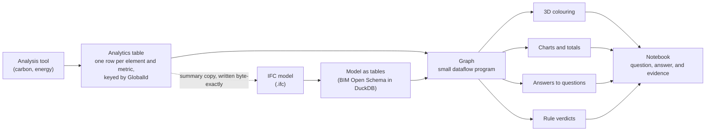
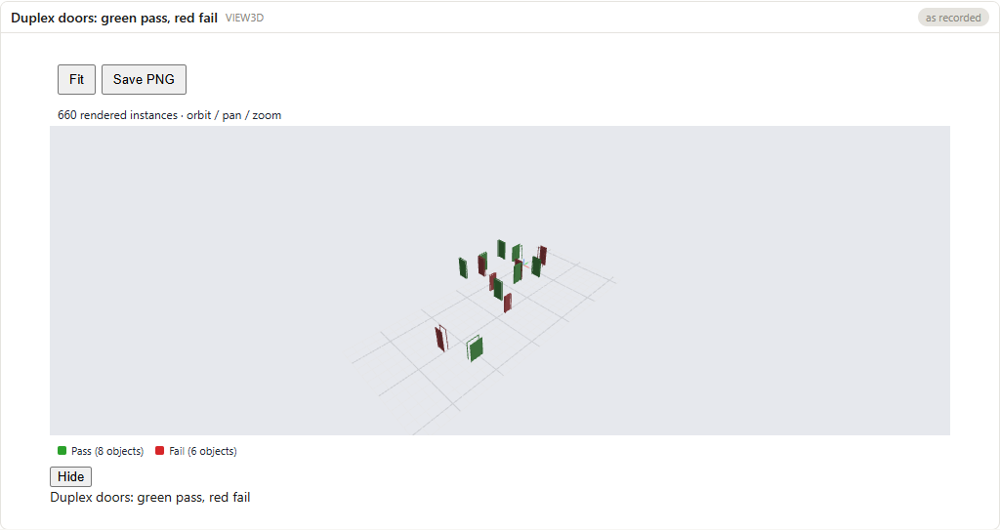
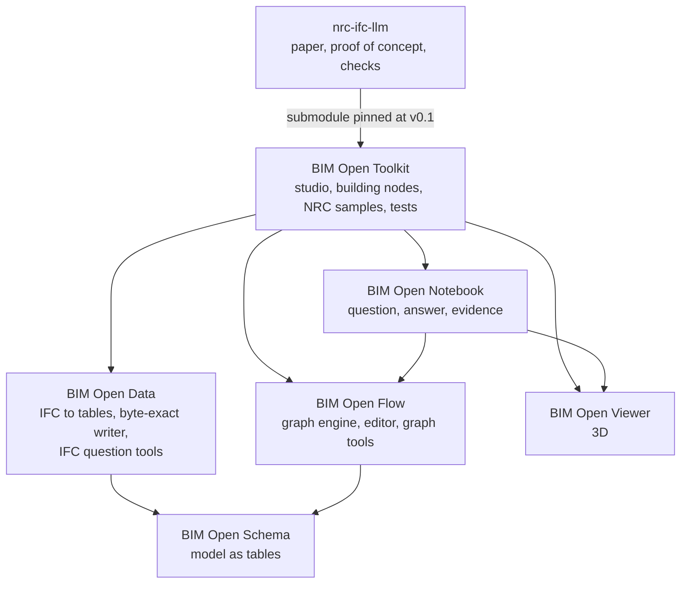

# LLM-Assisted Analytics Metadata on IFC Models

_A Studio 2.5 collaboration with the National Research Council of Canada (NRC). README revised 2026-10-05._

The NRC computes analytics on building models: embodied carbon, operational carbon, energy use, and similar indicators. The tools that compute them work outside the building model, so the results end up in spreadsheets and reports that cannot be joined back to the walls and doors they describe. This repository holds the research the NRC asked for on that problem: a technical paper, a proof of concept, and the checks that keep the two in agreement.

It is written for three readers: the NRC team receiving the work, a researcher who wants to reproduce it, and anyone deciding how to attach analytics to IFC (Industry Foundation Classes, the open ISO file format for building models).

Every analytics value in this repository is **synthetic**: made up with the right shape, units, and keys, but not computed by an analysis tool. The NRC has not yet supplied a model or a dataset.

## The questions we started with

The [statement of work](statement-of-work.md) asks three questions:

1. **Storage.** How can analytics be stored inside, or linked to, an IFC model so that they are portable, reusable, and queryable, at component, zone, storey, and building level?
2. **Display.** How can analytics be shown on the model's geometry, by colour, by text, and as totals?
3. **Questions in plain language.** Can a large language model (LLM) answer questions such as "which walls on Level 1 carry the most embodied carbon?" from an enriched model?

## The short answer

- **Storage:** write a small summary into the IFC file so it travels with the model, but keep the analytics themselves in a table keyed by each element's `GlobalId` (the identifier IFC gives every element). The IFC file is a delivery format, not the place the analytics live.
- **Display:** colour the model from that table, joined to the geometry on `GlobalId`, rather than from values baked into the file.
- **Questions:** do not hand the IFC file to the language model. Convert the model once into plain tables, give the model a few read-only tools over them, and have it answer by building a **graph**: a small, visible program that computes the answer.
- **Interface:** present the conversation as a **notebook**, a document in which each question sits beside the table, chart, 3D view, and graph that answered it.



The rest of this README explains why each of those choices was made, how the separate projects fit together, and how to reproduce each result.

## Why storing the analytics in IFC is not the solution

The obvious answer to the first question is "add property sets to the IFC file and let every tool read them". The proof of concept did exactly that, and found that it is fine for a summary and wrong as the home of the data. Six findings support this.

1. **The file is too large to read, for people and for language models.** An IFC file is a text listing of numbered entities. The small Duplex sample used here has 38,898 entities, and real buildings run to millions. Answering "total operational carbon on Level 2" means following the storey to its elements, each element to its property set, and each set to its values, all scattered through the file. No language model can hold the file in its context, and one that reads STEP text (the IFC text format) does arithmetic by pattern matching, producing totals that look right and are not.
2. **Names are the only schema.** A custom property set such as `Pset_NRCEmbodiedCarbon` is a convention, not a standard. Two organisations that both write `EmbodiedCarbon` can disagree on units, lifecycle stage, and method, and their files will look compatible when they are not.
3. **Storing totals in the file misled the model.** Version 1 of the paper wrote storey and building totals under the same property names as the element values. An unattended language model then summed totals together with the elements and doubled figures. On the same eight questions, Claude Haiku 4.5 scored 5, 6, and 4 of 8 on that file, and 7 of 8 in each of three runs once the totals were given their own names (paper v2, Table 4). The model was the same; the storage layout was the defect.
4. **Writing into IFC is fragile.** Most IFC libraries load a file and write it back out whole, renumbering and reformatting it, so the owner of the model cannot see what changed. This project needed a purpose-built writer that appends entities without touching any existing byte, and a diff that proves it.
5. **It does not scale.** Scenarios, time series, and hundreds of metrics per element inflate the file. Of the twelve IFC mechanisms the paper compares (Table 1), only an external table referenced from the file scales to millions of values.
6. **Every new view would mean rewriting the file.** Colouring the model by a different metric or scenario from a table is a parameter change. Colouring it from property sets requires writing those values into the file first.

What the file is good for is carrying a short, self-describing summary to people who use ordinary IFC viewers. So the recommendation in [paper v2, section 3](paper/paper-v2.md) is three layers: summary property sets in the file, a reference from the file to the full table, and a metric dictionary from which both are generated. Every question in the proof of concept is answered from tables, not from the file.

## Why the language model speaks in graphs

A chat answer is text. A number in that text could have come from a query, from the model's memory, or from a guess, and a week later nobody can tell which. The toolkit avoids this by asking the language model to answer with a graph instead of prose.

A graph is a JSON document whose nodes are small functions from table to table: load the model, filter to doors, join the widths, group by storey, draw a chart. The picture below is a real one: the model was asked how many doors the Duplex has on each storey, and answered with a four-node graph whose result is the table above it.


_The question, the answer table, and the graph that produced it, from the BIM Open Notebook. Claude Haiku 4.5 built the graph through the toolkit's tools._

Graphs were chosen over free text and over raw SQL (Structured Query Language, the query language of databases) for these reasons:

- **A person can check it.** The graph is drawn on screen, every node shows its parameters, and every wire can be opened to see the rows passing through it. A reviewer who cannot read SQL can still see "filter: IFCDOOR, group by: storey".
- **A person and the model edit it the same way.** Every change is one of four operations: add a node, connect two nodes, set a parameter, remove a node. The model's graph is one a person could have built by hand, and a person can correct it with the mouse.
- **The next question is an edit, not a restart.** "Now only Level 2" adds one filter node. "Colour those on the building" adds one colour node, because 3D views, charts, tables, and rule checks are all the same kind of graph.
- **The answer can be recomputed.** A graph saved with its inputs, identified by content hashes, gives the same answer next week, or shows that the data changed.
- **The model produces data, not verdicts.** A pass or fail comes from a rule node evaluated deterministically, and an absent value is reported as "information not available" instead of being guessed.

The paper measured this surface only lightly. On the toolkit's own test database, twelve requests produced ten correct graphs, one honest answer without a graph, and one correctly empty graph (paper v2, section 5.3). Those requests were not about carbon.

## Why a notebook is the interface

Four interfaces were considered for people asking questions of a building model.

| Interface | What it lacks |
|---|---|
| A chat window | The answer is text with no trace of how it was produced. |
| A code notebook such as Jupyter | The reader must write and read code. |
| A dashboard | It answers only the questions its builder anticipated. |
| A 3D viewer alone | It shows the model, not the reasoning or the totals. |

The BIM Open Notebook keeps the plain-language conversation and adds the evidence. Each turn holds the request, the reply text, the tool calls folded underneath, and the results as embedded tables, charts, graphs, and 3D views. Each result keeps a snapshot, so a notebook opens anywhere with no server. With a server running, a **Re-evaluate** button recomputes every graph and marks each result as current, changed (showing old and new values), or unavailable. There are no code cells.



_A notebook embed: the door-width rule DC-W1 (leaf width at least 850 mm) coloured on the Duplex doors, 8 pass and 6 fail._

This matches the people the NRC work serves: an analyst who asks questions without writing code, a compliance checker who must hand over failing elements with numbers that can be rechecked, and a reviewer who receives the result and wants to see where each number came from. The notebook is a working prototype, built and checked on 2026-10-04. It has not been tested with NRC users, and the eight-question measurements in the paper were run through Claude Code and the toolkit's command-line runner, not through the notebook.

## The projects and why each is separate

The work spans this repository and the open-source BIM Open Toolkit (MIT licence), which since 2026-10-03 is split into several repositories. Each is separate because each has users who need it without the others: a viewer developer does not want a .NET database stack, and a notebook reader does not want the editor.

| Project | What it holds | Why it stands alone |
|---|---|---|
| **nrc-ifc-llm** (this repository) | The paper, the proof-of-concept data and scripts, the recorded model runs, and checks that tie them to the toolkit. | It is the NRC deliverable. It pins one tested version of the toolkit so the paper's numbers cannot drift. |
| [BIM Open Toolkit](https://github.com/ara3d/bim-open-toolkit) | The analyst studio, the building-specific graph nodes, the sample analyses including the NRC samples, and the tests that assert the paper's eight answers. | It is the hub that combines the others and names one tested set of them (tag `v0.1`). |
| [BIM Open Schema](https://github.com/ara3d/bim-open-schema) | The specification for storing a building model as plain tables (Parquet files: entities, parameters, relations, geometry). | A file format must not depend on any one program that reads it. |
| [BIM Open Data](https://github.com/ara3d/bim-open-data) | .NET libraries that read and mesh IFC, convert it to BIM Open Schema and DuckDB (an embedded SQL database), write property sets back byte-exactly, and serve the IFC question-answering tools. | Anyone who needs IFC as tables can use it without the graph system. |
| [BIM Open Flow](https://github.com/ara3d/bim-open-flow) | The graph engine, generic nodes, local server, web editor, and the graph-building tools for language models. | Graphs over tables are useful for data that is not a building. |
| [BIM Open Viewer](https://github.com/ara3d/bim-open-viewer) | The WebGL 3D viewer. | It knows nothing about IFC; it draws tables of instances with colours, so any program can feed it. |
| [BIM Open Notebook](https://github.com/ara3d/bim-open-notebook) | The notebook page and file format. | A reviewer opens a notebook with nothing installed. |



The Model Context Protocol (MCP) is the open standard by which a language model client such as Claude Code calls these tools. Two MCP servers come out of the toolkit: `bimopen-ifc`, which answers questions about an IFC file, and `bimopenflow-duckdb`, which builds and edits graphs.

## Deliverables and their status

The statement of work names four deliverables. Status as of 2026-10-05; [REQUIREMENTS.md](REQUIREMENTS.md) has every requirement row by row.

| Deliverable | Where | Status |
|---|---|---|
| D1. Options analysis brief | [storing-analytics-in-ifc.md](storing-analytics-in-ifc.md) (the brainstorm of twelve mechanisms) and paper v2 sections 3 and 4 (the comparison and recommendation) | Partly met: the analysis exists inside the paper, not as a separate short brief. |
| D2. Proof-of-concept package | [poc/](poc/README.md) and the toolkit's `samples/nrc/` | Met: an enriched IFC model, the question-answering agent with recorded runs, 3D colourings, source, and documentation. |
| D3. Technical paper | [paper/paper-v2.md](paper/paper-v2.md) (start at [paper/README.md](paper/README.md)) | Written; the NRC's editorial review has not happened. |
| D4. Final presentation and handover | Not in the repository | Not done. |

The proof of concept shows, on the public buildingSMART Duplex model:

- 2,441 analytics values in 659 property sets written into the IFC file, with every original byte preserved and a fresh run reproducing the file byte for byte.
- Eight plain-language questions answered by Claude Haiku 4.5, unattended, 7 of 8 in each of three runs. The eighth is a question whose expected answer the paper disputes.
- 62 of 100 questions answered correctly on IFC-Bench, an external benchmark over public models from 16 projects, written by someone else. Some of those verdicts were judged by an evaluating agent and have not yet been checked by hand.
- The model coloured by carbon value, and a door-width rule giving 8 pass and 6 fail that matches independently derived ground truth.


_The Duplex model coloured by synthetic operational carbon. The graph on the left (load instances, read a value table, colour by a column) is the whole description; changing the column re-colours the model without touching the IFC file._

## How to reach each goal

All commands run from this repository's root unless stated. The full toolkit builds and runs on Windows only.

**Get the code.** Install Git, the .NET 8 SDK, Node.js, and Python 3. Clone with the toolkit, then fetch the repositories the toolkit is built from into `bim-open-toolkit/deps/`:

```bash
git clone --recurse-submodules https://github.com/ara3d/nrc-ifc-llm
```

```bash
node bim-open-toolkit/deps.mjs
```

If you already cloned without `--recurse-submodules`, run `git submodule update --init` before the second command.

**Store analytics in an IFC file.** Write the synthetic property sets into a copy of the Duplex model and confirm that only property sets were added:

```bash
dotnet run --project poc/EnrichIfc -c Release -- IFC-Test-Kit/duplex.ifc poc/data/psets_to_write.csv out/duplex-enriched.ifc out/enrich-report.json
```

```bash
python poc/check_enriched_ifc.py IFC-Test-Kit/duplex.ifc out/duplex-enriched.ifc poc/data/psets_to_write.csv
```

This is the version 1 path. The version 2 file, with summary sets under their own names, is written by the toolkit graph `nrc-enrich-run` and committed as `bim-open-toolkit/samples/nrc/duplex-enriched.ifc`; the metric dictionary it is generated from is `bim-open-toolkit/samples/nrc/nrc-metrics.csv`.

**Display analytics on the model.** The toolkit's walkthrough builds the toolkit, starts its server, and regenerates the paper's figures; the full run took 291 seconds on 2026-09-18. Run it inside `bim-open-toolkit/`. The Snowdon half needs a private model, so `nrc:walkthrough:duplex` skips it:

```bash
npm run nrc:walkthrough:duplex --prefix bimopenflow/web
```

**Ask questions in plain language.** Build the toolkit's MCP servers once, then start Claude Code in this repository's root and approve the `bimopen-ifc` server when asked:

```bash
node bim-open-toolkit/scripts/build-mcp.mjs
```

Questions to try:

- "How many doors are on each storey of poc/data/duplex-enriched.ifc?"
- "Which walls in the duplex have the highest embodied carbon?"
- "Summarize section 4 of the paper."

To repeat the unattended eight-question run and score it, follow "Unattended runs with Claude, scored" in [poc/README.md](poc/README.md).

**Keep questions and answers as evidence.** The notebook runs from its own repository; its [README](https://github.com/ara3d/bim-open-notebook) gives the steps to open the sample notebooks and to ask new questions through the toolkit's studio.

## Checks

[.github/workflows/check.yml](.github/workflows/check.yml) runs on every push and pull request, in three jobs: `paths` (every path into `bim-open-toolkit/` exists at the pinned commit), `poc` (the enrichment and the eight answers), and `toolkit-nrc` (the toolkit's NRC answer tests). To run the same checks locally:

```bash
python checks/check_toolkit_paths.py
```

```bash
dotnet run --project poc/EnrichIfc -c Release -- IFC-Test-Kit/duplex.ifc poc/data/psets_to_write.csv out/duplex-enriched.ifc out/enrich-report.json
```

```bash
python poc/check_enriched_ifc.py IFC-Test-Kit/duplex.ifc out/duplex-enriched.ifc poc/data/psets_to_write.csv
```

```bash
python poc/check_answers.py
```

```bash
dotnet test bim-open-toolkit/tests/studio/BimOpenFlow.NrcWorkflows.Tests -c Release
```

The last command builds the toolkit projects the tests need: about 2 minutes on a CI runner, 14 minutes on the first local run with an empty build cache. A reference the pinned toolkit no longer has, but which is not fixed yet, goes in `checks/known-missing-paths.txt` with its reason.

## What is not done

- No real NRC model or analytics dataset has been used; every value is synthetic.
- No question is asked at zone level, although the statement of work names it. The Duplex model has 21 spaces and no zones.
- The IFC reference to the full analytics table has a tested writer that the enrichment does not yet call.
- No Information Delivery Specification (IDS) file, the buildingSMART format for stating what a delivered model must contain, has been generated from the metric dictionary.
- The eight-question measurement uses one model family and one small building.
- The toolkit runs only on Windows, as a single-user local server.

[paper/poc-gap-report.md](paper/poc-gap-report.md) and [paper/handoff-needs.md](paper/handoff-needs.md) list the remaining work in detail.

## Repository map

| Path | What it holds |
|---|---|
| [paper/](paper/README.md) | The technical paper (deliverable D3), version 2 in `paper-v2.md`, version 1 one file per section, and the figures. |
| [poc/](poc/README.md) | The proof of concept: synthetic data generator, enrichment program, expected answers, recorded and scored model runs, and graphs. |
| `bim-open-toolkit/` | The toolkit, a git submodule pinned at tag `v0.1`. Not edited from here. |
| `checks/` | The path check that keeps the documentation in step with the pinned toolkit. |
| `data/`, `IFC-Test-Kit/` | Sample IFC models: `AC20-FZK-Haus.ifc`, `C20-Institute-Var-2.ifc`, `duplex.ifc`, `Office_A_20110811.ifc`, and the buildingSMART test kit. |
| `docs/images/` | Screenshots used in this README. |
| [REQUIREMENTS.md](REQUIREMENTS.md) | Every requirement on the repository, its status, and what checks it. |

Background documents:

- [Statement of Work](statement-of-work.md): objectives, scope, deliverables, and acceptance criteria.
- [Storing Analytics in IFC](storing-analytics-in-ifc.md): the twelve storage options with their pros and cons.
- [IDS Overview](ids.md): an introduction to the Information Delivery Specification.
- [IFC Viewers](ifc-viewers.md): an inventory of open-source IFC viewers.
- [MCP Tools That Can Wrap an IFC](mcp-ifc.md): a survey of existing IFC tool servers for language models.
- [Door Clearance Demonstration](door-clearance-demo.md): a building-code rule turned into a machine check over the Duplex doors.
- [Intro to Git](intro-to-git.md): a short introduction to Git for new contributors.
