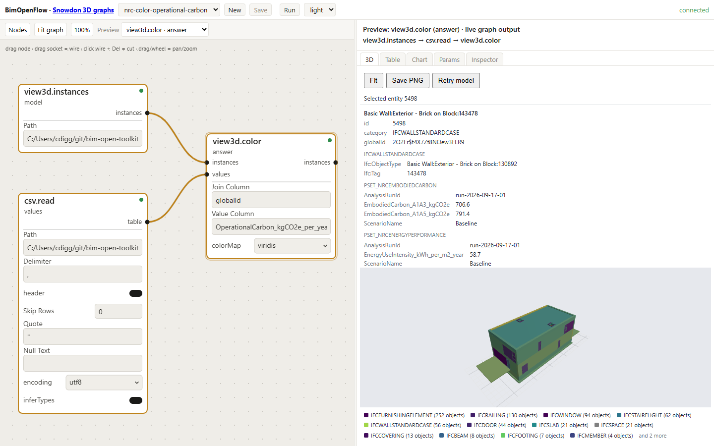

# Storing, displaying, and querying building analytics on IFC models with a large language model agent layer

**Christopher Diggins**, Ara 3D / Studio 2.5. Prepared for the National Research Council of Canada. Condensed version, 2026-09-19.

## Abstract

Building performance analytics such as embodied carbon, operational carbon, and energy use intensity are computed by tools outside the building information model and delivered as spreadsheets and reports. Once the results have left the model they cannot be shown on the geometry, reused by a later tool, or interrogated in plain language. This paper addresses three connected questions for openBIM workflows built on the Industry Foundation Classes (IFC): where analytics should be stored so that they travel with the model, how they should be displayed on the geometry, and how a large language model (LLM) can be placed in front of an enriched model so that it may be queried in natural language.

Twelve storage mechanisms available within IFC 4.3 are compared, and a three-layer approach is recommended: scalar summaries in custom property sets, a reference to an external columnar dataset joined on `GlobalId`, and a metric dictionary. Colour mapping driven by the same tables in which the analytics are stored is recommended for display. For querying, the language model is not given the IFC file but a small typed read-only tool surface over the Model Context Protocol (MCP), backed by a columnar copy of the model in DuckDB. A proof of concept on the buildingSMART Duplex Apartment model, 38,898 STEP entities, enriched the file with 664 property sets and 2,438 typed values written byte-exactly and reversibly, answered eight natural-language questions through the tool surface, and evaluated four accessible-door-clearance rules over 14 doors, producing 56 verdicts that matched independently derived ground truth door by door and were byte-identical across runs. The unattended run exposed one defect in the storage recommendation, namely that storey and building aggregates share the element property names, which is the first correction to make.

## 1 Introduction

The National Research Council of Canada (NRC) produces analytics on building models: operational carbon, embodied carbon, energy use, and related indicators. These are computed by simulation and life-cycle assessment tools whose inputs may derive from an IFC model but whose outputs are not written back to it. The numbers reside in the tools' own databases, in CSV exports, and in PDF reports.

Three activities become difficult once the results have left the model. A designer who opens the model looking for the walls carrying the most embodied carbon will not find them there. A downstream tool, or a later project phase, cannot locate the results without the original tool and its project file. And a question such as "what is the total operational carbon on Level 2" requires a person who understands both the analysis tool and the model.

The components needed to fix this already exist. The IFC schema [1] has several mechanisms for attaching data to elements. The Information Delivery Specification (IDS) [2] can state which results a delivered model must carry. Language models can turn a question into a query. What is absent is a settled practice for combining them, and the obvious combination, handing the IFC file to the language model, does not work at the scale of real models.

The statement of work [20] sets three objectives, and this paper is organised around them. Section 3 addresses storage: which IFC mechanisms should carry analytics at component, zone, storey, and building level. Section 4 addresses display: how analytics should be shown on IFC geometry and which freely available viewers support this. Section 5 addresses querying: how an LLM-based layer should be built so that its answers are correct and checkable. Section 6 reports the evidence, Section 7 the limitations, and Section 8 what should be built next.

Five contributions are offered: a ranked comparison of twelve storage mechanisms with a three-layer recommendation and concrete property-set definitions; an argument, supported by an implementation, that the language model belongs behind a small typed tool surface over a columnar copy of the model; a byte-exact write-back path by which analytics, verdicts, and overrides may be added to a client's file without altering any other byte; an executed and reproducible demonstration on a public model; and a roadmap for an open bidirectional viewer.

## 2 Background

**IFC and property sets.** IFC is an ISO standard schema for building information, ISO 16739-1:2024 [1], most often exchanged as STEP text files. A file is a list of numbered entities. Each building element carries a `GlobalId` intended to be stable across exports, and elements sit in a spatial hierarchy of project, site, building, storey, and space. A property set (`IFCPROPERTYSET`) is a named group of typed single-value properties attached to one or more elements through a relationship entity. Standard sets are prefixed `Pset_`; custom sets may be defined by anyone.

Three consequences shape everything that follows. Property names are effectively the schema, so two tools that both write `EmbodiedCarbon` may disagree on units, stage, and method. The file is a text serialisation of an object graph, so reading any single fact requires parsing the whole file; the Duplex model used here has 38,898 entities, and larger buildings run to millions. And writing is fragile, because most IFC libraries load the file into their own object model and re-serialise it, changing entity numbering and formatting throughout, so that a client who receives an enriched file has no straightforward way to see what changed.

**IDS.** An IDS file states, for a class of objects (its applicability), what those objects must contain (its requirements). Validators report a pass or fail per element. NRC already maintains an IDS framework, so any property set recommended here should be one an IDS can require. The applicability-plus-requirements shape is also the shape of a code-compliance rule, which Section 6.3 exploits.

**Language models and MCP.** A language model can turn a natural-language question into a structured query, but it has no reliable means of reading a 40,000-entity STEP file. Practical systems give the model tools: functions with typed arguments and results. The Model Context Protocol (MCP) [7] is an open standard for describing and calling such tools, so a server written once serves any MCP-capable client. A survey of seven IFC MCP servers extant in mid-2026 [24] found none that provided persistent element sets, joins with external tables, or analytics written back to the file.

**The toolkit.** The proof of concept is built on the open-source BIM Open Toolkit [8], MIT licence. BIM Open Schema (BOS) [9] is a columnar representation of a building model, one table each for entities, parameters, relations, and geometry, stored as Parquet and loaded directly into DuckDB. BimOpenFlow is a dataflow graph over those tables: nodes are small pure functions from tables to tables, a graph is a JSON document, and four operations (`addNode`, `connect`, `setParam`, `removeNode`) back the HTTP API, the MCP tools, and every gesture in the web editor. Nodes that write files run only inside an explicit run, which records the graph hash and every input by content hash. A byte-exact IFC editing library [29] locates entities by byte range and writes additions as an appended patch.

## 3 Storage of analytics within IFC

An analytics value is more than a number. To be reusable it needs the element or container it describes, identified by `GlobalId`; the metric; the unit; the lifecycle stage or time basis, such as A1 to A3 or annual; the scenario; and the run that produced it. Each candidate mechanism is judged on how much of this it carries and on four properties: portability (does the value travel with the file), queryability (can a tool or language model find it without special knowledge), interoperability (do other IFC tools read it), and scalability (does it still work for thousands of metrics or time series).

The options brief [21] examines twelve mechanisms, summarised in Table 1.

**Table 1** Twelve mechanisms within IFC 4.3 for carrying analytics, scored on four properties.

| Mechanism | IFC basis | Portability | Queryability | Interop. | Scalability |
|---|---|---|---|---|---|
| Custom property sets | `IfcPropertySet` | High | High | Med–high | Medium |
| Standard environmental sets | `Pset_EnvironmentalImpactIndicators` | High | High | Medium | Medium |
| Element quantities | `IfcElementQuantity` | High | High | High | Medium |
| Material properties | `IfcMaterialProperties` | High | Medium | Medium | High |
| Spatial aggregates | Property sets on space, storey, building | High | High | Medium | High |
| External dataset reference | `IfcDocumentReference` plus join key | Medium | Very high | Medium | Very high |
| Library and classification refs | `IfcLibraryInformation`, bsDD | Medium | Medium | Med–high | High |
| Performance history | `IfcPerformanceHistory` | Medium | Medium | Low–med | Medium |
| Constraints and metrics | `IfcMetric`, `IfcObjective` | Medium | Medium | Low–med | Medium |
| Visualisation metadata | Colour and legend properties | High | Low | Low | Low |
| Custom schema extension | New entity types | Low | Custom only | Low | Medium |

Two mechanisms stand apart. Custom property sets are the simplest and most widely readable: almost every viewer displays them and "colour by property X" is a standard viewer feature. The external dataset reference is the only one that scales, because a Parquet or DuckDB table holds millions of rows without inflating the IFC file. No single mechanism satisfies all four properties, so three are recommended together.

**Layer 1: summary values in custom property sets.** The scalar values that people inspect, filter by, colour by, and ask about are written directly into property sets on elements and spatial containers, one set per topic: `Pset_NRCEmbodiedCarbon`, `Pset_NRCOperationalCarbon`, `Pset_NRCEnergyPerformance`, and `Pset_NRCAnalyticsProvenance`. Every set carries `ScenarioName` and `AnalysisRunId`, so a value can never be separated from its run. Units and lifecycle stages are carried in the property names, as in `EmbodiedCarbon_A1A3_kgCO2e`, so the meaning survives tools that drop the IFC unit assignment.

**Layer 2: a reference to the full dataset.** An `IfcDocumentReference` on the project names the external result table, its format, checksum, and join key. The table is long-format, one row per run, element, and metric, so that new metrics never require a schema change:

```text
AnalysisRunId, GlobalId, IfcClass, MetricId, MetricName, Value, Unit,
LifecycleStage, Scenario, Source, Confidence, ComputationMethod
```

Parquet is the recommended format; CSV is acceptable for small datasets.

**Layer 3: a metric dictionary.** A short versioned list of identifiers such as `NRC.EC.A1A3.TOTAL` and `NRC.EUI.ANNUAL`, to which every Layer 1 property name and Layer 2 `MetricId` is mapped. It gives the query layer one place to resolve "carbon" to a column and gives an IDS one vocabulary to require.

**Writing without disturbing the file.** Layer 1 requires writing into a client's file. The toolkit's editing library treats the source as bytes, finds the highest entity identifier and the owner-history entity, and appends new entities: N `IFCPROPERTYSINGLEVALUE` lines, one `IFCPROPERTYSET`, and one `IFCRELDEFINESBYPROPERTIES` per element and set. Each new entity's `GlobalId` is a deterministic hash of a caller-supplied key, so running the writer twice produces the same bytes. An entity-level diff reports exactly which entities were added, and a remove operation strips them again. The practical consequence for NRC is that an enriched file can be returned to a model author with a diff listing the additions and nothing else, and the author can recover the original file exactly.

**Recommendation.** Write summary analytics into custom property sets on elements, spaces, storeys, buildings, and the project; put units, stage, scenario, run identifier, and provenance in every set; reference the full result table from the IFC by `IfcDocumentReference`, joined on `GlobalId` and stored as Parquet; publish a metric dictionary; write by byte-exact patch rather than re-serialisation; and express the whole as an IDS specification. The first, third, and fifth measures are implemented and tested; the IDS remains future work.

## 4 Display of analytics on IFC geometry

Three techniques show a number on a building. **Colour coding** maps each element's value through a gradient for numeric metrics or a palette for categories and verdicts. It is the most immediate view. **Text annotation** shows the value in a property panel when an element is selected; property panels are universal, whereas scene labels are rare in free viewers and clutter quickly. **Aggregated views** sum or average by storey, zone, or category and show the result as a table or chart beside the model. This is the view on which decisions are taken. A working display presents all three.

The display may be driven from the property sets of Layer 1, in which case any viewer that colours by property works but shows only what was written into the file, or from the external table of Layer 2, in which case the viewer joins the table to the geometry on `GlobalId` and colours by any column of any scenario without rewriting the IFC. The toolkit's dataflow graph takes the second approach. A three-node graph loads the instances of a model, reads a value table, and colours the instances:

```json
{
  "nodes": [
    { "id": "inst",    "kind": "view3d.instances" },
    { "id": "values",  "kind": "csv.read" },
    { "id": "colored", "kind": "view3d.color" }
  ],
  "edges": [
    { "from": "inst.instances", "to": "colored.instances" },
    { "from": "values.table",   "to": "colored.values" }
  ],
  "values": {
    "colored": { "joinColumn": "GlobalId", "valueColumn": "operational_carbon", "colorMap": "viridis" }
  }
}
```

Instances with no match in the value table are drawn grey, so missing data is visible rather than silently zero. Changing `valueColumn` re-colours the model without touching the file. A `table.aggregate` node grouped by storey feeds a bar chart or table from the same graph.


_Figure 1 The enriched Duplex model coloured by operational carbon (synthetic values) through a viridis gradient. The graph on the left is the whole description._


_Figure 2 Rule DC-W1, requiring a leaf width of at least 850 mm: 8 pass and 6 fail, coloured on the 14 doors. The rule is evaluated by a `check.rule` node inside the same graph that colours the model._



_Figure 3 A picked wall's property sets beneath the 3D view. The analytics sets appear beside the Revit-exported ones because they are ordinary property sets in the file._

The same path holds on a real building: the private Snowdon Towers sample, 456,598 instances, is coloured by category and its 142-door schedule built from two DuckDB query nodes, so nothing in the display path is sized for the small public model.

The viewer inventory [23] shortlists Bonsai (Blender), xBIM Xplorer, That Open Components, IFClite, FreeCAD NativeIFC, BIMvision, FZKViewer, and the toolkit's own web viewer. All support colouring by property and a property panel; colouring from an external table requires scripting in every case but the toolkit's, where it is a dataflow join. A seven-step test kit exists, and only the toolkit row has been run through it: steps one to five pass on the Duplex model and step six on Snowdon Towers. Speckle, named in the statement of work, is a platform rather than a viewer and should be included in the test run.

**Recommendation.** Drive colour from a value table joined on `GlobalId`, draw unmatched elements grey, show the selected element's Layer 1 sets in a standard property panel, and provide a per-storey and per-category aggregate beside the model from the same table. For a screenshot-level deliverable, write Layer 1 sets and use any viewer that colours by property; for an interactive deliverable, use the toolkit's graph and viewer. Bonsai should be the reference desktop viewer for verification, because it exposes the full IFC through IfcOpenShell and reproduces the join in a few lines of Python.

## 5 The language model and agent layer

**Why the model is not given the file.** A question such as "what is the total operational carbon on Level 2" requires finding the storey entity, following containment to its elements, following each element's property relationship to its set, reading the value, and summing. In a file of 38,898 entities those entities are scattered, and the file exceeds any model's context window. Even where a file fits, a language model reading STEP text does arithmetic by pattern matching and produces plausible rather than correct totals. The alternative is tools: typed functions the model calls and the runtime executes, so the model reasons over results that are small, structured, and correct.

**Four design principles.** Each was derived from running varied questions against the implementation and reading the transcripts.

- **Few, typed, read-only tools.** A server exposing the whole IFC API as 200 tools gives the model too many ways to be wrong. The implementation exposes 29 tools grouped by question shape. Every SQL tool accepts one read-only statement; `DROP`, `INSERT`, and statement chaining are rejected, and the rejection is tested.
- **A columnar copy rather than the object graph.** The IFC is converted once per session to BOS and loaded into DuckDB. Questions become SQL over tables with text views, which a model writes reliably.
- **Questions run in the opposite direction.** Per-element tools ("what does element N carry") are the wrong shape for almost every real question ("which elements are load bearing"). An inverted parameter index, built once per session, answers those in a single call. Without it the model made one call per element.
- **Answers carry their derivation.** Every list result reports its unpaged total, so the model can distinguish a complete answer from a truncated one. In the dataflow surface a question becomes a graph, and a run record pins the graph hash and every input hash, so a number arrives with a means of recomputing it.

**Two surfaces.** The IFC MCP server exposes data tools (entities, attributes, properties, quantities, relations, spatial tree), geometry tools (meshes, bounds, volumes), and analytics tools (convert to BOS, list tables, run read-only SQL, export). A representative exchange:

```text
User:  Which storeys have the most operational carbon?

Agent: ifc_to_bos { path: "duplex.ifc" }        -> { tables: 9, entities: 38898 }
Agent: ifc_sql { sql: "SELECT storey, round(sum(oc),1), count(*) ... GROUP BY storey" }
       -> { total: 2, rows: [["Level 2", 12406.3, 141], ["Level 1", 11874.9, 127]] }
Agent: Level 2 has the higher total at 12,406 kgCO2e per year across 141 elements.
       Values come from Pset_NRCOperationalCarbon, run id run-2026-07-14-01.
```

The second surface is the BimOpenFlow MCP server, whose tools are the same four graph operations that back the web editor. A question becomes a graph of small nodes rather than one SQL string, the graph persists where a person can open and edit it, the next question ("now only the doors") is an edit to the same graph, and the graph that colours the model is the same kind of object, so "colour Level 2 by the values just summed" is one further node. Making this work on large models required a schema summary the model can afford to read, a node guide in the system prompt, a single call to apply a list of edits (which cut input tokens per request from millions to hundreds of thousands), and a host-side check after the model reports completion that every node evaluated and the answer table has rows. On the toolkit's own test database, twelve requests produced ten correct graphs, one honest answer without a graph, and one correctly empty graph on a small model. These figures are not a measurement of the carbon-and-energy task.

**Compliance as a query.** A code rule is a query with a verdict column. A `check.rule` node takes a table of element rows and a Boolean expression and appends `verdict`, `checkId`, `checkTitle`, and `citation`. True yields `Pass`; false yields `Fail`, or `NeedsReview` where a second expression says so; and a null result, meaning the required fact was absent, yields `InfoNotAvailable`. Absence is reported and never skipped. The verdict table is an ordinary table: it may be coloured onto the model, summed per storey, or written back into the IFC.

**Recommendation.** Place the model behind a small typed read-only tool surface; convert the IFC once to columnar form and answer with SQL over text views; provide inverted parameter tools; make every answer carry its derivation; treat compliance checks as queries with a verdict column in which missing data is an explicit verdict; and use MCP so one server serves a chat client, a custom agent, and the web editor alike.

## 6 Proof of concept and results

Both case studies use the buildingSMART Duplex Apartment model [18], `duplex.ifc`, IFC2X3, 38,898 entities, two storeys, 14 doors, 61 furnishing elements. The toolchain is BIM Open Toolkit at commit `71790a7`, .NET 8, and DuckDB. Before either study, automated tests exercise conversion, table listing, paged SQL, read-only enforcement, text views, and export against the FZK-Haus model, with the server run as a live subprocess over stdio.

### 6.1 Case study A: natural-language questions over an enriched model

Executed 2026-09-17 with synthetic analytics: each of the 218 physical elements received a type-based embodied carbon value with deterministic jitter, and the test kit's operational carbon and energy intensity columns were reused. The roof deliberately received no embodied-carbon set. A generator produced Layer 1 values plus storey and building aggregates, a Layer 2 table, and a provenance set; a .NET program wrote them with the byte-exact writer; expected answers were computed from the CSV alone, without the IFC or the server; and the enriched model was queried through the IFC MCP server. The enrichment added 3,766 entities (664 property sets, 2,438 typed values, on 218 elements, 4 storeys, the building, and the project). The entity diff listed exactly the added entities, removing them restored the source byte for byte, and a second run produced identical bytes.

The eight questions were answered twice: by the author choosing tool calls by hand, with every call recorded verbatim, and on 2026-09-18 unattended by `gpt-5`, one fresh conversation per question, 35 tool calls in all. Table 2 compares both against the expectation.

**Table 2** Case study A: expected against returned, hand-driven and unattended.

| # | Question | Expected | Hand-driven | Unattended `gpt-5` |
|---|---|---|---|---|
| Q1 | Total operational carbon, building | 37,196.2 | Match, from both the aggregate and the sum of 218 elements | Match |
| Q2 | Higher mean energy intensity, L1 or L2 | Level 2, marginally (40.50 vs 40.56) | **Miss**: Level 1, because the relation walk reached 93 of 103 Level 1 elements | Match, via the new `StoreyOfEntity` view |
| Q3 | Five highest operational carbon elements | Two walls, a cabinet, two walls | Match | **Miss**: ranked the building and storeys, which carry the same property |
| Q4 | Carbon of door `M_Single-Flush:0762 x 2032mm` | 54.0, first of four | All four listed, ambiguity stated | All four listed, question returned |
| Q5 | Operational carbon per category | Wall 22,854.1, Floor 5,593.5, ... | Match, grouped by IFC class | Partial: by IFC class, container rows not excluded |
| Q6 | Which run, and when | run-2026-09-17-01 | Match, with tool, method, dataset URI | Match |
| Q7 | Embodied carbon of the roof | Not available | Match | **Miss**, and informative: found the roof's `IFCSLAB` member and said so |
| Q8 | Embodied carbon per storey | L1 49,451.2; L2 48,696.8; ... | Match | **Miss**: exactly double each |

Seven of eight matched in the hand-driven session and four of eight unattended. Three of the unattended misses share one cause that matters more for the storage recommendation than for the agent. The Layer 1 aggregates on the storey and building entities carry the same property set and property name as the element values. An agent that ranks everything carrying `OperationalCarbon_kgCO2e_per_year` counts the building and storeys as elements (Q3, Q5), and when it groups elements by storey it adds the storey's own aggregate to its elements' sum and doubles every total (Q8). The hand-driven session avoided this by excluding container classes in each query, which is knowledge a prompt can carry but a file should not require. The aggregate sets should be given their own names, for example `Pset_NRCStoreySummary`.

Q7 is a different lesson: the generator wrote no set on the `IFCROOF`, but the roof is an assembly whose slab member received values, and the agent found them and said which entity carries them. The agent's answer is the better one; the absence test should use an element with no analysed descendants. The hand-driven Q2 miss traces to elements inside assemblies (stair flights, railings) being reached through `MemberOf` rather than `ContainedIn`; the toolkit now exposes a `StoreyOfEntity` view that walks all three relations, which the unattended run used. A mechanical replay of the session's SQL for Q1, Q5, Q7, and Q8 over the stdio transport matched on 2026-09-18, establishing the tool surface end to end without a language model.

### 6.2 Case study B: door clearance, from code text to verdicts

Executed 2026-08-04 and independently re-run 2026-08-05; every claim is backed by a test or commit in the demonstration record [26]. Four provisions modelled on the accessible-door requirements of NBC 2020 [6] were expressed in a JSON rule file, each with an identifier, a citation labelled illustrative, an applicability filter (entity type and optional storey), requirement parameters, and verdict semantics (Table 3).

**Table 3** The four rules and their verdict totals over 14 doors.

| Rule | Requirement | Pass | Fail | N/A | Inconclusive |
|---|---|---|---|---|---|
| DC-W1 | `OverallWidth` of at least 850 mm | 8 | 6 | 0 | 0 |
| DC-W2 | `Pset_DoorCommon.ClearWidth` of at least 850 mm | 0 | 0 | 0 | 14 |
| DC-M1 | Width in type name agrees with `OverallWidth` within 25 mm | 14 | 0 | 0 | 0 |
| DC-Z1 | Manoeuvring zone in front of door free of furnishing; Level 1 only | 4 | 2 | 8 | 0 |


_Figure 4 The three stages of case study B: a code provision, its JSON rule, and the checker's verdict records, with the plan-view zone test of rule DC-Z1._

A small engine evaluates every rule against every door and emits one record per pair, sorted by `GlobalId` then rule identifier so the output does not depend on file order. A threshold rule returns `Inconclusive` where the property is absent and does not guess. The zone rule composes the door's full placement chain, rotation included, into an axis-aligned box and tests each furnishing element's placement origin against it.

Before the checker was written, a separate agent in a separate commit extracted every door's identifiers, name-encoded and declared dimensions, and storey [27]. All 14 doors carry both attributes, the two agree to the millimetre, and widths are 2 at 1250 mm, 6 at 864 mm, 4 at 762 mm, and 2 at 813 mm, predicting 8 pass and 6 fail for DC-W1. The checker matched door by door. All four verdict categories occur for real reasons: DC-W2 is inconclusive everywhere because the model's authors never wrote `ClearWidth`, and the storey filter marks the 8 Level 2 doors not applicable. DC-Z1 found two Level 1 doors with a furnishing element in the manoeuvring zone, a condition that was not staged. Every record carries the `GlobalId`, rule, citation, and evidence values.

The evaluation runs twice from scratch in the test suite and the SHA-256 of the verdict CSV is asserted identical; a fresh-process re-run the next day gave the same hash. A failing 762 mm door then receives an `Ara3D_Compliance` set carrying `Verdict`, `OverrideVerdict`, `OverrideReason`, and `ReviewedBy`, appended to a copy of the model. The test asserts that the diff lists exactly the added entities, that removing them restores the source byte for byte, and that the source is never modified:

```csharp
var diff = IfcDiff.Compare(original, overridden);
Assert.That(diff.Added, Is.EqualTo(builder.Ids));
Assert.That(diff.Changed, Is.Empty);
var restored = IfcPatcher.Remove(overridden, diff.Added);
Assert.That(restored, Is.EqualTo(File.ReadAllBytes(TestPaths.DuplexIfc)));
```

Seven tests pass in about four seconds on Windows 11 with .NET 8.

### 6.3 What the two studies show together

Case study B exercises every part of the recommended architecture except the language model: values read from the file, a rule as data, verdicts keyed by `GlobalId` with evidence, results written back byte-exactly, and reproducibility by hash. Case study A places the language model in front of the same tools. Both were deliberately built on one model, one writer, and one table shape, so that a verdict and a carbon value are the same kind of object: a row keyed by `GlobalId` that may be coloured, summed, asked about, and written back.

## 7 Limitations

**Of the proof of concept.** Both studies use one small public model whose Revit family names encode dimensions, which assisted ground truth; NRC's models will not necessarily do so, and rule DC-M1 will likely need a geometric measurement. Case study A was answered by one hand-driven session and one unattended run of one model; one run is not a measurement of reliability, and repeated runs with other models and the renamed aggregate sets are required before an accuracy figure is quoted. The analytics are synthetic: correct in shape, units, and join key, but not derived from an analysis tool. DC-W1 tests leaf width rather than clear width, and under a strict reading the six 864 mm doors could fail; DC-W2 is the honest placeholder. The zone rule tests placement origins against a box rather than meshing obstacles. The citations are illustrative and unreviewed by a code authority.

**Of the storage recommendation.** Custom property sets are a convention, not a standard; two organisations writing `Pset_NRCEmbodiedCarbon` with different stages produce files that look compatible and are not. The metric dictionary and an IDS are the mitigations, and neither is implemented. Aggregates share the element property names, as Section 6.1 showed. The dataflow node `sink.writePsets` wrote every value as text when the study ran, which is why the enrichment called the library directly; it now accepts a type column but the enrichment was not rerun through it. Units in property names are robust but redundant with `IfcUnitAssignment`. An external reference detects substitution through its checksum but not absence.

**Of the query layer.** The dataflow accuracy figures were obtained on the toolkit's test database, not on carbon questions over an enriched IFC. On questions with no single reading, the models tested chose an interpretation rather than asking; the host's check catches empty answers, not wrong interpretations. The IFC loader targets `net8.0-windows`, so the full proof of concept runs only on Windows. The host is local, single-user, and unauthenticated.

**Of the display recommendation.** The viewer comparison has one row from the test kit. For the others it rests on documented capabilities, and the toolkit row is the only one whose external-table colouring is a join rather than a script, which favours it by construction.

## 8 Future directions and viewer roadmap

**Near term.** Rename the storey and building aggregate sets, regenerate, re-enrich, and rerun the unattended questions before quoting any match count. Run the viewer test kit through the shortlist, beginning with Bonsai. Repeat both studies on an NRC model with a real dataset once supplied. Pass value types through `sink.writePsets`. Wire the existing volume and bounds tools into the zone rule.

**IDS as the rule format.** The threshold rules DC-W1 and DC-W2 are exactly what IDS was designed for: an applicability (`IFCDOOR`) and a requirement (a property with a minimum). Layer 1 should be expressed as an IDS specification and delivered models validated against it before any query runs, and the threshold rule kind should map to IDS so a rule file carries IDS requirements beside the geometric kinds IDS cannot express.

**Knowledge graphs.** The columnar tables are a graph flattened into edge lists, and converting them to RDF using the Building Topology Ontology [4] is mechanical. The gain is joins outside the building, to product databases, climate zones, and regulation text. The cost is tooling: a language model writes SQL more reliably than SPARQL at present. The columnar form should remain the working representation with an RDF export published from it.

**World-model substrates.** To machine-learning researchers a world model is a learned predictive model; to BIM practitioners it is an authored, complete database of the asset. The work here lies on the second side and is the foundation for the first: a predictor of embodied carbon from partial geometry needs a ground truth to train and audit against, and the tables, run records, and byte-exact diffs described here are what that ground truth looks like.

**Federated collections and design records.** Every IFC MCP server surveyed operates on one loaded file. A portfolio needs element sets that persist across sessions, queries spanning models, a notion of epoch, and identifiers that survive Revit to IFC to BOS. A longer-horizon vision [28] treats a project as a repository with checkpoints, options as branches, and decisions as records linked to evidence; the byte-exact write-back is what makes an IFC diff reviewable.

**A bidirectional viewer.** The toolkit's WebGL viewer knows nothing of IFC; the graph feeds it instance tables with colour columns, and the byte-exact writer returns property sets to the file. The components exist. What is absent is the set of operations that would let an agent drive the viewer, roughly: `select` and `get_selection`, `color_by`, `isolate`, `hide`, `section`, `set_viewpoint` and `get_viewpoint` exportable as BCF [3], `annotate`, `snapshot` with the graph hash that produced it, and `write_psets`. Each is a graph node as well as a tool. Four stages follow: the viewer as a graph sink (largely complete); selection as data, so "sum the carbon of what I selected" is a two-node graph; write-back from the viewer, with the entity diff shown before it is applied; and multiple models with history. Throughout, the viewer stays format-agnostic, every file write goes through the byte-exact path inside a run, every image carries the hash of what produced it, and one set of operations serves the mouse, the HTTP API, and the agent.

## 9 Conclusion

Summaries belong in the file and the full data beside it. Custom property sets carry the scalar values people inspect, with units, stage, scenario, and run identifier in every set, and an `IfcDocumentReference` points to a long-format Parquet table for everything else, tied together by a metric dictionary. Writing is a byte-exact patch, so an enriched file differs from the original only in what was added, and the additions can be removed to recover the original exactly. The one correction required is that aggregate sets be given names of their own.

Display should be driven from tables rather than from the file: one value table joined on `GlobalId` drives colour, selection detail, and per-storey aggregates from a single description, with unmatched elements grey.

The language model belongs behind tools. A small typed read-only surface over a columnar copy of the model lets it write queries that are correct, checkable, and inexpensive, with every answer carrying its derivation. Compliance rules are queries with a verdict column, and missing data is a verdict rather than a silent pass.

What the client gains is not a viewer and not a checker but a shape for the data: a row keyed by `GlobalId` that may be a carbon value, a verdict, or an override, and that may be coloured, summed, asked about, validated by an IDS, and written back. Everything proposed for the future builds on that shape rather than replacing it.

## References

[1] ISO 16739-1:2024. Industry Foundation Classes (IFC). https://ifc43-docs.standards.buildingsmart.org/
[2] buildingSMART. Information Delivery Specification (IDS) 1.0, June 2024.
[3] buildingSMART. BIM Collaboration Format (BCF).
[4] Rasmussen, M. H., et al. BOT: The Building Topology Ontology. Semantic Web 12(1), 2021.
[6] National Research Council of Canada. National Building Code of Canada 2020.
[7] Model Context Protocol specification. https://modelcontextprotocol.io/
[8] Ara 3D. BIM Open Toolkit, MIT licence. https://github.com/ara3d/bim-open-toolkit (commit `71790a7`).
[9] Ara 3D. BIM Open Schema. https://github.com/ara3d/bim-open-schema
[18] buildingSMART. Duplex Apartment sample model, IFC2X3.
[20] Statement of Work, `statement-of-work.md`, this repository.
[21] Storing analytics in IFC: options brief, `storing-analytics-in-ifc.md`, this repository.
[23] IFC viewer inventory and test kit, `ifc-viewers.md` and `IFC-Test-Kit/README.md`, this repository.
[24] MCP tools that can wrap an IFC, `mcp-ifc.md`, this repository.
[26] Door clearance demonstration, `door-clearance-demo.md`, this repository.
[27] Door ground-truth dataset, `IFC-Test-Kit/door_ground_truth.md`, this repository.
[28] AI-assisted architecture planning and design on Git, `ai_assisted_architecture_design_system.md`, this repository.
[29] `Ara3D.Ifc.Editing`. https://github.com/ara3d/bim-open-toolkit/tree/71790a7/src/Ara3D.Ifc.Editing

Reference numbers follow the full paper so that the two may be read side by side.
