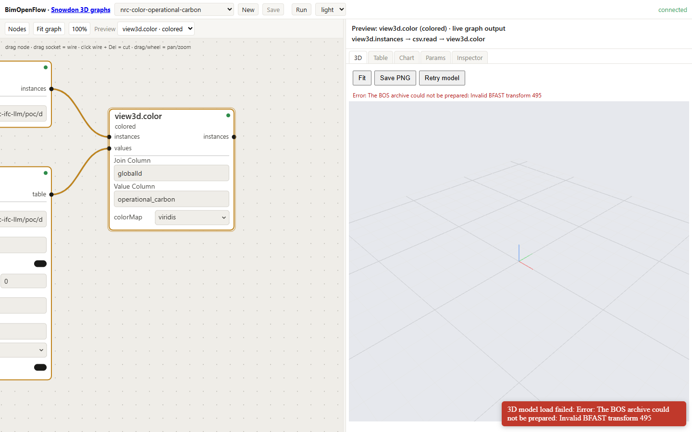

# ANNEX A Property-set definitions

The Layer 1 property sets recommended in Section 5.4 are defined here. Names follow IFC conventions: the set name identifies the topic, and each property name carries its lifecycle stage and unit so that the meaning survives tools which drop unit assignments. All values are `IfcPropertySingleValue`.

Every set includes the two provenance properties `ScenarioName` and `AnalysisRunId`. A value lacking them cannot be joined back to the run that produced it and is to be treated as unverified.

It should be noted that the aggregate sets written on storeys and on the building currently reuse the element property names, with the consequences reported in Section 8.2. A revision of this annex should give them distinct set names, for example `Pset_NRCStoreySummary` and `Pset_NRCBuildingSummary`, or distinct property names.

## A.1 Pset_NRCEmbodiedCarbon

Applies to subtypes of `IfcElement`, and to `IfcSpace`, `IfcBuildingStorey`, `IfcBuilding`, and `IfcProject`.

**Table A.1** Properties of `Pset_NRCEmbodiedCarbon`.

| Property | IFC type | Unit | Meaning |
|---|---|---|---|
| `EmbodiedCarbon_A1A3_kgCO2e` | `IfcReal` | kgCO2e | Product stage total |
| `EmbodiedCarbon_A1A5_kgCO2e` | `IfcReal` | kgCO2e | Product plus construction stage total |
| `EmbodiedCarbon_kgCO2e_per_m2` | `IfcReal` | kgCO2e/m2 | Intensity over the element's or container's reference area |
| `ReferenceArea_m2` | `IfcReal` | m2 | The area used for the intensity |
| `ScenarioName` | `IfcLabel` | — | Scenario identifier |
| `AnalysisRunId` | `IfcIdentifier` | — | Run identifier, joining to Layer 2 |

## A.2 Pset_NRCOperationalCarbon

Applies as in Section A.1.

**Table A.2** Properties of `Pset_NRCOperationalCarbon`.

| Property | IFC type | Unit | Meaning |
|---|---|---|---|
| `OperationalCarbon_kgCO2e_per_year` | `IfcReal` | kgCO2e/yr | Annual operational emissions attributed to the object |
| `OperationalCarbon_kgCO2e_per_m2_year` | `IfcReal` | kgCO2e/m2/yr | Intensity |
| `GridEmissionFactor_kgCO2e_per_kWh` | `IfcReal` | kgCO2e/kWh | Factor used |
| `ScenarioName` | `IfcLabel` | — | Scenario identifier |
| `AnalysisRunId` | `IfcIdentifier` | — | Run identifier |

## A.3 Pset_NRCEnergyPerformance

Applies as in Section A.1.

**Table A.3** Properties of `Pset_NRCEnergyPerformance`.

| Property | IFC type | Unit | Meaning |
|---|---|---|---|
| `EnergyUseIntensity_kWh_per_m2_year` | `IfcReal` | kWh/m2/yr | Site energy use intensity |
| `AnnualEnergyUse_kWh` | `IfcReal` | kWh | Annual site energy |
| `HeatingEnergy_kWh` | `IfcReal` | kWh | Annual heating end use |
| `CoolingEnergy_kWh` | `IfcReal` | kWh | Annual cooling end use |
| `ScenarioName` | `IfcLabel` | — | Scenario identifier |
| `AnalysisRunId` | `IfcIdentifier` | — | Run identifier |

## A.4 Pset_NRCAnalyticsProvenance

Applies to `IfcProject`, and optionally to any object carrying one of the sets above.

**Table A.4** Properties of `Pset_NRCAnalyticsProvenance`.

| Property | IFC type | Meaning |
|---|---|---|
| `AnalysisRunId` | `IfcIdentifier` | Run identifier |
| `SourceTool` | `IfcLabel` | Tool name and version |
| `Methodology` | `IfcLabel` | Standard or method, for example EN 15978:2011 [5] |
| `ComputedAt` | `IfcLabel` | ISO 8601 timestamp, UTC |
| `ComputedBy` | `IfcLabel` | Person or organisation |
| `MetricDictionaryVersion` | `IfcLabel` | Version of the Layer 3 dictionary |
| `ResultDatasetURI` | `IfcText` | Location of the Layer 2 table |
| `ResultDatasetFormat` | `IfcLabel` | `Parquet`, `CSV`, or `DuckDB` |
| `ResultDatasetChecksum` | `IfcLabel` | SHA-256 of the table file |
| `JoinKey` | `IfcLabel` | `GlobalId` |

## A.5 Ara3D_Compliance

The set used in case study B to record a verdict and a human override on an element. It is included here because it follows the same pattern and was verified in the round-trip test of Section 8.3.

**Table A.5** Properties of `Ara3D_Compliance`.

| Property | IFC type | Meaning |
|---|---|---|
| `Verdict` | `IfcLabel` | Verdict produced by the checker |
| `OverrideVerdict` | `IfcLabel` | Verdict asserted by the reviewer |
| `OverrideReason` | `IfcText` | Justification |
| `ReviewedBy` | `IfcLabel` | Reviewer |

A production version should add `RuleId`, `Citation`, `CheckedAt`, and `RuleFileChecksum`.

## A.6 Example STEP output

The lines appended for one element by the writer of Section 5.5, with identifiers relative to the file's highest existing identifier:

```text
#38899=IFCPROPERTYSINGLEVALUE('EmbodiedCarbon_A1A3_kgCO2e',$,IFCREAL(412.7),$);
#38900=IFCPROPERTYSINGLEVALUE('ScenarioName',$,IFCLABEL('Baseline'),$);
#38901=IFCPROPERTYSINGLEVALUE('AnalysisRunId',$,IFCIDENTIFIER('run-2026-07-14-01'),$);
#38902=IFCPROPERTYSET('1kQ7x$...',#41,'Pset_NRCEmbodiedCarbon',$,(#38899,#38900,#38901));
#38903=IFCRELDEFINESBYPROPERTIES('2mR8y$...',#41,$,$,(#1234),#38902);
```

The two `GlobalId` literals are deterministic hashes of the caller's key, so that a second run produces the same five lines.

# ANNEX B Rule file schema

The machine-readable provision file used in case study B is described here. It is JSON with one object per rule, and the full file is held in the toolkit [30].

## B.1 Structure

```text
RuleSet
  description        string   Note on provenance; states that citations are illustrative
  rules[]            Rule

Rule
  id                 string   Stable identifier, for example "DC-W1"
  citation
    code             string   Code name, for example "NBC 2020"
    clause           string   Clause reference
    text             string   Paraphrase of the requirement
  applicability
    entityType       string   IFC entity type to which the rule applies
    storey           string?  Storey name filter, or null for all storeys
  requirement
    kind             enum     "property-threshold" | "measured-vs-declared" | "zone-unobstructed"
    source           string   Where the value comes from: attribute, property set, or geometry
    minWidthMm       number?  For property-threshold
    toleranceMm      number?  For measured-vs-declared
    zoneDepthFactor  number?  For zone-unobstructed: zone depth as a multiple of door width
  verdictSemantics   string   Sentence stating when each verdict is produced
```

The `applicability` object has the same shape as an IDS applicability facet, comprising entity type and a container filter, which is what renders the IDS mapping of Section 10.2 straightforward for the property-threshold kind.

## B.2 One rule in full

```json
{
  "id": "DC-Z1",
  "citation": {
    "code": "NBC 2020",
    "clause": "3.8.3.12(3) (illustrative, not legal text)",
    "text": "A clear and level area shall be provided on the latch side and in front of an accessible door, unobstructed by fixed furnishings, sufficient for a wheelchair to approach and operate the door."
  },
  "applicability": { "entityType": "IFCDOOR", "storey": "Level 1" },
  "requirement": {
    "kind": "zone-unobstructed",
    "source": "placement-chain AABB vs IFCFURNISHINGELEMENT placements",
    "zoneDepthFactor": 1.0
  },
  "verdictSemantics": "pass when no furnishing element origin falls inside the clearance zone box (door footprint expanded by one door width); fail when one does; not_applicable outside the storey filter; inconclusive when the door placement cannot be resolved."
}
```

The word "shall" in the `text` field above occurs within a paraphrase of a code provision and is not a requirement stated by this report.

## B.3 Verdict record

Each evaluation of one element against one rule produces one record. The CSV written by the checker has the columns given in Table B.1, and its SHA-256 is the determinism check of Section 8.3.

**Table B.1** Columns of the verdict record.

| Column | Content |
|---|---|
| `GlobalId` | The element |
| `RuleId` | The rule |
| `Verdict` | `Pass`, `Fail`, `NotApplicable`, or `Inconclusive` |
| `Evidence` | The values read and compared, in words |
| `Citation` | Code and clause, taken from the rule |

An example evidence string for DC-W1 on a failing door is the following:

```text
IFCDOOR.OverallWidth attribute = 762 mm; required >= 850 mm
```

## B.4 Relation to the dataflow verdict table

The compliance node pack in the toolkit [32] uses the verdict set `Pass`, `Fail`, `NeedsReview`, and `InfoNotAvailable`, with the columns `verdict`, `checkId`, `checkTitle`, and `citation`. The mapping from the checker's set is as follows: `Inconclusive` maps to `InfoNotAvailable`; `NotApplicable` maps to a row omitted by the applicability filter before the check node; and `NeedsReview` is an addition, for rows which fail but are flagged by a review expression. A future revision should adopt one vocabulary.

# ANNEX C Agent tool surface

The tools given to the language model in Section 7 are listed here. Two servers are described, both held in the BIM Open Toolkit at commit `71790a7` [8].

## C.1 IFC MCP server, `Ara3D.Ifc.Mcp`

This server answers questions about one or more IFC files [31]. It runs over stdio by default, which is how MCP clients launch a server, or over HTTP for manual testing. Recent models are retained in a session cache, of three models by default. Every list result takes `skip` and `take` and reports the unpaged `total`.

**Table C.1** Model and header tools.

| Tool | Answers |
|---|---|
| `ifc_open`, `ifc_close`, `ifc_models` | Schema and entity count; free a model; list open models |
| `ifc_header` | STEP header: description, originating file, schema |
| `ifc_type_counts` | Entity counts by IFC type |

**Table C.2** Entity and attribute tools.

| Tool | Answers |
|---|---|
| `ifc_search` | Entities whose name, `GlobalId`, or type contains given text |
| `ifc_entity` | One entity by STEP identifier, with raw attributes |
| `ifc_entities_of_type` | Every entity of one type |
| `ifc_attributes` | Raw STEP attributes by position |

**Table C.3** Property and quantity tools.

| Tool | Answers |
|---|---|
| `ifc_properties` | Properties grouped by property set |
| `ifc_quantities` | Lengths, areas, volumes, counts, weights |
| `ifc_property_sets` | Set names and sizes |
| `ifc_parameters` | Every parameter in the model, with element counts, ranges, and samples |
| `ifc_parameter_values` | Distinct values of one parameter and their counts |
| `ifc_find_by_parameter` | Elements whose parameter passes a test: `eq`, `contains`, `gt`, and others |
| `ifc_parameter_table` | One row per element, one column per parameter |

**Table C.4** Relation and spatial structure tools.

| Tool | Answers |
|---|---|
| `ifc_relations` | Relationship edges touching an entity |
| `ifc_spatial_tree` | Project, site, building, storey, space |
| `ifc_spatial_contents` | Elements directly inside one container |
| `ifc_element_containment` | The container chain above an element |

**Table C.5** Geometry tools.

| Tool | Answers |
|---|---|
| `ifc_mesh` | Mesh statistics |
| `ifc_bounds` | Bounding boxes |
| `ifc_volume` | Volume and surface area |
| `ifc_export_glb` | Writes a GLB |
| `ifc_meshing_diagnostics` | What failed to mesh, and why |

**Table C.6** Analytics tools.

| Tool | Answers |
|---|---|
| `ifc_to_bos` | Converts to BIM Open Schema, optionally saving the `.bos` |
| `ifc_table` | Tables and views, with row counts and column types |
| `ifc_sql` | One read-only DuckDB statement, paged |
| `ifc_sql_export` | Full result to `.csv`, `.parquet`, or `.json` |

The SQL tools reject anything other than a single read-only statement. The text views `EntityText`, `ParameterText`, and `RelationText` resolve the interned string and enum indexes of BOS, so that a query is able to see names and values.

## C.2 Dataflow MCP server, `BimOpenFlow.Mcp`

This server exposes the graph-editing operations. Each tool is one of the operations behind the HTTP API and the web editor, so that a graph an agent builds is of the same kind as a graph a person builds.

**Table C.7** Dataflow tools.

| Tool | Function |
|---|---|
| `listDatabases` | DuckDB files under the model roots |
| `describeDatabase` | Tables with row counts and columns; with `table`, column types, null and distinct counts, samples, and ranges |
| `getNodeCatalog` | Every node kind, with ports, parameters, enum values, and capability |
| `listAnalyses`, `getAnalysis`, `saveAnalysis` | The graph library |
| `editGraph` | A list of `addNode`, `setParam`, `connect`, and `removeNode` edits, validated together and saved once |
| `addNode`, `setParam`, `connect`, `removeNode` | Single edits |
| `evaluate` | Per-node status: `Ok`, `Unready`, `EffectPending`, `Unavailable`, `Error` |
| `getResult` | One node output, as a paged table slice |
| `createRun`, `listRuns` | Freeze an evaluation as an immutable run record; list the archive |

## C.3 Client configuration

The IFC server is registered with an MCP client as follows:

```json
{
  "mcpServers": {
    "ara3d-ifc": {
      "command": "dotnet",
      "args": ["run", "--project", "src/Ara3D.Ifc.Mcp"]
    }
  }
}
```

Under stdio, standard output is the protocol stream and all diagnostics are sent to standard error.

# ANNEX D Proof-of-concept gap report

This annex records the run of 2026-09-17 on the BIM Open Toolkit at commit `afe69b4` plus one local change, stating what the run set out to show, what it showed, and what it did not. The purpose of the run was to produce evidence for the report's three claims: that analytics may be stored in IFC and travel with the file, as described in Section 5; that they may be displayed from the same tables, as described in Section 6; and that they may be queried through a small tool surface, as described in Section 7.

## D.1 What was demonstrated

**Table D.1** Requirements of the run against the evidence obtained.

| Requirement | Evidence | Status |
|---|---|---|
| Layer 1 property sets at element, storey, building, and project level | 664 sets and 2,438 typed values written into `duplex-enriched.ifc`; `enrich-report.json` | Done |
| Byte-exact, auditable, reversible write | Entity diff equals the additions; removal restores the source byte for byte; second run byte-identical | Done |
| Layer 2 long-format table with provenance | `nrc_analytics_long.csv`; `Pset_NRCAnalyticsProvenance` on the project names it with the join key | Done, except the `IfcDocumentReference` entity itself, as noted in Section D.2.3 |
| Natural-language questions at component, storey, building, category, provenance, and absence level | 8 questions, 12 tool calls, transcript with every call and result | Done, with the author acting as agent, as noted in Section D.2.1 |
| Answers match an independent expectation | 7 of 8 exact; Q2 differs owing to incomplete storey resolution | Done, with one honest miss |
| Aggregated views, chart and table per storey | Figures 1 and 2, from a two-node graph over the storey CSV | Done |
| Values shown as a table | Figure 3, the written property values | Done |
| Colour coding on 3D geometry from a value table | Figures 4 to 7, captured 2026-09-18 after the converter and loader corrections of Section D.2.2 | Done |
| Property panel on a selected element | Figure 9, the toolkit's 3D pane listing the picked element's property sets, fetched from the host at toolkit commits `f9900c9`, `e8b3230`, and `54dfb8a` | Done |
| Viewer comparison from the test kit | One row, that of the toolkit viewer, from the walkthrough; other viewers not run | Partly done |
| Autonomous agent answering unattended | `gpt-5` through `bimopenmcp-ifc-ask`, 2026-09-18: four of eight match | Done, with three misses explained in Section 8.2 |

## D.2 Gaps found

### D.2.1 The agent was the author

The questions were answered by choosing MCP tool calls by hand and recording each call and result before the answer was written. This establishes that the tool surface is able to answer the report's question list from the enriched file. It does not measure how a language model performs unattended. The toolkit now provides `bimopenmcp-ifc-ask`, in `src/studio/BimOpenMcp.Ifc.Ask`, which runs a question list unattended through the same agent loop as the DuckDB Ask box, against the IFC MCP server in process, with one fresh conversation per question, recording every tool call; `samples/nrc/questions.txt` holds this report's eight questions. The run of 2026-09-18 is reported in Section 8.2, and its misses arise from the storey and building aggregates sharing the element property names, which is a storage-design finding, as recorded in Section D.2.10. This gap is resolved.

### D.2.2 The 3D viewer rejected the Duplex model

Every colouring graph, namely `nrc-color-operational-carbon`, `-embodied-carbon`, `-category`, and `nrc-door-verdicts-dc-w1`, validated and evaluated on the host, but the 3D pane reported the following:

```text
The BOS archive could not be prepared: Invalid BFAST transform 495
```

The same error occurred for the original `duplex.ifc`, so the enrichment was not the cause. The message originates in the viewer's loader, `viz/packages/loaders/src/bfast-loader.ts`, which throws where any instance transform contains a non-finite number. The host's IFC-to-BOS geometry path therefore emitted at least one non-finite transform for this model, and the loader aborted the whole model rather than skipping the instance. The failure is shown in Figure 14.



_Figure 14 The 3D pane rejecting the Duplex model before the converter and loader were corrected, reporting an invalid BFAST transform._

The cause was one zero-vertex mesh whose translation web-ifc [13] reports as infinity. The toolkit's converter now skips zero-vertex meshes and non-finite transforms, at commit `53a69d9`, and the web loaders hide such an instance and report it as skipped rather than rejecting the model, at commit `53129a8`. The colouring graphs were moved into the toolkit as `samples/nrc-analyses/nrc-color-*` with tests, at commit `21e6b52`, and Figures 4 to 7 were captured by `scripts/nrc-walkthrough.mjs`, at commit `66df499`. This gap is resolved.

### D.2.3 No `IfcDocumentReference` was written

Layer 2 is referenced from the project through properties in `Pset_NRCAnalyticsProvenance`, namely `ResultDatasetURI`, `ResultDatasetFormat`, and `JoinKey`. The recommendation of Section 5.4 calls for an `IfcDocumentReference` associated through `IfcRelAssociatesDocument`. The toolkit now provides `IfcDocumentReferenceBuilder`, at commit `6b34a54`, which emits `IFCDOCUMENTINFORMATION`, `IFCDOCUMENTREFERENCE`, and `IFCRELASSOCIATESDOCUMENT` with the IFC2X3 or IFC4 attribute layout, tested against the Duplex project entity for an exact diff and a byte-for-byte reversal. The enriched file in `poc/data` was not rewritten with it, which is one call in `poc/EnrichIfc/Program.cs`. This gap is partly resolved.

### D.2.4 The `bim` host profile could not load a CSV

The host's `bim` profile registered the geometry, BOS, compliance, effects, and viz packs but not the DuckDB or Tables packs, so that a `csv.read` node was an unknown kind and no external value table was able to drive a colouring. A one-line change adds the two packs to the profile, and the host tests pass with it. The change is committed to the toolkit as part of this run, and the Tables-profile tests that pin its exact contents are unaffected. This gap is resolved.

### D.2.5 Storey resolution through relations missed assembly parts

The converted model's `ContainedIn` relation points at rooms for elements inside a room and at the storey for the remainder, and stair, railing, and member parts are reached only through `PartOf`. The Q2 query walked room to storey but not assembly to element, reached 93 of 103 Level 1 elements, and reversed a marginal comparison. The toolkit's text views now include `StoreyOfEntity`, which walks `ContainedIn`, `PartOf`, and `MemberOf`, the Duplex conversion emitting aggregation as `MemberOf`; the seeded graph `nrc-storey-of-element` reaches all 103 Level 1 elements, as shown in Figure 10, and the IFC MCP server exposes the same view to `ifc_sql`. This gap is resolved.

### D.2.6 `sink.writePsets` wrote every value as text

The dataflow node wrote `IFCTEXT` for every value, so that numeric analytics written through a graph would be read back as strings. The proof of concept bypassed the node and called the library directly in order to obtain `IFCREAL`. The node now accepts an optional `valueType` column, and the seeded graph `nrc-enrich-run` writes `psets_to_write.csv` with its types under an engine run. This gap is resolved.

### D.2.7 Names are ambiguous keys

Four doors share the family name used in Q4. The agent listed all four rather than selecting one, which is the correct behaviour, but the question list should use `GlobalId` for component-level questions, and Section 8.2 should state as much. This gap is open.

### D.2.8 One toolkit test failed on this machine independently of the change

`BimSampleSeedingTests.EmptyStore_SeedsBimAndView3dSamples` expected the seeded list to end without a Snowdon Towers entry, and failed wherever the private Snowdon Towers file is present. It failed both with and without the profile change. The test now includes the Snowdon Towers identifiers only where the local model exists. This gap is resolved.

### D.2.9 Windows only

The IFC loader, the MCP server, and the write path target `net8.0-windows`. Nothing in this run could be repeated on Linux or macOS. This gap is open, and is restated in Section 9.3.

### D.2.10 Aggregates share the element property names

`Pset_NRCOperationalCarbon.OperationalCarbon_kgCO2e_per_year` is written on elements, on storeys, and on the building. A sum or ranking over the property which does not exclude the container classes counts the aggregates as elements, as in Q3 and Q5, and doubles the per-storey sums, as in Q8. Annex A should give the aggregate sets distinct names, and the generator, the enrichment, and the expected answers should be rerun with them. This gap is open, and is the first item of Section 10.1.

## D.3 What to do next, in order

Items corresponding to Sections D.2.1, D.2.2, D.2.3, D.2.5, and D.2.6 were addressed in the toolkit on 2026-09-18. Four items remain, in the following order:

1. Rename the storey and building aggregate sets, as described in Section D.2.10, regenerate, re-enrich, and rerun the unattended questions; the match count may then be quoted in the executive summary;
2. Rewrite the enriched file with the `IfcDocumentReference` and re-verify the diff and the hash;
3. Run the viewer test kit through the remainder of the shortlist in Table 5, beginning with Bonsai;
4. Repeat the run on an NRC model with real analytics.
