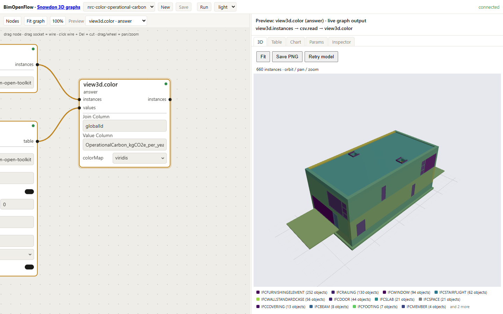
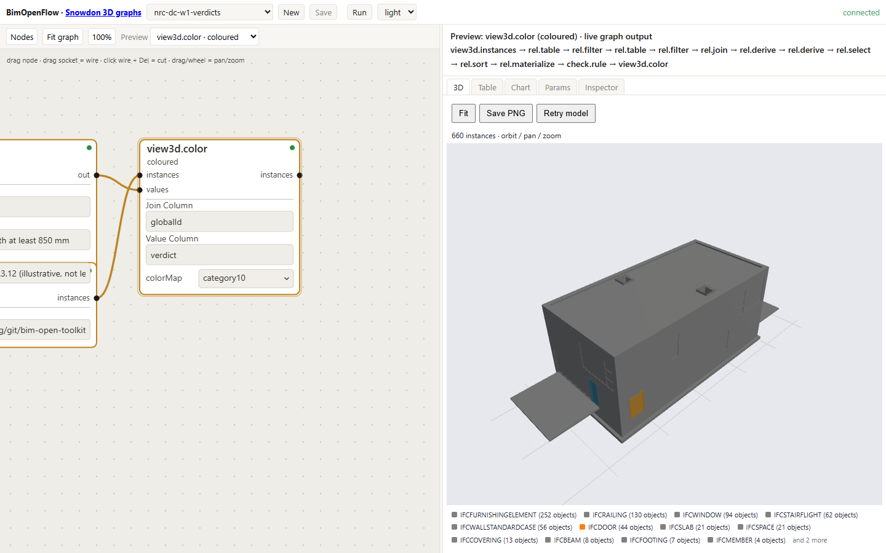
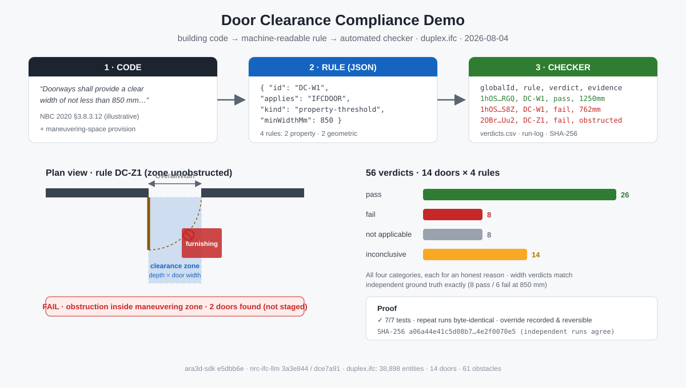

# Storing, displaying, and querying building analytics on IFC models with a large language model agent layer

**Version 2.** Christopher Diggins, Ara 3D / Studio 2.5. Prepared for the National Research Council of Canada. 2026-10-04.

## Abstract

Building performance analytics such as embodied carbon, operational carbon, and energy use intensity are computed by tools outside the building information model and delivered as spreadsheets and reports that cannot be joined back to the geometry, validated against an information requirement, or interrogated in plain language. This paper addresses three connected questions for openBIM workflows built on the Industry Foundation Classes (IFC): where analytics should be stored so that they travel with the model, how they should be displayed on the geometry, and how a large language model (LLM) can be placed in front of an enriched model so that it may be queried in natural language.

The storage answer is an analytics contract: a metric dictionary from which the element property sets, the storey and building summary sets, the aggregation graph, and the agent's own view of the model are all derived, so that no total can be mistaken for an element value. Version 1 of this paper recommended the property sets without that dictionary, and an unattended language model found the consequence: three of its four wrong answers came from summing aggregates as if they were elements. Version 2 reports the fix, the test that asserts it, and the rerun. The display answer is colour, a property panel, and aggregates driven from the same tables the analytics are stored in. The query answer is a small typed read-only tool surface over the Model Context Protocol (MCP), backed by a columnar copy of the model in DuckDB, with every answer carrying its derivation and absence reported as a verdict rather than a silent pass.

The evidence is a proof of concept on the buildingSMART Duplex Apartment model (38,898 STEP entities). The enrichment writes 2,441 typed values in 659 property sets byte-exactly and reproducibly from a dataflow run. Eight natural-language questions were answered by hand (7 of 8), by `gpt-5` unattended on the version 1 file (4 of 8), and by Claude Haiku 4.5 unattended in three runs on each file: 7 of 8 in every run on the version 2 file, the eighth being a question whose expected answer this paper disputes, against 5, 6, and 4 of 8 on the version 1 file, where the misses fall exactly where the storage defect predicts. The same tool surface scored 62 of 100 on IFC-Bench, an external benchmark over public building models from 16 projects, and the 29 wrong answers led to three toolkit defects that were fixed. Four accessible-door-clearance rules evaluated over 14 doors gave 56 verdicts in all four categories, byte-identical across runs, with rule DC-W1 matching independently derived ground truth door by door. The eight answers, the figure counts, the enrichment bytes, and the verdicts are asserted by tests in two repositories, and a push that changes one of the eight answers fails their continuous integration; the model runs and the benchmark are recorded as transcripts and scored by a committed script.

## 1 Introduction

The National Research Council of Canada (NRC) produces analytics on building models: operational carbon, embodied carbon, energy use, and related indicators. These are computed by simulation and life-cycle assessment tools whose inputs may derive from an IFC model but whose outputs are not written back to it. Three activities become difficult once the results have left the model. A designer who opens the model looking for the walls carrying the most embodied carbon will not find them there. A downstream tool cannot locate the results without the original tool and its project file. And a question such as "what is the total operational carbon on Level 2" requires a person who understands both the analysis tool and the model.

The components needed already exist. The IFC schema [1] has several mechanisms for attaching data to elements. The Information Delivery Specification (IDS) [2] can state which results a delivered model must carry. Language models can turn a question into a query. What is absent is a settled practice for combining them, and the obvious combination, handing the IFC file to the language model, does not work at the scale of real models.

The statement of work [20] sets three objectives, and the paper follows them: storage (Section 3), display (Section 4), and querying (Section 5), with the evidence in Section 6, the limitations in Section 7, and what should be built next in Section 8.

### 1.1 What is new in version 2

Version 1 of this paper (2026-09-19) made the storage recommendation, ran the proof of concept, and reported in its own results that the recommendation had a defect: the aggregates written on storeys and the building carried the same property names as the element values, so an agent that summed or ranked everything carrying a property counted a total as an element. Version 2 reports the following, all executed between 2026-09-27 and 2026-10-04 in the open-source BIM Open Toolkit [8] at its tagged release `v0.1`:

- The storage recommendation is restated as an **analytics contract** centred on a metric dictionary (Section 3.4). Summary sets have their own names and their own property names, and are computed by a graph from the element values rather than supplied by the data generator. A test asserts the defect's absence: summing the element operational-carbon property over every entity that carries it, with no class filter, returns the element total.
- The enrichment is **a dataflow run**, not a console program: one graph reads the element values and the dictionary, computes the summary rows, and writes 2,441 values into a copy of the model; a test asserts that a fresh run reproduces the committed file byte for byte (Section 3.5).
- The eight questions were **rerun unattended with Claude Haiku 4.5** through the Claude Code command line, several times each, on the regenerated file and, as a control, on the version 1 file (Section 6.2). The comparator that scores them is a committed script.
- The tool surface was **measured on an external benchmark**, IFC-Bench [35], 100 questions over public building models from 16 projects, with ground truth written by someone else (Section 6.3). Three toolkit defects the wrong answers exposed were fixed.
- The paper's numbers are **guarded by continuous integration** in two repositories: the toolkit's tests assert the eight answers and the figure counts on every push, and this paper's repository checks the enrichment, the answers, and every path it names into the toolkit (Section 6.5).

Five contributions are offered. The first is a comparison of twelve storage mechanisms available within IFC 4.3 and an analytics contract, dictionary first, that makes aggregates derived rather than declared (Section 3). The second is an argument, supported by an implementation and two measurements, that the language model should be placed behind a small typed read-only tool surface over a columnar copy of the model rather than reading the IFC file (Sections 5 and 6). The third is a byte-exact, reproducible write-back path, run as a dataflow graph, by which analytics, verdicts, and human overrides may be added to a client's file without altering any other byte (Sections 3.5 and 6.4). The fourth is a reproducibility apparatus for a research paper whose claims are software behaviour: a tagged tested set of the toolkit and its eight pinned dependencies, tests that assert the published numbers, a check that fails when the paper's text drifts from the code, and a costed list of what remains (Sections 6.5 and 8).

## 2 Background

IFC is an ISO standard schema for building information, ISO 16739-1:2024 [1], most often exchanged as STEP text files: a list of numbered entities, each element carrying a `GlobalId` intended to be stable across exports, placed in a hierarchy of project, site, building, storey, and space. A property set (`IFCPROPERTYSET`) is a named group of typed single-value properties attached to elements through a relationship entity. Standard sets are prefixed `Pset_`; custom sets may be defined by anyone.

Three consequences shape everything that follows. Property names are effectively the schema, so two tools that both write `EmbodiedCarbon` may disagree on units, stage, and method. The file is a text serialisation of an object graph, so reading one fact requires parsing the whole file; the Duplex model has 38,898 entities and larger buildings run to millions. And writing is fragile, because most IFC libraries load the file into their own object model and re-serialise it, changing numbering and formatting throughout, so a client who receives an enriched file cannot easily see what changed.

An IDS file states, for a class of objects (its applicability), what those objects must contain (its requirements), and validators report a pass or fail per element. NRC already maintains an IDS framework, so any property set recommended here should be one an IDS can require. The applicability-plus-requirements shape is also the shape of a code-compliance rule, which Section 6.4 exploits.

Practical systems give a language model tools rather than the file: functions with typed arguments and results that the runtime executes. MCP [7] is an open standard for describing and calling such tools, so a server written once serves any MCP-capable client. A survey of seven IFC MCP servers extant in mid-2026 [24] found none that offered persistent element sets, joins with external tables, or analytics written back to the file.

The proof of concept is built on the BIM Open Toolkit [8], MIT licence, which since 2026-10-03 is the hub of a family of repositories: BIM Open Schema (BOS) [9], a columnar representation of a model with one Parquet table each for entities, parameters, relations, and geometry; BIM Open Data, the .NET libraries that read and mesh IFC, convert it to BOS and DuckDB, edit property sets byte-exactly, and serve the IFC MCP server; BIM Open Flow, the dataflow engine, node packs, headless host, web editor, and dataflow MCP server; BIM Open Viewer, the WebGL viewer; and BIM Open Notebook. In BimOpenFlow a graph is a JSON document whose nodes are pure functions from tables to tables, and four operations (`addNode`, `connect`, `setParam`, `removeNode`) back the HTTP API, the MCP tools, and every gesture in the web editor. Nodes that write files run only inside an explicit run, which records the graph hash and every input hash. The toolkit's release `v0.1` pins one commit of each repository and is the version cited throughout this paper.

## 3 Storage: an analytics contract for IFC

### 3.1 Requirements on a storage mechanism

An analytics value is more than a number. To be reusable it needs the element or container it describes, identified by `GlobalId`; the metric; the unit; the lifecycle stage or time basis, such as A1 to A3 or annual; the scenario; and the run that produced it. Each candidate mechanism is judged on how much of this it carries and on portability (does the value travel with the file), queryability (can a tool or language model find it without special knowledge), interoperability (do other IFC tools read it), and scalability (does it still work for thousands of metrics or time series).

### 3.2 The twelve mechanisms

The options brief [21] examines twelve mechanisms. Table 1 scores ten rows: mechanisms 7 and 8 of the brief, library references and classification references, behave alike and share a row, and mechanism 11, visualisation metadata such as colour and legend properties, is a presentation hint rather than a store and is not scored.

**Table 1** The mechanisms within IFC 4.3 for carrying analytics, scored on four properties (ten rows for the brief's twelve mechanisms).

| Mechanism | IFC basis | Portability | Queryability | Interop. | Scalability |
|---|---|---|---|---|---|
| Custom property sets | `IfcPropertySet` | High | High | Med–high | Medium |
| Standard environmental sets | `Pset_EnvironmentalImpactIndicators` | High | High | Medium | Medium |
| Element quantities | `IfcElementQuantity` | High | High | High | Medium |
| Material properties | `IfcMaterialProperties` | High | Medium | Medium | High |
| Spatial aggregates | Property sets on space, storey, building | High | High | Medium | High |
| External dataset reference | `IfcDocumentReference` plus join key | Medium | Very high | Medium | Very high |
| Library and classification refs | `IfcLibraryInformation`, bsDD | Medium | Medium | Med–high | High |
| Performance history | `IfcPerformanceHistory` | Medium | Medium | Low–med | Medium |
| Constraints and metrics | `IfcMetric`, `IfcObjective` | Medium | Medium | Low–med | Medium |
| Custom schema extension | New entity types | Low | Custom only | Low | Medium |

Custom property sets are the simplest and most widely readable, in that almost every viewer displays them and "colour by property X" is a standard viewer feature. The external dataset reference is the only one that scales, in that a Parquet or DuckDB table holds millions of rows without inflating the IFC. No single mechanism satisfies all four properties, so three are used together, and version 2 adds the rule that binds them.

### 3.3 Three layers

**Layer 1: summary values in custom property sets.** The scalar values that people inspect, filter by, colour by, and ask about are written into property sets on elements and spatial containers, one set per topic: `Pset_NRCEmbodiedCarbon`, `Pset_NRCOperationalCarbon`, and `Pset_NRCEnergyPerformance` on elements, `Pset_NRCStoreySummary` and `Pset_NRCBuildingSummary` on containers, and `Pset_NRCAnalyticsProvenance` on the project. Every set carries `ScenarioName` and `AnalysisRunId`, so a value can never be separated from its run. Units and lifecycle stages are carried in the property names, as in `EmbodiedCarbon_A1A3_kgCO2e`, so the meaning survives tools that drop the IFC unit assignment.

**Layer 2: a reference to the full dataset.** An `IfcDocumentReference` on the project names the external result table, its format, checksum, and join key. The table is long-format, one row per run, element, and metric (`AnalysisRunId, GlobalId, IfcClass, MetricId, MetricName, Value, Unit, LifecycleStage, Scenario, Source, Confidence, ComputationMethod`), so new metrics never require a schema change. Parquet is recommended; CSV is acceptable for small datasets. The toolkit's writer for the reference exists and is tested; the proof-of-concept file names the dataset through the provenance set and does not yet carry the reference entity itself (Section 7).

**Layer 3: a metric dictionary.** A short versioned list of metric identifiers to which every Layer 1 property and every Layer 2 `MetricId` is mapped. In version 1 this was a document. In version 2 it is the file every other part of the contract is generated from, which is the subject of the next section.

### 3.4 The dictionary as the single source

The defect version 1 reported is worth restating, because the fix is a design rule and not a rename. The storey and building aggregates were written with the element sets' names and the element properties' names. A reader who knew the convention excluded the container classes in every query; an agent that did not know it summed a storey's total together with the storey's elements and doubled every figure (Section 6.2). The hand-driven session avoided the error because the author carried the convention in his head, which is exactly the kind of knowledge a file should not require of its reader.

The contract now has one source, `nrc-metrics.csv`, with one row per metric and level. Table 2 shows it in full; the proof of concept has fifteen rows.

**Table 2** The metric dictionary, `nrc-metrics.csv`, version `NRC-metrics-0.2`. Every value is synthetic.

| MetricId | Level | Property set | Property | Unit | Stage | Rollup |
|---|---|---|---|---|---|---|
| NRC.EC.A1A3.TOTAL | element | Pset_NRCEmbodiedCarbon | EmbodiedCarbon_A1A3_kgCO2e | kgCO2e | A1–A3 | none |
| NRC.EC.A1A5.TOTAL | element | Pset_NRCEmbodiedCarbon | EmbodiedCarbon_A1A5_kgCO2e | kgCO2e | A1–A5 | none |
| NRC.OC.ANNUAL | element | Pset_NRCOperationalCarbon | OperationalCarbon_kgCO2e_per_year | kgCO2e/yr | B6 | none |
| NRC.GRID.FACTOR | element | Pset_NRCOperationalCarbon | GridEmissionFactor_kgCO2e_per_kWh | kgCO2e/kWh | B6 | none |
| NRC.EUI.ANNUAL | element | Pset_NRCEnergyPerformance | EnergyUseIntensity_kWh_per_m2_year | kWh/m2/yr | B6 | none |
| NRC.COUNT.ELEMENTS | storey | Pset_NRCStoreySummary | ElementCount | count | | count |
| NRC.EC.A1A3.TOTAL | storey | Pset_NRCStoreySummary | TotalEmbodiedCarbon_A1A3_kgCO2e | kgCO2e | A1–A3 | sum |
| NRC.EC.A1A5.TOTAL | storey | Pset_NRCStoreySummary | TotalEmbodiedCarbon_A1A5_kgCO2e | kgCO2e | A1–A5 | sum |
| NRC.OC.ANNUAL | storey | Pset_NRCStoreySummary | TotalOperationalCarbon_kgCO2e_per_year | kgCO2e/yr | B6 | sum |
| NRC.EUI.ANNUAL | storey | Pset_NRCStoreySummary | MeanEnergyUseIntensity_kWh_per_m2_year | kWh/m2/yr | B6 | mean |
| NRC.COUNT.ELEMENTS | building | Pset_NRCBuildingSummary | ElementCount | count | | count |
| NRC.EC.A1A3.TOTAL | building | Pset_NRCBuildingSummary | TotalEmbodiedCarbon_A1A3_kgCO2e | kgCO2e | A1–A3 | sum |
| NRC.EC.A1A5.TOTAL | building | Pset_NRCBuildingSummary | TotalEmbodiedCarbon_A1A5_kgCO2e | kgCO2e | A1–A5 | sum |
| NRC.OC.ANNUAL | building | Pset_NRCBuildingSummary | TotalOperationalCarbon_kgCO2e_per_year | kgCO2e/yr | B6 | sum |
| NRC.EUI.ANNUAL | building | Pset_NRCBuildingSummary | MeanEnergyUseIntensity_kWh_per_m2_year | kWh/m2/yr | B6 | mean |

Four things are derived from this file and from nothing else.

1. **The element property-set rows.** A graph places each value of the long-format table into the set and property the dictionary names for its metric at element level. An element with no value for a metric gets no set for it; the roof, which has no embodied-carbon value, carries no `Pset_NRCEmbodiedCarbon`. A dictionary property with no value in the table takes the run-level fact of the same name from a second small file, `nrc-run.csv`, which holds the run identifier, scenario, grid emission factor, and the provenance fields once.
2. **The summary rows.** A second graph places every element on one storey through a view that walks containment, aggregation, and membership, groups by storey and by building, and aggregates each metric by its `Rollup` rule, rounded to its `Decimals`. Nothing in the input supplies a total; a total is something a graph computes.
3. **The agent's view.** The IFC MCP server exposes the dictionary as a table, `MetricCatalog`, read from the file the model's provenance set names in `MetricDictionaryURI`. The agent's guide says to resolve a metric through it before querying, to aggregate the element-level property only, grouped by storey through the elements-only view, and to say so when a figure was read from a summary set instead.
4. **The information requirement.** An IDS specification for Layer 1 is generated from the same rows: element classes require the element sets with typed values and a run identifier, storeys require the storey summary, the project requires provenance. This is the one derivation not yet implemented (Section 8).

The defect is now a test. Over the regenerated file, summing `OperationalCarbon_kgCO2e_per_year` across every entity that carries it, with no class filter, returns 37,196.2, the element total, and not a multiple of it; and no `Pset_NRC` element set exists on any `IfcBuildingStorey` or `IfcBuilding`. Both assertions run in the toolkit's test suite on every push.

### 3.5 Writing as a reproducible run

Layer 1 requires writing into a client's IFC file, and Section 2 noted that most libraries re-serialise the whole file. The toolkit's editing library instead treats the source as bytes, finds the highest entity identifier and the owner-history entity, and appends new entities: N `IFCPROPERTYSINGLEVALUE` lines, one `IFCPROPERTYSET`, and one `IFCRELDEFINESBYPROPERTIES` per element and set. Each new entity's `GlobalId` is a deterministic hash of a caller-supplied key, so running the writer twice produces the same bytes. An entity-level diff reports exactly which entities were added, and a remove operation strips them again.

In version 1 a console program called this library over a CSV of rows. In version 2 the enrichment is a graph, `nrc-enrich-run`, whose nodes are the two derivations above feeding a `sink.writePsets` node that writes typed values (`IFCREAL`, `IFCINTEGER`, `IFCLABEL`, `IFCIDENTIFIER`, `IFCTEXT`) into a copy of the unenriched model. The sink runs only inside an explicit run, which records the graph hash and the content hash of every input. The rows are ordered by entity, set, and property, which is unique, so a run writes the same bytes every time, and a test asserts that a fresh run reproduces the committed enriched file byte for byte. Table 3 compares the two enrichments.

**Table 3** The two enrichments of the Duplex model.

| | Version 1 (2026-09-17) | Version 2 (toolkit `v0.1`) |
|---|---|---|
| Written by | `EnrichIfc` console program over `psets_to_write.csv` | a run of the `nrc-enrich-run` graph over the element table and the dictionary |
| Property sets | 664 | 659 |
| Property values | 2,438 | 2,441 |
| Entities enriched | 224 (218 elements, 4 storeys, building, project) | 224 |
| Aggregates | element set and property names, on storeys and the building | `Pset_NRCStoreySummary`, `Pset_NRCBuildingSummary`, `Total*` and `Mean*` properties, plus `ElementCount` |
| Aggregates supplied by | the data generator | computed by the `nrc-rollup` graph from element values |
| Reproducibility | diff exact, reversible, second run identical (checked by script in CI) | a test asserts a fresh run equals the committed file byte for byte |
| Metric dictionary | a table in the paper | `nrc-metrics.csv`, named by the file's provenance set, served to the agent as `MetricCatalog` |

The practical consequence for NRC is unchanged and stronger: an enriched file can be returned to a model author with a diff listing the additions and nothing else, the author can recover the original exactly, and anyone with the model, the element table, and the dictionary can regenerate the enriched file and get the same bytes.

### 3.6 Recommendation

Six measures, restated for version 2:

1. Write summary analytics into custom property sets on elements and on spatial containers, with container sets and properties under their own names, and never reuse an element property name for an aggregate;
2. Put units, stage, scenario, run identifier, and provenance in every set;
3. Reference the full result table from the IFC by `IfcDocumentReference`, joined on `GlobalId` and stored as Parquet;
4. Publish the metric dictionary as a versioned file beside the model, named from the provenance set, and derive the element sets, the summary sets, the agent's view, and the IDS from it rather than maintaining them by hand;
5. Compute aggregates from element values inside the write-back run, by byte-exact patch rather than re-serialisation, so that additions are auditable, reversible, and reproducible;
6. Express measures 1 to 4 as an IDS specification generated from the dictionary, so that delivered models may be validated before any query runs.

Measures 1, 2, 4, and 5 are implemented and tested at `v0.1`. Measure 3 has a tested writer that the enrichment run does not yet call. Measure 6 is future work.

## 4 Display of analytics on IFC geometry

Three techniques show a number on a building. Colour coding maps each element's value through a gradient for numeric metrics or a palette for categories and verdicts, and is the most immediate view. Text annotation shows the value in a property panel when an element is selected; panels are universal, whereas scene labels are rare in free viewers and clutter quickly. Aggregated views sum by storey, zone, or category and show a table or chart beside the model, and this is the view on which decisions are taken. A working display presents all three.

The display may be driven from the property sets of Layer 1, in which case any viewer that colours by property works but shows only what was written into the file, or from the external table of Layer 2, in which case the viewer joins the table to the geometry on `GlobalId` and colours by any column of any scenario without rewriting the IFC. The toolkit's dataflow graph takes the second approach. A three-node graph loads the instances of a model, reads a value table, and colours the instances by a chosen column through a chosen colour map; instances with no match in the table are drawn grey, so missing data is visible rather than silently zero. Changing the column re-colours the model without touching the file, and an aggregate node grouped by storey feeds a bar chart or table from the same graph. Since version 1 the three colouring graphs of the proof of concept were merged into one, whose two parameters the walkthrough sets per figure the way a person would from the parameter panel.

_Figure 1 The enriched Duplex model coloured by operational carbon (synthetic values) through a viridis gradient. The graph on the left is the whole description. Captured 2026-09-18; the element values are unchanged in version 2._

_Figure 2 Rule DC-W1, requiring a leaf width of at least 850 mm: 8 pass and 6 fail, coloured on the 14 doors. The rule is evaluated by a rule node inside the same graph that colours the model._

When an element is picked, the pane lists its property sets, and the analytics sets appear beside the authoring tool's own sets because they are ordinary property sets in the file. The same path holds on a real building: the private Snowdon Towers sample, 456,598 instances, is coloured by category and its 142-door schedule is built from two DuckDB query nodes.

The viewer inventory [23] shortlists Bonsai (Blender), xBIM Xplorer, That Open Components, IFClite, FreeCAD NativeIFC, BIMvision, FZKViewer, and the toolkit's own web viewer. All but FreeCAD (partial) colour by property, and all have a property panel; FZKViewer cannot colour from an external table, and the others need a script or plug-in to do it, except the toolkit's, where it is a dataflow join. A seven-step test kit exists, and only the toolkit row has been run through it; a template graph that joins any CSV to any IFC on a key column and reports the rows that matched nothing on either side now exists in the toolkit as the first step of running the kit on NRC's own data.

**Recommendation.** Drive colour from a value table joined on `GlobalId`, draw unmatched elements grey, show the selected element's Layer 1 sets in a standard property panel, and provide a per-storey and per-category aggregate beside the model from the same table. For a screenshot-level deliverable, write Layer 1 sets and use any viewer that colours by property; for an interactive deliverable, use the toolkit's graph and viewer. Bonsai should be the reference desktop viewer for verification, because it exposes the full IFC through IfcOpenShell and reproduces the join in a few lines of Python.

## 5 The language model and agent layer

A question such as "what is the total operational carbon on Level 2" requires finding the storey entity, following containment to its elements, following each element's property relationship to its set, reading the value, and summing. In a file of 38,898 entities those entities are scattered, and the file exceeds any model's context window. Even where a file fits, a language model reading STEP text does arithmetic by pattern matching and produces plausible rather than correct totals. The alternative is tools, so that the model reasons over results that are small, structured, and correct.

### 5.1 Design principles

Four principles were derived from running varied questions against the implementation and reading the transcripts; the fifth was added in version 2 from the measurements of Section 6.

- **Few, typed, read-only tools.** A server exposing the whole IFC API as 200 tools gives the model too many ways to be wrong. The implementation exposes 29 tools grouped by question shape, of which the unattended runner hides four that write files or manage several models. Every SQL tool accepts one read-only statement; `DROP`, `INSERT`, and statement chaining are rejected, and the rejection is tested.
- **A columnar copy rather than the object graph.** The IFC is converted once per session to BOS and loaded into DuckDB. Questions become SQL over text views that resolve the interned string and enum codes into readable names and values, which a model writes reliably.
- **Questions run in the opposite direction.** Per-element tools ("what does element N carry") are the wrong shape for almost every real question ("which elements are load bearing"). An inverted parameter index answers those in a single call. Without it the model made one call per element.
- **Answers carry their derivation.** Every list result reports its unpaged total, so the model can tell a complete answer from a truncated one. In the dataflow surface a run record pins the graph hash and every input hash, so a number arrives with a means of recomputing it.
- **The file tells the agent how to read it.** The provenance set names the metric dictionary, the server serves the dictionary as a view, and the guide tells the agent to resolve metrics through it and to aggregate element-level values only. The knowledge that version 1 carried in a person's head is carried in the file and in one paragraph of the guide.

### 5.2 The tool surface and the guide

The IFC MCP server exposes data tools (entities, attributes, properties, quantities, relations, spatial tree), geometry tools (meshes, bounds, volumes), and analytics tools (convert to BOS, list tables, run read-only SQL, export). The guide the agent receives as its system prompt is a page long. It names the views and their columns, including `StoreyOfEntity`, which maps every entity to its storey and a storey to itself, and `StoreyOfElement`, the same view with the self-mapped rows removed, with the instruction to use the second for any total per storey. It sets the rules of evidence: every number must come from a tool result read in the conversation; every total, sum, average, and count is computed in SQL and never by the model; the answer names the tool and the row count it came from; and "not available" is a correct answer when the property, set, or geometry is absent, with no estimate and no substitution of a related property. The guide is one file, embedded in the unattended runner and read by interactive sessions, so an edit changes both.

### 5.3 The dataflow surface

The second surface is the BimOpenFlow MCP server, whose six tools (`describeDatabase`, `getNodeCatalog`, `editGraph`, `evaluate`, `getResult`, `createRun`) include `editGraph`, which applies the same four operations that back the web editor. A question becomes a graph of small nodes rather than one SQL string, the graph persists where a person can open and edit it, the next question ("now only the doors") is an edit to the same graph, and the graph that colours the model is the same kind of object, so "colour Level 2 by the values just summed" is one further node. Making this work on large models required a schema summary the model can afford to read, a single call to apply a list of edits, and a host-side check that every node evaluated and the answer table has rows. On the toolkit's own test database, twelve requests produced ten correct graphs, one honest answer without a graph, and one correctly empty graph with an explanation; these figures are not a measurement of the carbon-and-energy task.

### 5.4 Compliance as a query

A code rule is a query with a verdict column. A `check.rule` node takes a table of element rows and a Boolean expression and appends `verdict`, `checkId`, `checkTitle`, and `citation`. True yields `Pass`; false yields `Fail`, or `NeedsReview` where a second expression says so; a null result, meaning the required fact was absent, yields `InfoNotAvailable`. Absence is reported and never skipped. The verdict table is an ordinary table that may be coloured onto the model, summed per storey, written to an HTML report on a run, or written back into the IFC. The door-width rule of Section 6.4 exists in this form as a seeded graph, and its 8 pass and 6 fail are asserted by a test.

### 5.5 Recommendation

Place the model behind a small typed read-only tool surface; convert the IFC once to columnar form and answer with SQL over text views; provide inverted parameter tools; make every answer carry its derivation; let the file name its own dictionary and serve it to the agent; treat compliance checks as queries with a verdict column in which missing data is an explicit verdict; and use MCP so one server serves a chat client, a custom agent, and the web editor alike. Measure the agent on questions whose expected answers are computed by code, repeatedly, and on at least one question set written by someone else.

## 6 Evidence

Both case studies use the buildingSMART Duplex Apartment model [18], IFC2X3, 38,898 entities, two storeys, 14 doors, 61 furnishing elements. The toolkit is cited at its release `v0.1` (2026-10-04) unless a date says otherwise. Before either study, automated tests exercise conversion, table listing, paged SQL, read-only enforcement, text views, and export against the FZK-Haus model [19], with the server run as a live subprocess over stdio.

### 6.1 The enrichment

The analytics are synthetic, as Section 7 restates: each of the 218 physical elements received a type-based embodied carbon value with deterministic jitter, and the test kit's operational carbon and energy intensity columns were reused. The roof deliberately received no embodied-carbon value. The version 1 enrichment (Table 3, left column) added 3,766 entities to the file; the entity diff listed exactly those, removing them restored the source byte for byte, and a second run produced identical bytes, which this paper's repository re-checks on every push. The version 2 enrichment (right column) is the toolkit's committed `duplex-enriched.ifc`, which its test suite regenerates from a run and compares byte for byte on every push.

### 6.2 The eight questions

Eight questions at building, storey, component, category, provenance, and absence level were fixed in version 1 and have not changed. Their expected answers are computed by a script from the element table alone, without the IFC file and without the server, and are committed as `expected_answers.json`; the toolkit's tests assert the same eight values from graphs over its copies of the data.

The questions have now been answered four ways, all with the same question text and the same tool surface:

- **Hand-driven**, 2026-09-17, the author choosing tool calls over the version 1 file, every call recorded.
- **Unattended, `gpt-5`**, 2026-09-18, one fresh conversation per question, over the version 1 file, 35 tool calls in all.
- **Unattended, Claude Haiku 4.5** (`claude-haiku-4-5-20251001`, medium effort), 2026-10-04, through the Claude Code command line with the IFC MCP server as its tools, one fresh conversation per question, over the **version 2 file**, 3 runs.
- **The same, as a control, over the version 1 file**, 3 runs, so that the difference between the two files can be read against the same model and the same guide.

A committed script, `score_unattended.py`, scores every unattended answer against the expected values with one rule per question (a number within 0.1 %, a list as a set, an absence as a stated absence) and prints the rule beside the verdict; Table 4 gives its output, with the hand-driven and `gpt-5` columns as version 1 reported them.

**Table 4** The eight questions: expected against returned. Claude columns give matches out of runs; the rule the scorer applied is in the second column.

| # | Question and rule | Hand-driven, v1 file | `gpt-5`, v1 file | Claude Haiku 4.5, v1 file (control) | Claude Haiku 4.5, v2 file |
|---|---|---|---|---|---|
| Q1 | Total operational carbon, building: states 37,196.2 | Match | Match | 1 of 3 (2 miss) | 3 of 3 |
| Q2 | Higher mean energy intensity, L1 or L2: Level 2 named, means 40.56 and 40.50 stated | Miss | Match | 3 of 3 | 3 of 3 |
| Q3 | Five highest operational carbon elements: the five values, no container ranked | Match | Miss | 0 of 3 (3 miss) | 3 of 3 |
| Q4 | Carbon of door `M_Single-Flush:0762 x 2032mm`: 54.0 stated; listing all four is a match | Match | Match | 3 of 3 | 3 of 3 |
| Q5 | Operational carbon per category: top three totals by category or IFC class, no container rows | Match | Partial | 1 of 3 (2 partial) | 3 of 3 |
| Q6 | Which run, and when: run-2026-09-17-01 and 2026-09-17 stated | Match | Match | 3 of 3 | 3 of 3 |
| Q7 | Embodied carbon of the roof: absence stated first; an embodied value given as the answer is a miss | Match | Miss | 1 of 3 (1 miss, 1 partial) | 0 of 3 (3 miss) |
| Q8 | Embodied carbon per storey: 49,451.2; 48,696.8; 11,761.3; 5,821.0 stated | Match | Miss | 3 of 3 | 3 of 3 |
| | **Matches** | 7 of 8 | 4 of 8 | 5, 6, 4 of 8 per run | 7, 7, 7 of 8 per run |

On the version 2 file every run matched the same seven of eight, and the one miss was Q7 each time: once the agent read "the roof" as the storey named Roof and reported that storey's summary total (5,821.0 kgCO2e, naming `Pset_NRCStoreySummary` and the storey entity), and twice it read it as the slab whose predefined type is ROOF and reported that slab's own values (1,838.5 and 2,059.1), naming the entity. Neither is the aggregate defect. Both are the question's ambiguity on a model that has a storey, an assembly, and a slab all called roof, and the absence the question was written to test is reported only when the agent lands on the `IFCROOF` entity, as the control did once ("Not available. The roof element in this model does not have embodied carbon properties assigned to it").

On the version 1 file the three runs matched five, six, and four of eight, and the misses are the defect version 1 reported, now observed on a second model family. In two of three runs Q1 summed the operational-carbon property "across all 223 building elements that carry this property" and returned 111,589 kgCO2e per year, three times the building total, because the four storeys and the building each carried a copy under the element's name. In all three runs Q3 ranked the building and the four storeys as the five highest elements. In two of three runs Q5 listed `IFCBUILDINGSTOREY` and `IFCBUILDING` as categories at 37,196.2 each. Q8 matched in every run on both files, because the guide's elements-only storey view already excluded the storeys' own rows, which is the toolkit-side mitigation version 1 described; the file-side fix removes the need for it and, as Q1 shows, the mitigation did not cover a sum that never groups by storey.

The six runs used 2.9 million input tokens and 65 thousand output tokens in all, between 42 and 51 turns per run of eight questions. The version 2 file costs more input per run (523 to 563 thousand tokens against 373 to 471 thousand) because the agent reads the metric catalogue and both summary sets before it queries, which is the behaviour the guide asks for.

Two observations from version 1 still hold and are restated because they shaped the contract. Q4 is ambiguous by name, four doors sharing the Revit family name; every agent so far has listed all four rather than choosing one silently, and the scorer counts that as a match. Q7, the absence question, is the one on which the expected answer was arguably wrong: the generator wrote no set on the `IFCROOF`, but the roof is an assembly whose slab member received values, and an agent that reports the member's value and says which entity carries it has answered better than "not available". The scorer therefore counts a stated absence as a match and a member value given beside it as partial, and the absence test in a future question set should use an element with no analysed descendants.

### 6.3 An external benchmark: IFC-Bench

The eight questions were written by the author over data the author generated. On 2026-10-03 the same tool surface and the same guide were run against IFC-Bench [35], a public benchmark of 1,026 natural-language questions over 22 projects (a project is one building, delivered as one or more IFC models) in four categories (direct retrieval, aggregation, geometric, and information not available), each with a ground-truth answer written by its authors. The models whose licences permit it (CC BY 4.0 or MIT, 16 of the 22 projects) were downloaded at a pinned dataset revision; none is committed. A subset of 100 questions, stratified so that each category keeps its share of the whole (15, 55, 11, and 19), over the eligible projects' models of at most 80 MB, was run with Claude Haiku 4.5 at medium effort, with at most 30 turns per question (a turn is one model response, with or without a tool call), through the same command-line path as Section 6.2.

**Table 5** IFC-Bench, 100-question subset, Claude Haiku 4.5, 2026-10-03.

| Category | Questions | Correct |
|---|---|---|
| 1 Direct retrieval | 15 | 8 |
| 2 Aggregation | 55 | 39 |
| 3 Geometric | 11 | 3 |
| 4 Information not available | 19 | 12 |
| **Total** | **100** | **62** (29 wrong, 7 unresolved, 2 at the turn limit) |

The run cost $6.79 at list price and 46 minutes of wall time at three sessions at a time. A deterministic comparator settled 38 questions; an evaluating agent reviewed all 100, and its verdicts have not yet been checked by the author, which Section 7 records.

The value of the benchmark was in the 29 wrong answers, which were read one by one. Three toolkit defects came out of them, two in the layer that reads the file into tables and one in the agent's guide:

1. **Duplicate property sets doubled totals.** The DigitalHub Revit exports attach two property sets of the same name with the same values to every pipe and duct, and the converter wrote both, so a sum over a plumbing model counted each length twice. The converter, the parameter index, and the properties tool now read each (set, name, value) once per element and keep differing values.
2. **Material layers were invisible.** A material's name was read from the wrong attribute, layer thickness was dropped, constituents were excluded, the quantity set in which Revit reference-view exports keep each layer's width was not parsed, and the STEP `\X\` escape was not decoded. Layers and constituents now carry thickness, material, set, and position.
3. **The guide let the model add.** Two answers listed the right areas and then summed them wrongly in prose. The guide now says every total is computed in SQL, which is the rule Section 5.2 states.

After the fixes, the eight questions those defects had failed were rerun: four correct, two wrong for reasons of their own, two awaiting the author's reading of the ground truth, all judged by the same evaluating agent that made the fixes and not yet by the author. The paper draws two conclusions. First, an external question set finds defects an internal one cannot, because the internal set is written by the people who know where the data is. Second, two of the three defects were in how the file was read into tables, which is the layer this paper recommends putting between the model and the agent, and which is therefore the layer to test; the third became the rule in Section 5.2 that every total is computed in SQL.

### 6.4 Door clearance: from code text to verdicts

This study was executed on 2026-08-04 and independently re-run on 2026-08-05; every claim is backed by a test or commit in the demonstration record [26]. Four provisions modelled on the accessible-door requirements of NBC 2020 [6] were expressed in a JSON rule file, each with an identifier, a citation labelled illustrative, an applicability filter (entity type and optional storey), requirement parameters, and verdict semantics (Table 6).

**Table 6** The four rules and their verdict totals over 14 doors.

| Rule | Requirement | Pass | Fail | N/A | Inconclusive |
|---|---|---|---|---|---|
| DC-W1 | `OverallWidth` of at least 850 mm | 8 | 6 | 0 | 0 |
| DC-W2 | `Pset_DoorCommon.ClearWidth` of at least 850 mm | 0 | 0 | 0 | 14 |
| DC-M1 | Width in type name agrees with `OverallWidth` within 25 mm | 14 | 0 | 0 | 0 |
| DC-Z1 | Manoeuvring zone in front of door free of furnishing; Level 1 only | 4 | 2 | 8 | 0 |

_Figure 3 The three stages of the door-clearance study: a code provision, its JSON rule, and the checker's verdict records, with the plan-view zone test of rule DC-Z1._

A small engine evaluates every rule against every door and emits one record per pair, sorted by `GlobalId` then rule identifier so the output does not depend on file order. A threshold rule returns `Inconclusive` where the property is absent. The zone rule composes the door's placement chain into an axis-aligned box and tests each furnishing element's origin against it.

Before the checker was written, a separate agent in a separate commit extracted every door's identifiers, name-encoded and declared dimensions, and storey [27]. All 14 doors carry both attributes, the two agree to the millimetre, and widths are 2 at 1250 mm, 6 at 864 mm, 4 at 762 mm, and 2 at 813 mm, predicting 8 pass and 6 fail for DC-W1. The checker matched door by door. All four verdict categories occur for real reasons: DC-W2 is inconclusive everywhere because the model's authors never wrote `ClearWidth`, and the storey filter marks the 8 Level 2 doors not applicable. DC-Z1 found two Level 1 doors with a furnishing element in the manoeuvring zone, a condition that was not staged.

The evaluation runs twice from scratch in the test suite and the SHA-256 of the verdict CSV is asserted identical; a fresh-process re-run the next day gave the same hash. A failing 762 mm door then receives an `Ara3D_Compliance` set carrying `Verdict`, `OverrideVerdict`, `OverrideReason`, and `ReviewedBy`, appended to a copy of the model. The test asserts that the diff lists exactly the added entities, that removing them restores the source byte for byte, and that the source is never modified. Since version 1 the same rule exists as a dataflow graph (Section 5.4) whose verdicts are coloured onto the model in Figure 2 and asserted by a test.

### 6.5 The reproducibility apparatus

A paper whose claims are software behaviour drifts from the software unless something fails when it does. Four mechanisms now hold this paper to its code.

- **A tagged tested set.** The toolkit is built from eight other repositories, each moving on its own schedule. Its `v0.1` tag marks one combination of commits that passed, on a fresh clone with no files outside the repositories, the release build, every test that needs no private data, the host and web smoke checks, and the notebook's own checks. This paper's repository pins the toolkit submodule at that tag and fetches the eight dependencies at the tag's pins.
- **The answers are tests.** The toolkit's `NrcWorkflows` test project (70 tests at `v0.1`) evaluates every proof-of-concept graph and asserts the eight expected answers, the storey walk, the DC-W1 verdicts, the row and colour counts behind every Duplex figure, and the byte-for-byte enrichment, on every push to the toolkit. This paper's repository runs the same project from the pinned submodule on every push, re-runs the version 1 enrichment and checks its diff and hash, and checks the eight expected answers against the element table and three of them against the property sets inside the enriched file, without calling any model.
- **The text is checked against the code.** A script scans every Markdown, script, and configuration file in this paper's repository for paths into the toolkit and fails when one does not exist at the pinned commit, resolving `deps/<name>/` paths through the toolkit's dependency pins. When the toolkit split into separate repositories on 2026-10-03, this check named every reference that had to move.
- **Runs are recorded, not described.** Every unattended run writes a Markdown transcript with every tool call and its result, and a JSON file the scorer reads. The transcripts in this paper's repository are the evidence for Table 4, and the scorer that produced the table is committed beside them.

A push that changes one of the eight answers fails continuous integration in both repositories. That is the property version 1 asked for and version 2 has.

### 6.6 What the studies show together

The door-clearance study exercises every part of the recommended architecture except the language model: values read from the file, a rule as data, verdicts keyed by `GlobalId` with evidence, results written back byte-exactly, and reproducibility by hash. The eight-question study places the language model in front of the same tools, and IFC-Bench places it in front of 22 models nobody here authored. All were deliberately built on one table shape, so that a verdict and a carbon value are the same kind of object: a row keyed by `GlobalId` that may be coloured, summed, asked about, and written back. The contract of Section 3 is what makes the row's meaning travel with it.

## 7 Limitations

**Of the proof of concept.** Both studies use one small public model whose Revit family names encode dimensions, which assisted ground truth; NRC's models will not necessarily do so, and rule DC-M1 will likely need a geometric measurement. The analytics are synthetic: correct in shape, units, and join key, but not derived from an analysis tool, and NRC has supplied no model, dataset, or IDS at the time of writing. The question set has no space or zone level, although the statement of work names zone level and an energy model's operational results arrive per thermal zone rather than per wall; the Duplex model has 21 spaces and no zones. DC-W1 tests leaf width rather than clear width, the zone rule tests origins rather than meshes, and the citations are illustrative and unreviewed by a code authority.

**Of the storage recommendation.** Custom property sets are a convention, not a standard; two organisations writing `Pset_NRCEmbodiedCarbon` with different stages produce files that look compatible and are not. The dictionary is the mitigation and the IDS generated from it is not yet implemented. The `IfcDocumentReference` of Layer 2 has a tested writer that the enrichment run does not yet call, so the proof-of-concept file names its dataset only through the provenance set. Units in property names are robust but redundant with `IfcUnitAssignment`. An external reference detects substitution through its checksum but not absence.

**Of the measurements.** The eight questions were answered by one model family unattended in version 2, in three runs on each file; that is a measurement of repeatability on one model and one question set, not of reliability across models. The IFC-Bench subset is 100 of 1,026 questions, its verdicts on the 62 non-deterministic cases were made by an evaluating agent and not yet checked by the author, and four category 4 questions remain disputed between the answer and the ground truth. The dataflow accuracy figures of Section 5.3 were obtained on the toolkit's test database, not on carbon questions. On questions with no single reading, the models tested chose an interpretation rather than asking; the host's check catches empty answers, not wrong interpretations.

**Of the platform.** The IFC loader targets `net8.0-windows`, so the full proof of concept runs only on Windows, and the host is local, single-user, and unauthenticated. The language model is reached through the Claude Code command line on a signed-in machine rather than an API account, which is the owner's decision and means the measurement cannot be repeated without such a machine.

**Of the display recommendation.** The viewer comparison has one row from the test kit. For the others it rests on documented capabilities, and the toolkit row is the only one whose external-table colouring is a join rather than a script, which favours it by construction. Figures 1 and 2 were captured on 2026-09-18 from the version 1 file; the element values they colour are unchanged in version 2, but the captures have not been regenerated.

## 8 Future directions

The toolkit's own proposal for what it still owes this work [36] lists eight pieces, P1 to P8. Since it was written, P1, the analytics contract and rollup, is complete, and the template join graph of P5 exists; P4 asked for sixteen questions in five runs each and this paper reports eight in three; the external benchmark of Section 6.3 was outside the proposal. The rest are in the order below.

**Space and zone level.** Views `SpaceOfElement` and `ZoneOfSpace` beside the storey view; a zone writer beside the property-set writer; a synthetic zone table for the Duplex grouping its 21 spaces; zone-level operational values in the data; and a ninth question with a known answer, "which zone has the highest energy use intensity".

**IDS generated from the dictionary.** An IDS 1.0 file for Layer 1 produced from `nrc-metrics.csv`, a second expressing rule DC-W1 to show that a threshold rule is an IDS, an evaluator over the columnar tables that yields `InfoNotAvailable` with a warning for any facet it does not support, a `check.ids` node emitting the standard verdict table, and a parity run against IfcOpenShell's `ifctester` on the same file. Done when the roof, which deliberately lacks embodied carbon, fails, and `dc-w1.ids` gives 8 pass and 6 fail.

**The agent measured on a larger set.** Sixteen questions across four levels and three metrics plus absence, provenance, ambiguity, and an IDS question, each naming the graph that computes its expected answer, five runs each, with the score table committed whatever it shows. Then the full IFC-Bench set once its cost is approved, and the author's review of the agent-judged verdicts.

**Enrichment as a run that leaves evidence.** One run over the enrichment graph that also writes the Parquet table, the `IfcDocumentReference` with the table's checksum, the IDS verdicts as a warning table, and an evidence package listing the enriched IFC, the Parquet, the IDS, the verdicts, and the entity diff with a SHA-256 each.

**Labels and the handover bundle.** A `view3d.label` node drawing a column as screen-space text, the first figure being each storey's total operational carbon over its slab; and a Windows bundle built from the tagged toolkit, with the host, both MCP servers, the page, the files, graphs, figures, transcripts, and a reviewer's README, so that a machine with only a browser runs it.

**Performance as its own target.** Measure cold and warm conversion, DuckDB build, warm evaluation of every proof-of-concept graph, first rendered frame, and host memory for the Duplex and for the test kit's 49 MB public model; set budgets; gate them.

**Knowledge graphs and world models.** The columnar tables are a graph flattened into edge lists, and converting them to RDF using the Building Topology Ontology [4] is mechanical, with the dictionary as the predicate vocabulary. The gain is joins outside the building, to product databases, climate zones, and regulation text; the cost is tooling, since a language model writes SQL more reliably than SPARQL at present. The columnar form should remain the working representation with an RDF export published from it. A learned "world model" that predicts embodied carbon from partial geometry needs a ground truth to train and audit against, and the enriched, versioned, reproducible models this pipeline produces are what that ground truth looks like.

**A bidirectional viewer.** The toolkit's WebGL viewer knows nothing of IFC; the graph feeds it instance tables with colour columns, and the byte-exact writer returns property sets to the file. What is absent is the set of operations that would let an agent drive the viewer: `select` and `get_selection`, `color_by`, `isolate`, `hide`, `section`, `set_viewpoint` and `get_viewpoint` exportable as BCF [3], `annotate`, `snapshot` with the graph hash that produced it, and `write_psets`. Each is a graph node as well as a tool. Four stages follow: the viewer as a graph sink (largely complete); selection as data; write-back from the viewer, with the entity diff shown before it is applied; and multiple models with history. Throughout, every file write goes through the byte-exact path inside a run, and one set of operations serves the mouse, the HTTP API, and the agent.

## 9 Conclusion

Summaries belong in the file and the full data beside it, and the file should say how it is to be read. Custom property sets carry the scalar values people inspect, with units, stage, scenario, and run identifier in every set; summary sets on storeys and the building carry totals under names that cannot be confused with element values; an `IfcDocumentReference` points to a long-format Parquet table for everything else; and a metric dictionary, named from the file and served to the agent, is the one source the sets, the summaries, and the information requirement are generated from. Writing is a byte-exact patch performed by a reproducible run, so an enriched file differs from the original only in what was added, the additions can be removed to recover the original exactly, and the same inputs produce the same bytes.

Display should be driven from tables rather than from the file: one value table joined on `GlobalId` drives colour, selection detail, and per-storey aggregates from a single description, with unmatched elements grey.

The language model belongs behind tools, and its performance belongs in a table rather than a sentence. A small typed read-only surface over a columnar copy of the model lets it write queries that are correct, checkable, and inexpensive; the eight-question study, its control, and an external benchmark of 100 questions over 22 models show where it succeeds and where the data layer, not the model, was wrong. Compliance rules are queries with a verdict column, and missing data is a verdict rather than a silent pass.

What the client gains is not a viewer and not a checker but a shape for the data and a way to hold software to a paper: a row keyed by `GlobalId` that may be a carbon value, a verdict, or an override, and that may be coloured, summed, asked about, validated, and written back; and a tagged, tested, continuously checked set of code in which the answers, counts, and bytes printed here are assertions that fail when they stop being true, and the model runs are transcripts anyone can rescore.

## References

[1] ISO 16739-1:2024. Industry Foundation Classes (IFC). https://ifc43-docs.standards.buildingsmart.org/
[2] buildingSMART. Information Delivery Specification (IDS) 1.0, June 2024.
[3] buildingSMART. BIM Collaboration Format (BCF).
[4] Rasmussen, M. H., et al. BOT: The Building Topology Ontology. Semantic Web 12(1), 2021.
[6] National Research Council of Canada. National Building Code of Canada 2020.
[7] Model Context Protocol specification. https://modelcontextprotocol.io/
[8] Ara 3D. BIM Open Toolkit, MIT licence, release `v0.1` (2026-10-04). https://github.com/ara3d/bim-open-toolkit
[9] Ara 3D. BIM Open Schema. https://github.com/ara3d/bim-open-schema
[18] buildingSMART. Duplex Apartment sample model, IFC2X3, CC BY 4.0.
[19] Karlsruhe Institute of Technology. FZK-Haus reference model, `AC20-FZK-Haus.ifc`. https://www.ifcwiki.org/index.php/KIT_IFC_Examples
[20] Statement of Work, `statement-of-work.md`, this repository.
[21] Storing analytics in IFC: options brief, `storing-analytics-in-ifc.md`, this repository.
[23] IFC viewer inventory and test kit, `ifc-viewers.md` and `IFC-Test-Kit/README.md`, this repository.
[24] MCP tools that can wrap an IFC, `mcp-ifc.md`, this repository.
[26] Door clearance demonstration, `door-clearance-demo.md`, this repository.
[27] Door ground-truth dataset, `IFC-Test-Kit/door_ground_truth.md`, this repository.
[35] Hellin, S. IFC-Bench v2, revision `df630de`: 1,026 natural-language questions with ground-truth answers over 22 IFC models, CC BY 4.0. https://huggingface.co/datasets/sylvainHellin/ifc-bench
[36] Ara 3D. NRC deliverables: what the toolkit still owes the statement of work. `docs/proposals/nrc-deliverables.md` in [8] at `v0.1`.

Reference numbers follow version 1 and the full paper where the source is the same, so that the versions may be read side by side; [35] and [36] are new.
