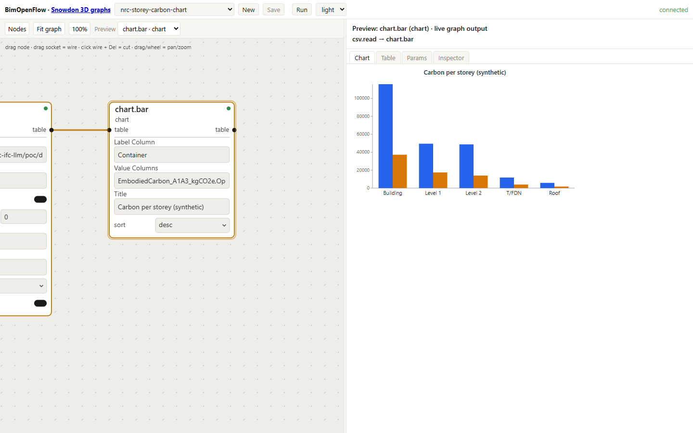
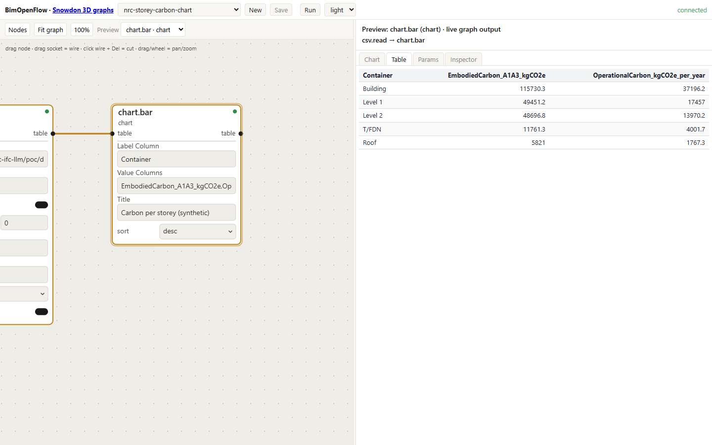
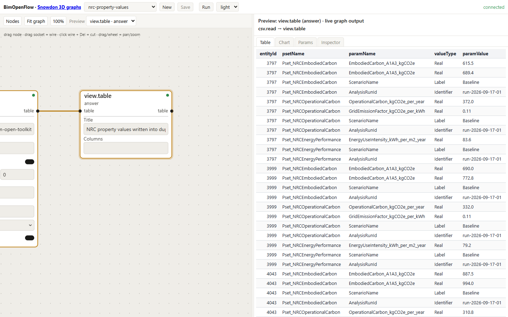
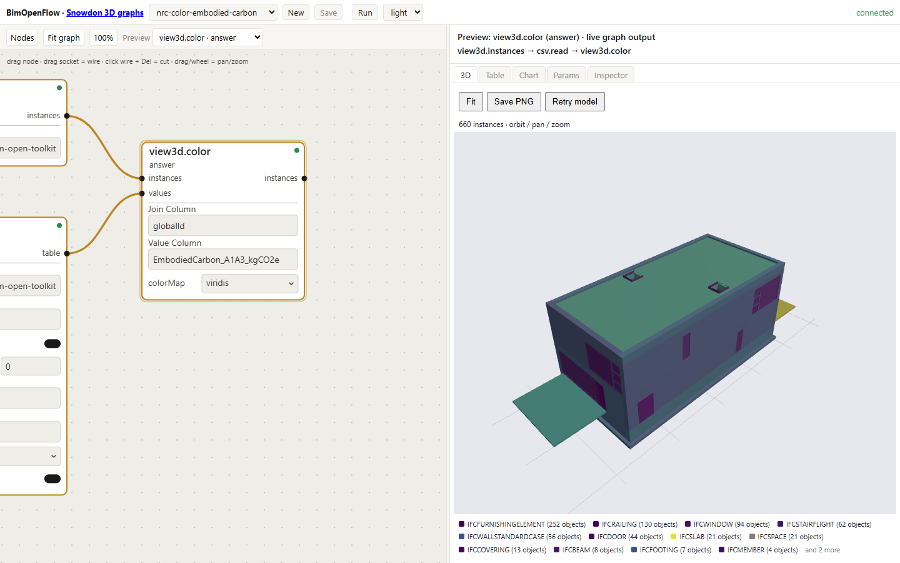
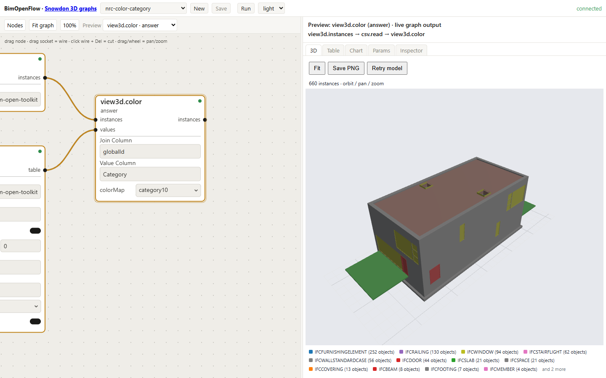
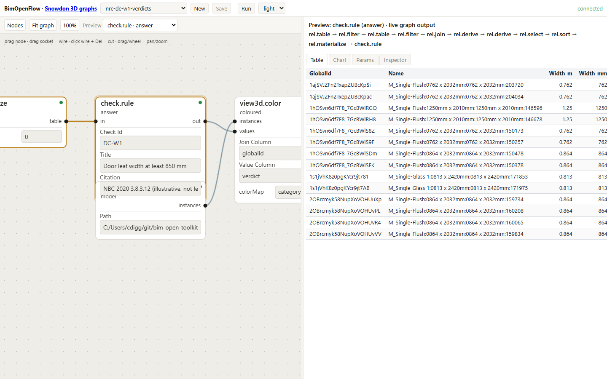
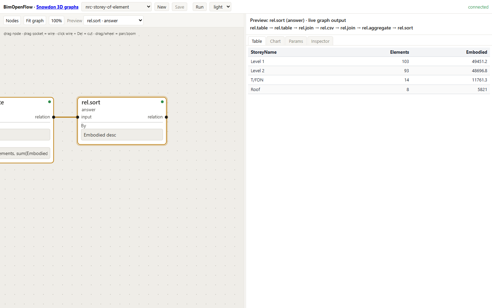
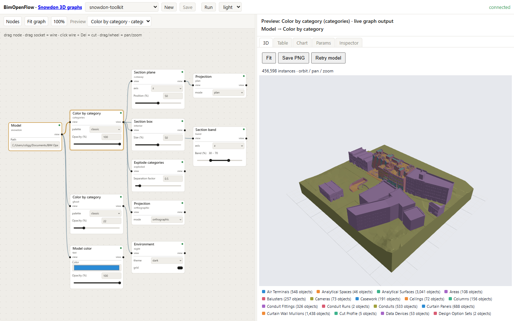
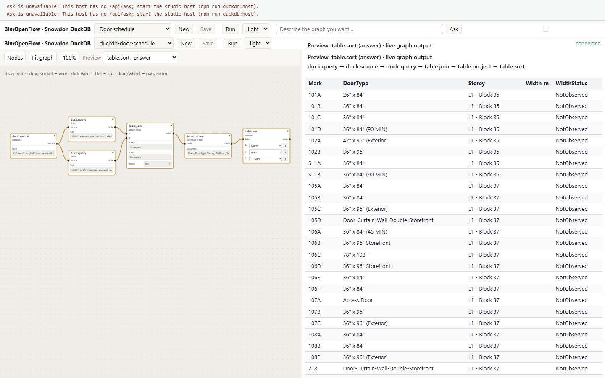

# Storing, Displaying, and Querying Building Analytics on IFC Models with an LLM Agent Layer

_Christopher Diggins, Ara 3D / Studio 2.5, for the National Research Council of Canada. Draft of 2026-09-16._

## Abstract

Building performance analytics such as embodied carbon, operational carbon, and energy use
intensity are usually computed by tools that sit outside the building information model. The
results end up in spreadsheets and reports that cannot be joined back to the geometry, cannot be
validated against an information requirement, and cannot be asked about in plain language.

This paper examines three connected questions for openBIM workflows built on the Industry
Foundation Classes (IFC): where analytics should be stored so that they travel with the model,
how they should be displayed on the geometry, and how a large language model (LLM) can be placed in
front of an enriched model so that people can query it in natural language.

We compare twelve storage options available within the IFC 4.3 schema and recommend a
three-layer approach: scalar summary values in custom property sets at element, space, storey,
and building level; a reference from the IFC file to a richer external columnar dataset joined
on `GlobalId`; and a small metric dictionary that fixes names, units, and lifecycle stages so
that queries resolve reliably. We survey display techniques and open-source viewers, and
recommend colour mapping and aggregated views driven by the same tables the analytics are
stored in.

For the query layer we argue against giving an LLM the raw IFC file, and for a small typed,
read-only tool surface exposed over the Model Context Protocol (MCP). We describe an
implementation that converts IFC to the columnar BIM Open Schema, loads it into DuckDB, and
exposes 29 tools, and a dataflow graph in which the agent builds queries, colourings, and rule
checks with the same four editing operations a person uses.

The proof of concept was carried out on the buildingSMART Duplex Apartment model. A rule
checker driven by a machine-readable provision file evaluated four accessible-door-clearance
rules over 14 doors, produced 56 verdicts in all four categories with per-element evidence,
matched an independently derived ground truth exactly, produced byte-identical output across
repeated runs, and recorded a human override inside the IFC file in a form that can be removed
to restore the original byte for byte. A second case study enriched the same model with synthetic carbon and energy
analytics (664 property sets, 2,438 typed values, written byte-exactly and reversibly), and
answered eight natural-language questions at building, storey, component, category, provenance,
and absence level through the tool surface, seven of them matching the independently computed
expectation; the values are illustrative, not measured, and the paper says so wherever one
appears.

We close with the limitations of the work, the extensions the statement of work anticipates,
including knowledge graphs and world-model substrates, and a roadmap for an open-source
viewer in which selection, colouring, and property write-back are first-class agent operations.
# 1. Introduction

## 1.1 The problem

The National Research Council of Canada (NRC) produces analytics on building models: operational
carbon, embodied carbon, energy use, and related performance indicators. These are computed by
simulation and life-cycle assessment tools whose inputs may be derived from an IFC model but whose
outputs are not written back to it. The numbers live in the tools' own databases, in CSV exports,
and in PDF reports.

Three things become hard once the results have left the model:

1. **Showing them.** A designer cannot open the model and see which walls carry the most embodied
   carbon, because the model does not know.
2. **Reusing them.** A downstream tool, or a later project phase, cannot find the results without
   the original tool and its project file. There is no standard place to look.
3. **Asking about them.** Questions such as "what is the total operational carbon on Level 2" or
   "which doors fail the clearance rule" require someone who knows both the analysis tool and the
   model.

The IFC schema has mechanisms that could hold these results. The Information Delivery
Specification (IDS) can state which results a delivered model must carry. Large language models
can turn a question into a query. None of these pieces is new, but there is no settled practice
for putting them together, and the obvious approach, handing the LLM the IFC file, does not
work at the scale of real models.

## 1.2 Questions this paper answers

The statement of work sets three objectives and a publication. The paper is organised around
them.

- **Storage.** Which IFC mechanisms should carry analytics, at component, zone, storey, and
  building level, so that the data is portable, reusable, and queryable? (Section 3)
- **Display.** How should analytics be shown on IFC geometry, and which freely available viewers
  and libraries support it? (Section 4)
- **Query.** How should an LLM-based layer be built so that it answers natural-language questions
  about an enriched model correctly, and so that its answers can be checked? (Section 5)
- **Evidence.** What does a working proof of concept look like, and what did it find? (Section 6)

## 1.3 Contributions

1. A comparison of twelve storage options within IFC 4.3, ranked on portability, queryability,
   interoperability, and scalability, with a three-layer recommendation and concrete property-set
   definitions (Section 3, Appendix A).
2. An argument, supported by an implementation, that the LLM should sit behind a small typed
   read-only tool surface over a columnar copy of the model rather than reading the IFC file, and
   a description of that surface (Section 5, Appendix C).
3. A byte-exact write-back path for property sets, so that analytics, verdicts, and human
   overrides can be added to a client's IFC file without altering any byte the writer did not
   intend to change (Sections 3.5 and 6.3).
4. An executed, reproducible demonstration on a public model: a machine-readable provision file,
   a checker, four verdict categories, independently derived ground truth, hash-verified
   determinism, and a reversible override recorded in the IFC (Section 6).
5. A roadmap for an open bidirectional viewer in which selection, colouring, viewpoints, and
   write-back are operations an agent can call (Section 9).

## 1.4 Scope and exclusions

The proof of concept is a minimal one. It is not a production viewer, not a certified compliance
checker, and not a replacement for the client's analysis tools. Geometry authoring is out of
scope. The models used are public samples; NRC's own models and analytics datasets, once
supplied, will be used to repeat the runs reported in Section 6.

## 1.5 How to read this paper

Sections 3 and 4 are the options analysis (deliverable D1) and can be read on their own.
Sections 5 and 6 describe the proof of concept (deliverable D2). Sections 7 to 9 look forward.
Readers who want only the recommendations should read Sections 3.6, 4.4, and 5.6.
# 2. Background

This section gives the minimum needed to follow the rest of the paper. Readers familiar with
IFC, IDS, and MCP can skip to Section 3.

## 2.1 IFC and its property mechanisms

IFC is an ISO standard (ISO 16739) schema for building information, most often exchanged as
STEP Physical Files (`.ifc`). A file is a list of numbered entities. Each building element is an
entity such as `IFCDOOR` or `IFCWALL`, with a `GlobalId` that is meant to be stable across
exports and tools. Elements are placed in a spatial hierarchy of project, site, building,
storey, and space through `IFCRELCONTAINEDINSPATIALSTRUCTURE`.

IFC has several ways to attach data to an element, and Section 3 compares them. The one that
matters most for this paper is the property set. A property set (`IFCPROPERTYSET`) is a named
group of properties; a single-value property (`IFCPROPERTYSINGLEVALUE`) carries a name, a typed
value, and an optional unit; and a relationship (`IFCRELDEFINESBYPROPERTIES`) attaches the set
to one or more elements. Standard sets are prefixed `Pset_`; anyone may define custom sets.

Three consequences shape everything that follows.

- **Property names are the schema.** Two tools that both write `EmbodiedCarbon` as a property
  can still disagree on units, lifecycle stage, and method. Portability of the file does not
  give portability of the meaning.
- **The file is a text serialisation of an object graph.** Reading any one fact requires
  parsing the whole file. The Duplex Apartment model used in this paper has 38,898 entities;
  larger buildings run to millions.
- **Writing is fragile.** Most IFC libraries load the file into their own object model and
  re-serialise it, which changes entity numbering, formatting, and sometimes content. A client
  who receives an "enriched" file that differs everywhere from the one they sent has no easy
  way to check what changed.

## 2.2 Information Delivery Specification

IDS is a buildingSMART standard (IDS 1.0, June 2024) for machine-readable information
requirements. An IDS file states, for a class of objects (its applicability), what those
objects must contain (its requirements): a property with a certain name and permitted values,
a classification, a material, an attribute. Validators check an IFC file against an IDS and
report pass or fail per element.

For this project IDS matters in two ways. NRC already has an IDS framework, so any property
set the paper recommends should be one an IDS can require. And the applicability-plus-
requirements shape of an IDS specification is the same shape as a code-compliance rule, which
Section 6 uses. The repository document [ids.md](../ids.md) gives a longer introduction.

## 2.3 Linked data and IFC-LBD

The Linked Building Data community expresses building information as RDF graphs, using
ontologies such as BOT (Building Topology Ontology) and mappings from IFC (IFC-LBD, ifcOWL).
This representation is well suited to joining building data with other graphs and to
reasoning. It is included in the storage comparison in Section 3 and treated as a future
extension in Section 8, because the client's current workflow is file-based and the tooling for
LBD is less mature than that for IFC files and columnar tables.

## 2.4 Large language models as query interfaces

An LLM can turn a natural-language question into a structured query, but it has no reliable way
to read a 40,000-entity STEP file. Practical systems give the model tools: functions it may
call, with typed arguments and results, that do the reading. The Model Context Protocol (MCP)
is an open standard for describing such tools and calling them over a stream, so that any
MCP-capable client (Claude Code, other chat clients, or a custom agent) can use a server
written once.

The repository document [mcp-ifc.md](../mcp-ifc.md) surveys seven IFC MCP servers that existed
in mid-2026. They fall into three patterns: fixed query functions over one loaded file; a
generic selector plus generic edit operation; and arbitrary Python execution through IfcOpenShell
or Blender. None of them provided persistent element sets, joins with external tables, or
analytics written back into the file. Section 5 describes the design chosen here in that light.

## 2.5 BIM Open Schema and the toolkit used

The proof of concept is built on the open-source BIM Open Toolkit (MIT licence). Two parts of
it are used.

**BIM Open Schema (BOS)** is a columnar representation of a building model: one table each for
entities, parameters, relations, and geometry, with strings and numbers pooled. Parameters are
stored entity-attribute-value, one table per primitive type. Relations use a closed vocabulary
(`PartOf`, `ContainedIn`, `HostedBy`, `BoundedBy`) that covers both IFC and the Revit API. A
`.bos` file is a zip of Parquet tables and loads directly into DuckDB. A converter turns an IFC
file into BOS in one pass.

**BimOpenFlow** is a dataflow graph over those tables. Nodes are small pure functions from
tables to tables; a graph is a JSON document; and four operations (`addNode`, `connect`,
`setParam`, `removeNode`) back the HTTP API, the MCP tools, and every gesture in the web
editor. Nodes that write files, including the one that writes property sets into IFC, run only
inside an explicit run, and each run records the graph hash and every input by content hash.

The toolkit also contains a byte-exact IFC editing library, `Ara3D.Ifc.Editing`, which locates
entities by byte range in the source file and writes additions as an appended patch, so that
every byte the writer did not touch is preserved. This is the basis of the write-back path in
Sections 3.5 and 6.3.
# 3. Storage options and recommendation

This section answers the first objective: where should analytics live so that they are
portable, reusable, and queryable at component, zone, storey, and building level. It condenses
the longer options brief in [storing-analytics-in-ifc.md](../storing-analytics-in-ifc.md).

## 3.1 What "storing analytics in IFC" has to achieve

An analytics value is more than a number. To be reusable it needs, at minimum:

- the element or spatial container it describes (`GlobalId`);
- the metric (embodied carbon, energy use intensity);
- the unit;
- the lifecycle stage or time basis (A1 to A3, A1 to A5, annual);
- the scenario (baseline, retrofit option 2);
- the run that produced it, with the tool, method, and date.

Any storage option is judged on how much of this it can carry, and on four properties:
**portability** (does the value travel with the file), **queryability** (can a tool or an LLM
find it without special knowledge), **interoperability** (do other IFC tools read it), and
**scalability** (does it still work for thousands of metrics, many scenarios, or time series).

## 3.2 The twelve options

The options brief examines twelve mechanisms. They are summarised here; the brief gives the
IFC entity references and a fuller discussion of each.

| # | Option | Mechanism | Best for |
|---|---|---|---|
| 1 | Custom property sets | `IfcPropertySet` on elements and containers | Summary values for display and query |
| 2 | Standard environmental Psets | `Pset_EnvironmentalImpactIndicators` and related | Standards-aligned LCA fields |
| 3 | Element quantities | `IfcElementQuantity` | Takeoff inputs (areas, volumes) |
| 4 | Material properties | `IfcMaterialProperties` | Carbon factors, EPD data per material |
| 5 | Spatial aggregates | Property sets on space, storey, building | Dashboards and roll-ups |
| 6 | External dataset reference | `IfcDocumentReference` plus join key | Full analytics tables, time series |
| 7 | Library references | `IfcLibraryInformation` | Reusable metric definitions |
| 8 | Classification references | `IfcClassificationReference`, bsDD | Semantic tagging of metrics |
| 9 | Performance history | `IfcPerformanceHistory` | Operational, time-based performance |
| 10 | Constraints and metrics | `IfcMetric`, `IfcObjective`, `IfcConstraint` | Targets and pass/fail |
| 11 | Visualisation metadata | Colour and legend properties | Presentation hints |
| 12 | Custom schema extension | New entity types | Research; not portable |

Two of the twelve stand out. Option 1 is the simplest and the most widely readable: almost every
IFC viewer shows property sets, and "colour every element by property X" is a standard viewer
feature. Option 6 is the only one that scales: an external Parquet or DuckDB table holds
millions of rows without bloating the IFC, and the IFC keeps a pointer and a join key. The
others are refinements that add meaning (7, 8, 10), cover a special case (3, 4, 9), or should
be avoided for a portability-first project (12).

## 3.3 Comparison matrix

| Option | Portability | Queryability | Interoperability | Scalability |
|---|---|---|---|---|
| Custom property sets | High | High | Medium to high | Medium |
| Standard environmental Psets | High | High | Medium | Medium |
| Element quantities | High | High | High | Medium |
| Material properties | High | Medium | Medium | High |
| Spatial aggregates | High | High | Medium | High |
| External dataset reference | Medium | Very high | Medium | Very high |
| Library and classification references | Medium | Medium | Medium to high | High |
| `IfcPerformanceHistory` | Medium | Medium | Low to medium | Medium |
| Constraints, objectives, metrics | Medium | Medium | Low to medium | Medium |
| Custom schema extension | Low | High with custom tools | Low | Medium |

Portability is scored on whether the value is inside the `.ifc` file. Queryability is scored on
whether a generic IFC parser, or an LLM with generic tools, can find it by name. Interoperability
is scored on how many existing viewers and checkers understand the mechanism.

## 3.4 The three-layer recommendation

No single option satisfies all four properties. The recommendation is to use three together,
each doing the job it is best at.

**Layer 1: summary values in custom property sets.** Write the scalar values that people look
at, filter by, colour by, and ask about, directly into property sets on elements and on spatial
containers. Use one set per topic so that a viewer's property panel stays readable and an IDS can
require the topic as a unit:

```text
Pset_NRCEmbodiedCarbon
Pset_NRCOperationalCarbon
Pset_NRCEnergyPerformance
Pset_NRCAnalyticsProvenance
```

Every set carries `ScenarioName` and `AnalysisRunId` so that a value can never be separated from
the run that produced it. Units and lifecycle stages are in the property names
(`EmbodiedCarbon_A1A3_kgCO2e`) so that they survive tools that drop the IFC unit assignment.
Appendix A gives the full definitions.

**Layer 2: a reference to the full dataset.** Attach an `IfcDocumentReference` to the project
(or to the building) that names the external result table, its format, its checksum, and the
join key. The external table is long-format, one row per (run, element, metric), so that new
metrics never require a schema change:

```text
AnalysisRunId, GlobalId, IfcClass, MetricId, MetricName, Value, Unit,
LifecycleStage, Scenario, Source, Confidence, ComputationMethod
```

Parquet is the recommended format: it is columnar, compressed, typed, and loads into DuckDB,
pandas, and every lakehouse tool. CSV is acceptable for small datasets and for human
inspection.

**Layer 3: a metric dictionary.** Define a short list of metric identifiers and map each property
name in Layer 1 and each `MetricId` in Layer 2 to one of them:

```text
NRC.EC.A1A3.TOTAL      Embodied carbon, stages A1 to A3, kgCO2e
NRC.EC.A1A5.TOTAL      Embodied carbon, stages A1 to A5, kgCO2e
NRC.OC.ANNUAL          Operational carbon, kgCO2e per year
NRC.EUI.ANNUAL         Energy use intensity, kWh per m2 per year
NRC.GWP.MATERIAL_FACTOR Global warming potential factor per material unit
```

The dictionary can be published as an IFC library reference, as a bsDD domain, or simply as a
versioned JSON file shipped with the IDS. Its purpose is to give the query layer (Section 5)
one place to resolve "carbon" to a column, and to give an IDS one vocabulary to require.

## 3.5 Writing property sets without disturbing the file

Layer 1 requires writing into a client's IFC file. Section 2.1 noted that most libraries
re-serialise the whole file. The toolkit's editing library instead treats the source file as
bytes, finds the highest entity id and the owner-history entity, and appends new entities. For
one element and one property set it emits N `IFCPROPERTYSINGLEVALUE` lines, one
`IFCPROPERTYSET`, and one `IFCRELDEFINESBYPROPERTIES`. The `GlobalId` of each new entity is a
deterministic hash of a caller-supplied key, so running the writer twice produces the same
bytes.

```csharp
var original = IfcSourceFile.Load(sourcePath);
var builder = new IfcPropertySetBuilder(
    original.MaxId + 1,
    original.FirstIdOfType("IFCOWNERHISTORY"));

builder.AddPropertySet(wall.Id, "Pset_NRCEmbodiedCarbon",
    new[]
    {
        IfcPropertyValue.Real("EmbodiedCarbon_A1A3_kgCO2e", 412.7),
        IfcPropertyValue.Label("ScenarioName", "Baseline"),
        IfcPropertyValue.Label("AnalysisRunId", "run-2026-07-14-01"),
    },
    guidKey: $"analytics:{wall.GlobalId}:Pset_NRCEmbodiedCarbon");

File.WriteAllBytes(targetPath, IfcPatcher.Append(original, builder.Lines));
```

An entity-level diff (`IfcDiff.Compare`) then reports exactly which entities were added, and
`IfcPatcher.Remove` takes them out again. Section 6.3 shows this round trip verified byte for
byte on the Duplex model. The same path is exposed as the `sink.writePsets` node in the dataflow
graph, where it runs only inside an explicit run.

The practical consequence for NRC is that an enriched file can be given back to a model author
with a diff that lists the additions and nothing else, and the author can strip the additions
and recover their original file exactly.

## 3.6 Recommendation in brief

1. Write summary analytics into custom property sets on elements, spaces, storeys, buildings,
   and the project, using the definitions in Appendix A.
2. Put units, lifecycle stage, scenario, run id, and provenance in every set.
3. Reference the full result table from the IFC with an `IfcDocumentReference`, joined on
   `GlobalId`, stored as Parquet.
4. Publish a small metric dictionary and map every property and metric id to it.
5. Write with a byte-exact patch, never a re-serialisation, so that additions are auditable and
   reversible.
6. Express items 1 to 4 as an IDS specification so that delivered models can be validated.

Items 1, 3, and 5 are implemented and tested in the toolkit. Item 4 is a document. Item 6 is
future work (Section 8).
# 4. Display options and recommendation

This section answers the second objective: how analytics should be shown on IFC geometry, and
what freely available software supports it. The viewer inventory in
[ifc-viewers.md](../ifc-viewers.md) lists the candidates; this section selects among them.

> **Status.** Every figure in this section was captured on 2026-09-18 by the toolkit's
> walkthrough script (`scripts/nrc-walkthrough.mjs`, toolkit commit `66df499`) from the seeded
> graphs in `samples/nrc-analyses`; the captures and their captions are indexed in
> [poc/results/walkthrough-index.md](../poc/results/walkthrough-index.md). The 3D views load
> because the toolkit's IFC-to-BOS converter now drops a non-finite instance transform
> (toolkit commit `53a69d9`) and the web loader hides one instead of rejecting the model
> (`53129a8`). The comparison matrix in 4.3 has one row filled, the toolkit's own viewer; the
> other viewers have not been run through the [test kit](../IFC-Test-Kit/README.md).

## 4.1 Three ways to show a number on a building

**Colour coding.** Each element is coloured by a value. Numeric values map through a gradient
(low to high embodied carbon); categorical values map to a palette (analysis category, pass or
fail). This is the most immediate view and the one every stakeholder understands.

**Text annotation.** The value is shown as text: in a property panel when an element is
selected, as a label in the 3D scene, or as a tooltip. Property panels are universal; scene
labels are rare in free viewers and clutter quickly.

**Aggregated views.** Values are summed or averaged by storey, zone, or category and shown as a
table or chart beside the model, or as a colouring of the containers themselves (storey slabs
coloured by total carbon). This is the view for decisions: which floor, which system, which
option.

The three are not alternatives. A working display shows all three: the model coloured by
metric, the selected element's values in a panel, and a per-storey table alongside.

## 4.2 Where the values come from

Section 3 stored values in property sets (Layer 1) and in an external table (Layer 2). The
display can be driven from either.

- **From property sets.** Any viewer that can colour by property works without extra software.
  This is the path for a screenshot-level demonstration and for handing a file to someone with
  their own viewer. Its limit is that it only shows what was written into the file.
- **From the external table.** The viewer, or a script in front of it, joins the table to the
  geometry on `GlobalId` and colours by any column. This shows any metric, any scenario, without
  rewriting the IFC. It requires a viewer with a scripting or data-binding interface.

The toolkit's dataflow graph does the second. A three-node graph loads the instances of a model,
aggregates or joins a value table, and colours the instances:

```json
{
  "nodes": [
    { "id": "inst",    "kind": "view3d.instances" },
    { "id": "values",  "kind": "csv.read" },
    { "id": "colored", "kind": "view3d.color" }
  ],
  "edges": [
    { "from": "inst.instances",  "to": "colored.instances" },
    { "from": "values.table",    "to": "colored.values" }
  ],
  "values": {
    "inst":    { "path": "{DATA}/duplex.ifc" },
    "values":  { "path": "{DATA}/analytics_dataset_with_levels.csv" },
    "colored": { "joinColumn": "GlobalId", "valueColumn": "operational_carbon", "colorMap": "viridis" }
  }
}
```

The `view3d.color` node maps a numeric column through a gradient normalised over its range, or a
text column through a categorical palette with indices assigned by sorted distinct value, so
that colours are stable when rows are reordered. Instances with no match in the value table are
drawn grey, which makes missing data visible rather than silently zero. Changing
`valueColumn` to `energy_intensity` or `colorMap` to `redgreen` re-colours the model without
touching the file.

Aggregated views come from the same graph: a `table.aggregate` node grouped by `Level` feeds a
`chart.bar` or a `view.table` node, and the same aggregate can feed a second `view3d.color`
that colours storeys. Figures 2 and 3 show the storey aggregates from the proof of concept as
a bar chart and as a table, from a two-node graph; Figure 4 shows the property values that
were written into the model, as a table.



_Figure 2. The storey aggregates of the synthetic dataset, drawn by a `chart.bar` node fed from
the storey CSV. The graph on the left is the whole description; the chart is its live output._



_Figure 3. The same node's output in the Table tab. Building, storey, and roof values are the
ones written into the corresponding IFC entities._



_Figure 4. The rows given to the byte-exact writer: entity id, set name, property name, IFC
value type, and value. Each row became one `IFCPROPERTYSINGLEVALUE`._

The 3D colourings of the Duplex model by these values are Figures 5 to 7. Each is a
three-node graph: `view3d.instances` over the enriched IFC, `csv.read` over the elements
table, and `view3d.color` joining them on `GlobalId`. Of the 218 analysed elements, 216 have
a mesh in the converted geometry and are coloured; openings and spaces have no row in the
table and are grey.


_Figure 5. `duplex-enriched.ifc` coloured by operational carbon (synthetic values) through a
viridis gradient normalised over the column. The graph on the left is the whole description._



_Figure 6. Embodied carbon A1-A3 (synthetic). The roof has no embodied-carbon set, so it stays
grey: the absence that Q7 asks about is visible without a query._



_Figure 7. The `Category` column through the categorical palette, nine categories, colours
assigned by sorted distinct value so they are stable across reorderings._

Verdicts are displayed the same way. Figure 8 is rule DC-W1 evaluated inside the graph by a
`check.rule` node over the door widths read from the model's own `OverallWidth`, then fed to
`view3d.color`; Figure 9 is the verdict table behind it.


_Figure 8. Rule DC-W1 (leaf width at least 850 mm): 8 pass, 6 fail, coloured on the doors of
the model. The chain in the preview header is the whole graph, from the two DuckDB views
through the rule to the colouring._



_Figure 9. The `check.rule` output: one row per door with `GlobalId`, the width read in
metres and millimetres, the verdict, and the citation._

Text annotation is the property panel. Figure 13 is a wall picked in the 3D pane: the pane
asks the host for that entity's property sets and lists them, the enrichment's
`Pset_NRCEmbodiedCarbon` and `Pset_NRCEnergyPerformance` among the authoring tool's own, with
the run identifier and scenario name the provenance convention requires.


_Figure 13. The picked element's property sets under the 3D view: name, class, `GlobalId`,
then one section per set. The analytics sets sit beside the Revit-exported ones because they
are ordinary property sets in the file._

Aggregates that depend on the spatial structure come from the `StoreyOfEntity` view added to
the toolkit's text views for this work; Figure 10 shows the elements per storey it produces,
including the 103 on Level 1 that the hand-driven session in Section 6.2 undercounted.



_Figure 10. Elements per storey, from a relation graph over the `StoreyOfEntity` view joined to
the elements table: Level 1 103, Level 2 93, T/FDN 14, Roof 8._

The same pane, graphs, and recipes run on a real building. Figure 11 is the private Snowdon
Towers sample, 456,598 instances, coloured by category through the `view3d.categoryStyle`
recipe node; the walkthrough captures it after the Duplex figures to show that nothing in the
display path is sized for the small public model.



_Figure 11. Snowdon Towers (private sample) coloured by category. The graph on the left composes
eleven recipe nodes; the browser applies the selected branch to the loaded model._

Aggregated views on the same building come from its typed DuckDB export rather than from
property sets: Figure 12 is the door schedule (142 doors) built from two `duck.query` nodes, a
join, and a sort, the graph the dataflow MCP server also builds from tool calls alone in the
walkthrough's last step.



_Figure 12. The Snowdon door schedule in the DuckDB workflow page: mark, type, storey, width in
metres, and why the width is missing when it is._

## 4.3 Viewer comparison

The test kit defines seven steps: load `duplex.ifc`, connect the analytics CSV on `GlobalId`,
test numeric and category colouring, display values for a selected element, test totals by
level, load a large model and record responsiveness, and record any preprocessing required.
The shortlist below is drawn from the inventory; a full row is filled in for each once the kit
has been run.

| Viewer | Licence | Platform | Colour by property | Colour from external table | Property panel | Aggregates | Scripting | Result |
|---|---|---|---|---|---|---|---|---|
| Bonsai (Blender) | GPL | Desktop | Yes | Yes, via Python | Yes | Via Python | Python, IfcOpenShell | to test |
| xBIM Xplorer | CDDL | Windows | Yes | Via plug-in | Yes | No | .NET | to test |
| That Open Components | MIT | Web | Yes | Yes, via JavaScript | Yes | Via code | JavaScript | to test |
| IFClite | MPL-2.0 | Web | Yes | Via code | Yes | No | JavaScript | to test |
| FreeCAD NativeIFC | LGPL | Desktop | Partial | Via Python | Yes | Via Python | Python | to test |
| BIMvision | Freeware | Windows | Yes | Plug-in | Yes | Limited | Plug-in API | to test |
| FZKViewer | Freeware | Desktop | Yes | No | Yes, strong | No | No | to test |
| BimOpenFlow viewer (toolkit) | MIT | Web | Yes (Figures 5 to 8) | Yes, native (Figures 5 to 8) | Yes, on pick (Figure 13) | Yes, native (Figures 2, 3, 10) | Graph and MCP | tested 2026-09-18: steps 1 to 5 of the kit pass; step 6 with the Snowdon model, 456,598 instances (Figure 11); step 7: IFC is converted to BOS once by the host and cached |

Speckle, listed in the statement of work, is a platform rather than a viewer; its web viewer
supports colouring by property and its connectors support custom data, and it should be
included in the test run.

## 4.4 Recommendation in brief

1. Use colour coding driven by a value table joined on `GlobalId`, with a gradient for numeric
   metrics and a categorical palette for classes and verdicts. Draw unmatched elements grey.
2. Show the selected element's Layer 1 property sets in a standard property panel; do not build
   custom scene labels for the proof of concept.
3. Provide an aggregated table or bar chart per storey and per category beside the model, from
   the same table that drives the colouring.
4. For a screenshot-level deliverable, write Layer 1 property sets and use any viewer that
   colours by property. For an interactive deliverable, use the toolkit's dataflow graph and
   web viewer, which do the join, the colouring, and the aggregation from one description.
5. Choose Bonsai as the reference desktop viewer for verification, because it exposes the full
   IFC through IfcOpenShell and can reproduce the join in a few lines of Python.
# 5. The LLM and agent layer

This section answers the third objective: how to build a layer in which a person asks a
question in plain language and receives a correct answer about an enriched model. The design
follows from one observation about what LLMs are and are not good at.

## 5.1 Why not give the model the file

An IFC file is a serialisation of an object graph. A question such as "what is the total
operational carbon on Level 2" requires finding the storey entity, following the containment
relationship to its elements, finding each element's property set relationship, finding the
set, finding the property, reading the value, and summing. In a 38,898-entity file the
relevant entities are scattered and the file is far larger than any model's context window.
Even where a file fits, a language model reading STEP text does arithmetic by pattern matching
and produces plausible rather than correct totals.

The alternative is to give the model tools. A tool is a function with a typed signature that
the model may call; the runtime executes it and returns the result. The model then reasons over
results that are small, structured, and correct. This is the design of every practical IFC MCP
server surveyed in [mcp-ifc.md](../mcp-ifc.md), and the design used here. The difference lies
in what the tools are.

## 5.2 Design principles

Four principles were applied. Each was learned from running varied questions against the
implementation and reading the transcripts; the toolkit's
[MCP demo notes](https://github.com/ara3d/bim-open-toolkit/blob/71790a7/docs/bim-flow-mcp-demo.md)
record the failures that motivated them.

**Few, typed, read-only tools.** A server that exposes the whole IFC API as 200 tools gives the
model too many ways to be wrong. The implementation exposes 29 tools grouped by question shape
(Appendix C). Every SQL tool accepts one read-only statement; `DROP`, `INSERT`, and statement
chaining are rejected, and the rejection is tested.

**Columnar copy, not the object graph.** The IFC file is converted once per session to BIM Open
Schema and loaded into DuckDB. Questions then become SQL over tables with text views, which a
model writes reliably. The conversion is the expensive step and happens once, not once per
question.

**Questions run the other way.** The per-element tools ("what does element N carry") are the
wrong shape for almost every real question ("which elements are load bearing", "`Height` for
all the windows"). An inverted parameter index, built once per session, answers those in one
call. Without it the model made one call per element.

**Answers carry their derivation.** Every list result reports its unpaged total, so the model
can tell a complete answer from a truncated one. In the dataflow surface, a question becomes a
graph, the graph is evaluated, and a run record pins the graph hash and every input by content
hash. A number comes with a way to recompute it.

## 5.3 The tool surface

The IFC MCP server has three groups of tools. The data tools answer questions about entities,
attributes, properties, quantities, relations, and the spatial tree directly from the parsed
file, without loading geometry. The geometry tools answer questions about meshes, bounds, and
volumes. The analytics tools convert the model to BOS, list the tables, run read-only SQL, and
export results.

A representative exchange, with the model's tool calls shown as they appear in a transcript:

```text
User:  Which storeys have the most operational carbon, and what is the total for each?

Agent: ifc_to_bos { path: "duplex.ifc" }
       -> { tables: 9, entities: 38898 }

Agent: ifc_sql { sql: "SELECT p.Value AS storey ... " }
       (reads the ContainedIn relations and the Pset_NRCOperationalCarbon values)

Agent: ifc_sql { sql:
         "SELECT storey, round(sum(oc), 1) AS total_kgCO2e_per_year, count(*) AS elements
            FROM element_carbon GROUP BY storey ORDER BY total DESC" }
       -> { total: 2, rows: [["Level 2", 12406.3, 141], ["Level 1", 11874.9, 127]] }

Agent: Level 2 has the higher total at 12,406 kgCO2e per year across 141 elements;
       Level 1 has 11,875 across 127. Values come from Pset_NRCOperationalCarbon
       on each element, run id run-2026-07-14-01.
```

The numbers in this exchange are illustrative of the shape of an answer, not measured results;
Section 6.2 will replace them with the recorded run.

## 5.4 The dataflow surface

The second surface is the BimOpenFlow MCP server. Its tools are the same operations that back
the web editor: `describeDatabase`, `getNodeCatalog`, `editGraph`, `evaluate`, `getResult`,
and `createRun`. A question becomes a graph of small nodes rather than one SQL string, and the
graph persists in a store where a person can open it, inspect each intermediate table, and
edit it.

This matters for three reasons. The person who asked can see how the answer was built. The
next question ("now only the doors") is an edit to the same graph. And the graph that colours
the model (Section 4.2) and the graph that answers the question are the same kind of object,
so "colour Level 2 by the values you just summed" is one more node.

Nine tactics made this work on small and large models alike. The four that matter most:

1. A schema summary the model can afford to read, with companion columns folded and empty tables
   given only a name and count.
2. A node guide in the system prompt: the expression language, the aggregate syntax, and the
   fact that `sql.query` exists for anything the table nodes cannot express.
3. One call to build a graph. Applying a list of edits at once and saving once cut input tokens
   per request from 2 to 4 million to 100 to 300 thousand.
4. A check by the host after the model says it is done: every node evaluated, an `answer` node
   present, rows in its table. An empty answer is reported back with the row count of every
   upstream node, and the model gets two more turns to fix it or to say honestly why the answer
   is empty.

On the toolkit's Snowdon test database, twelve requests over rooms, roofs, storeys, doors, and
lineage produced ten correct graphs, one honest answer without a graph, and one correctly empty
graph with an explanation, on a small model, and eleven correct graphs and one honest answer on
a mid-sized one. Where a hand-built graph existed for the same question, the counts matched.

## 5.5 Compliance as a query

A code-compliance rule is a query with a verdict column. The compliance node pack expresses this
directly. A `check.rule` node takes a table of element rows and a Boolean expression, and
appends four columns: `verdict`, `checkId`, `checkTitle`, and `citation`. A true expression is
`Pass`; false is `Fail` (or `NeedsReview` when a second expression says so); a null result,
meaning the fact needed was absent, is `InfoNotAvailable`. Absence is reported, never skipped.

```csharp
verdicts[i] = expr.Eval(lookup) switch
{
    null => Verdict.InfoNotAvailable,
    BooleanScalar { Value: true } => Verdict.Pass,
    _ => review?.Eval(lookup) is BooleanScalar { Value: true } ? Verdict.NeedsReview : Verdict.Fail,
};
```

The verdict table is an ordinary table. It can be coloured onto the model, summed per storey,
exported, or written back into the IFC as a property set. Section 6.3 shows a checker built on
the same four-verdict idea running over real doors.

## 5.6 Recommendation in brief

1. Put the LLM behind a small, typed, read-only tool surface. Do not give it the file.
2. Convert the IFC once to a columnar form and answer questions with SQL over text views.
3. Provide inverted parameter tools so that "which elements have X" is one call.
4. Make every answer carry its derivation: totals on lists, graphs and run records for
   dataflow questions.
5. Treat compliance checks as queries with a verdict column, and require that missing data
   produce an explicit verdict rather than a silent pass.
6. Use MCP so that the same server serves a chat client, a custom agent, and the web editor.
# 6. Proof of concept and results

The proof of concept has two case studies on the same public model. Case study A is the
statement of work's acceptance criterion: natural-language questions answered against an IFC
model enriched with analytics. Case study B applies the same storage and query machinery to
code compliance, and is the study that has been executed and recorded. Both are on the
buildingSMART Duplex Apartment model, `duplex.ifc`, 38,898 STEP entities.

> **Status.** Case study B (6.3) was executed on 2026-08-04 and independently re-run on
> 2026-08-05. Every claim in it is backed by a test or a commit pinned in
> [door-clearance-demo.md](../door-clearance-demo.md). Case study A (6.2) was executed on
> 2026-09-17 with synthetic analytics; its scripts, data, and transcript are in
> [poc/](../poc/README.md), and what it did not cover is listed in the
> [gap report](poc-gap-report.md).

## 6.1 Model, data, and toolchain

| Item | Detail |
|---|---|
| Model | `duplex.ifc`, buildingSMART Duplex Apartment, IFC2X3, 38,898 entities, 2 storeys |
| Elements with analytics | 268, keyed by `GlobalId`, in `analytics_dataset_with_levels.csv` |
| Analytics columns | `operational_carbon`, `energy_intensity`, `category`, `Level` |
| Doors | 14 (6 on Level 1, 8 on Level 2) |
| Furnishing elements | 61, treated as potential obstacles |
| Toolchain | BIM Open Toolkit at commit `71790a7`; .NET 8; DuckDB |

The toolchain itself is exercised end to end by automated tests before either case study runs.
The IFC-to-BOS conversion, table listing, paged SQL, read-only enforcement, text views,
export, and a cross-check that the storey count from SQL equals the storey count from the
entity tools are all asserted against the FZK-Haus model, and the server is run as a live
subprocess over stdio. [bos-validation-evidence.md](../bos-validation-evidence.md) lists the
tests and commits.

## 6.2 Case study A: natural-language questions over an enriched model

**Executed 2026-09-17.** The analytics are synthetic (Section 7.1): each physical element
received a type-based embodied carbon value with a deterministic jitter, and the test kit's
operational carbon and energy intensity columns were reused. The roof deliberately received no
embodied-carbon set.

**Procedure as run.**

1. A generator script produced Layer 1 values for the 218 physical elements (openings excluded),
   storey and building aggregates, a Layer 2 long-format table, and a provenance set for the
   project, following Appendix A.
2. A small .NET program wrote the values into a copy of the model with the byte-exact writer:
   664 property sets, 2,438 typed property values (`IFCREAL`, `IFCLABEL`, `IFCIDENTIFIER`,
   `IFCTEXT`), on 218 elements, 4 storeys, the building, and the project. The entity diff
   listed exactly the 3,766 added entities, removing them restored the source byte for byte,
   and a second run produced identical bytes.
3. The expected answer to each question was computed from the CSV alone, without the IFC file
   or the server.
4. The enriched model was opened through the IFC MCP server over HTTP. The author, acting as
   the agent, asked each question by choosing tool calls, and a helper script recorded every
   call, its arguments, and its result verbatim before the answer was written.

| Item | Value |
|---|---|
| Source entities | 38,898 |
| Enriched entities | 42,664 |
| Property sets written | 664 |
| Property values written | 2,438 |
| Entities added | 3,766 |
| Diff exact, reversible, deterministic | yes, yes, yes |

**Results.** All eight questions were answered from the file through the read-only SQL tool
over the BOS text views. Seven returned values matched the expectation exactly; Q2 did not,
for a reason the transcript makes visible.

| # | Level | Question | Expected | Returned | Calls |
|---|---|---|---|---|---|
| Q1 | Building | Total operational carbon | 37,196.2 kgCO2e/yr | 37,196.2, from both the building aggregate and the sum of 218 elements | 2 |
| Q2 | Storey | Higher mean energy intensity, Level 1 or 2 | L2, marginally: L1 40.50, L2 40.56 over 103 and 93 elements | **L1**: 41.72 against 40.56, over 93 elements each; disagrees | 2 |
| Q3 | Component | Five highest operational carbon | walls 412.0, 410.8; cabinet 402.0; walls 399.7, 398.6 | same five, same order | 1 |
| Q4 | Component | Operational carbon of door `M_Single-Flush:0762 x 2032mm` | 54.0 (first of four) | all four doors listed, 54.0 for the first; ambiguity stated | 1 |
| Q5 | Category | Operational carbon per class | walls 17,547.4; slabs 5,816.9; furnishing 5,766.3 | same, all 14 classes | 1 |
| Q6 | Provenance | Which run, when | run-2026-09-17-01, 2026-09-17 | same, plus tool, method, dataset URI; 664 sets carry the run id | 2 |
| Q7 | Absence | Embodied carbon of the roof | not available | not available, with the two sets the roof does carry | 1 |
| Q8 | Storey | Embodied carbon per storey | L1 49,451.2; L2 48,696.8; T/FDN 11,761.3; Roof 5,821.0 | same | 1 |

Two observations from the transcript matter more than the matches.

- **Q2 needed a second query and still came out wrong.** The converted model's `ContainedIn`
  relation points at the room (Kitchen, Bedroom 1) for elements inside a room and at the
  storey for the rest. The first query grouped by the direct container and produced a list of
  rooms. The agent said so in the transcript and wrote a second query that walks room to
  storey. That query reaches 93 of the 103 Level 1 elements, because ten stair, railing, and
  member parts are aggregated into assemblies rather than contained. The answer stated the
  caveat, but the conclusion it drew (Level 1 higher) is the opposite of the expectation over
  all elements (Level 2 higher by 0.06). The margin is tiny and the synthetic data makes the
  question artificial, but the lesson is real: a per-storey mean derived by the agent from
  relations is only as complete as the relation walk, and the storey aggregates written in
  Layer 1 (Q8) exist precisely so that the answer does not depend on it.
- **Q4 is ambiguous by name.** Four doors share the family name. The agent returned all four
  with their STEP ids and `GlobalId`s rather than choosing one silently.

The full transcript, including the wrong first attempt at Q2, is in
[poc/results/transcript.md](../poc/results/transcript.md).

**Mechanical replay.** The toolkit's `scripts/demo-ifc-mcp.mjs` replays the session's SQL for
Q1, Q5, Q7, and Q8 over the IFC MCP server's stdio transport, the transport an MCP client
uses, and checks each result against `expected_answers.json`. On 2026-09-18 all four matched;
the transcript is [poc/results/transcript-mcp-replay.md](../poc/results/transcript-mcp-replay.md).
This proves the connection and the tool surface end to end without a language model.

**Unattended run, 2026-09-18.** The same eight questions, verbatim, were put to `gpt-5`
through the toolkit's `bimopenmcp-ifc-ask` runner: one fresh conversation per question, the
IFC MCP server in process, no human in the loop. The system prompt names the file, the views
and their columns, and the rules (every number from a tool result; "not available" is a valid
answer). Totals: 35 tool calls, 221,968 input and 30,144 output tokens, toolkit commit
`66df499`. The transcript with every call is
[poc/results/transcript-unattended.md](../poc/results/transcript-unattended.md); the per-question
record is `results-unattended.json`.

| # | Expected | Returned by gpt-5 | Calls | Match |
|---|---|---|---|---|
| Q1 | 37,196.2 | 37,196.2, from the building's own aggregate | 3 | yes |
| Q2 | L2, marginally: 40.50 against 40.56 | Level 2, 40.499 against 40.557, grouped through `StoreyOfEntity` | 4 | yes, where the hand-driven session did not |
| Q3 | walls 412.0, 410.8; cabinet 402.0; walls 399.7, 398.6 | the building (37,196.2) and the four storeys: the query ranked every entity carrying the property, containers included | 3 | no |
| Q4 | 54.0, first of four | all four doors with STEP ids, 54.0 for #8066, and a question back about which one | 4 | yes |
| Q5 | per analytics category: Wall 22,854.1, Floor 5,593.5, ... | per IFC class: IFCWALLSTANDARDCASE 17,547.4, IFCSLAB 5,816.9, ... over 16 rows that include the building and storey aggregates | 3 | partly: the recorded session's grouping, with container rows not excluded |
| Q6 | run-2026-09-17-01, 2026-09-17 | same, from `Pset_NRCAnalyticsProvenance` | 4 | yes |
| Q7 | not available | 1,838.5 kgCO2e A1-A3 from the roof's `IFCSLAB` member, stating that the `IFCROOF` itself carries none | 11 | no, and informative |
| Q8 | L1 49,451.2; L2 48,696.8; T/FDN 11,761.3; Roof 5,821.0 | exactly double each: 98,902.4; 97,393.6; 23,522.6; 11,642.0 | 3 | no |

Four matched, one partly, three did not, and the three misses share one cause that matters
more for the storage recommendation than for the agent. The Layer 1 aggregates written on the
storey and building entities carry the same property set and property name as the element
values. An agent that sums or ranks "everything with `OperationalCarbon_kgCO2e_per_year`" then
counts the building and the storeys as elements (Q3, Q5) and, when it groups elements by storey
through `StoreyOfEntity`, adds the storey's own aggregate to its elements' sum and doubles every
total (Q8). The hand-driven session avoided this by excluding the container classes in each
query, which is the kind of knowledge a prompt can carry but a file should not need. Appendix
A's recommendation should therefore give the aggregate sets their own names (for example
`Pset_NRCStoreySummary`) or their own property names, so that a sum over the element property
cannot include an aggregate of itself.

Q7 is a different lesson. The generator wrote no set on the `IFCROOF`, but the roof is an
assembly whose `IFCSLAB` member received values, and the agent found them, reported them, and
said which entity carries them. The expected answer "not available" was the author's, and the
agent's answer is the better one; the question should be read as being about the roof
assembly, and the absence test in the question list should use an element with no analysed
descendants.

Q2 is the mirror image of the recorded session: the unattended agent used the storey view
the toolkit gained after that session and got the expected ordering over all elements.

## 6.3 Case study B: door clearance, from code text to verdicts

**Executed 2026-08-04.** This study shows a building-code provision expressed as a
machine-readable rule, executed by a checker against the model, with verdicts stored per element
and a human override written back into the IFC. Figure 1 shows the three stages and the
plan-view geometry of the zone rule.


_Figure 1. The three stages of case study B: a code provision, its JSON rule, and the checker's
verdict records, with the plan-view zone test of rule DC-Z1 and the verdict totals._

**Rules.** Four provisions modelled on NBC 2020 accessible-door requirements. The citations are
labelled illustrative in the rule file; they are not legal text.

| Rule | Kind | Requirement |
|---|---|---|
| DC-W1 | property threshold | `OverallWidth` at least 850 mm |
| DC-W2 | property threshold | `Pset_DoorCommon.ClearWidth` at least 850 mm |
| DC-M1 | measured versus declared | Width encoded in the type name agrees with `OverallWidth` within 25 mm |
| DC-Z1 | zone unobstructed | Manoeuvring zone in front of the door, depth equal to door width, free of furnishing elements; applies to storey "Level 1" only |

Each rule in the JSON file has an id, a citation, an applicability filter (entity type and
optional storey), requirement parameters, and a sentence of verdict semantics. Appendix B gives
the schema and one full rule.

**Checker.** A small engine loads the rule file, evaluates every rule against every door, and
emits one record per (door, rule) with the verdict and the evidence that produced it. Output is
sorted by (`GlobalId`, rule id) so that it does not depend on file order.

```csharp
public static IReadOnlyList<VerdictRecord> Evaluate(ModelFacts facts, RuleSet rules)
    => facts.Doors
        .SelectMany(door => rules.Rules.Select(rule => Evaluate(door, rule, facts)))
        .OrderBy(v => v.GlobalId, StringComparer.Ordinal)
        .ThenBy(v => v.RuleId, StringComparer.Ordinal)
        .ToList();
```

A property-threshold rule returns `Inconclusive` when the property is absent; it does not
guess. The zone rule composes the door's full placement chain (rotation included) to build an
axis-aligned zone box and tests each furnishing element's placement origin against it.

**Ground truth.** Before the checker was written, a separate agent in a separate commit
extracted every door's STEP id, `GlobalId`, name-encoded width and height (Revit family names
such as `M_Single-Flush:0762 x 2032mm`), declared `OverallWidth` and `OverallHeight`, and
containing storey. Findings: all 14 doors carry both attributes; name-encoded and declared
dimensions agree to the millimetre on every door; widths are 2 at 1250 mm, 6 at 864 mm, 4 at
762 mm, 2 at 813 mm. The ground truth therefore predicted, for DC-W1, 8 pass and 6 fail, with
the 864 mm doors passing by 14 mm and the 813 mm doors failing by 37 mm.

**Results.** 56 verdicts, 14 doors by 4 rules.

| Rule | Pass | Fail | Not applicable | Inconclusive |
|---|---|---|---|---|
| DC-W1 width | 8 | 6 | 0 | 0 |
| DC-W2 clear width pset | 0 | 0 | 0 | 14 |
| DC-M1 measured vs declared | 14 | 0 | 0 | 0 |
| DC-Z1 zone (Level 1 only) | 4 | 2 | 8 | 0 |
| Total | 26 | 8 | 8 | 14 |

- DC-W1 matches ground truth exactly, door by door.
- All four verdict categories occur, each for a real reason. DC-W2 is inconclusive on every
  door because the model's authors never wrote `Pset_DoorCommon.ClearWidth`. DC-Z1's storey
  filter marks the 8 Level 2 doors not applicable.
- DC-Z1 found two Level 1 doors with a furnishing element inside the manoeuvring zone. This
  was not staged; the model contains the condition.
- Every record carries the `GlobalId`, the rule id, the citation, and the evidence values: the
  widths read, the zone bounds, the obstructing element.

**Determinism.** The evaluation runs twice from scratch in the test suite and the SHA-256 of the
verdict CSV is asserted identical. An independent re-run in a fresh process the next day gave
the same hash. Timestamps are kept in a separate run log, never in the hashed output.

**Override.** A failing 762 mm door receives an `Ara3D_Compliance` property set with
`Verdict`, `OverrideVerdict`, `OverrideReason`, and `ReviewedBy`, appended to a copy of the
model with the byte-exact writer. The test asserts three things: the entity diff lists exactly
the added entities and nothing else; removing them restores the source file byte for byte; and
the source model is never modified.

```csharp
File.WriteAllBytes(overriddenPath, IfcPatcher.Append(original, builder.Lines));

using var overridden = IfcSourceFile.Load(overriddenPath);
var diff = IfcDiff.Compare(original, overridden);
Assert.That(diff.Added, Is.EqualTo(builder.Ids));
Assert.That(diff.Deleted, Is.Empty);
Assert.That(diff.Changed, Is.Empty);

var restored = IfcPatcher.Remove(overridden, diff.Added);
Assert.That(restored, Is.EqualTo(File.ReadAllBytes(TestPaths.DuplexIfc)));
```

**Test run.** Seven tests, all passing, in about four seconds on Windows 11 and .NET 8.0.28,
verified twice: once by the implementing agent and once in a fresh session.

## 6.4 What the two studies show together

Case study B exercises every part of the recommended architecture except the language model:
values read from the file, a rule expressed as data, verdicts keyed by `GlobalId` with evidence,
results written back byte-exactly, and reproducibility proven by hash. Case study A adds the
language model in front of the same tools. The studies are deliberately built on one model, one
writer, and one table shape, so that a verdict and a carbon value are the same kind of thing:
a row keyed by `GlobalId` that can be coloured, summed, asked about, and written back.
# 7. Limitations

The limitations are stated here in one place so that the results in Section 6 are not read as
more than they are.

## 7.1 Of the proof of concept

**One public model.** Both case studies use the Duplex Apartment. It is small (two storeys,
14 doors) and its authoring conventions (Revit family names that encode dimensions) helped the
ground-truth step. NRC's own models will not necessarily encode dimensions in names, and the
measured-versus-declared rule (DC-M1) will need a geometric measurement in its place.

**One model, one run.** Case study A was answered twice: by the author choosing tool calls
by hand, and by one unattended run of one language model (`gpt-5`) on 2026-09-18. Four of eight
matched, and the three misses trace to the aggregate naming in Appendix A rather than to the
tool surface (Section 6.2). One run is not a measurement of reliability; repeated runs, other
models, and the renamed aggregate sets are needed before an accuracy figure can be quoted.

**Synthetic analytics.** The carbon and energy values were generated from per-type base values
with a hash jitter, and the operational columns come from a dataset made for viewer testing.
They have the right shape, units, and join key but are not from an analysis tool. Provenance
fields will carry real run identifiers only once NRC supplies a dataset.

**Storey resolution through relations was incomplete in the recorded session.** In the
converted model, elements inside assemblies (stair flights, railings, members) are reached by
`MemberOf`, not `ContainedIn`, and the Q2 query missed ten of them, which flipped a marginal
comparison. The toolkit now exposes a `StoreyOfEntity` view that walks containment,
aggregation, and membership (Figure 10 reaches all 103 Level 1 elements), but the recorded
session predates it and is kept as recorded. Storey-level answers should still come from the
written aggregates where they exist.

**Leaf width, not clear width.** Rule DC-W1 tests `OverallWidth`, which is the door leaf. The
code's clear width subtracts frame, stops, and hinge-side projection; under a strict reading
the six 864 mm doors could fail. DC-W2 is the honest placeholder: it demands an authored
`ClearWidth` and returns inconclusive when absent.

**Placement-level geometry.** The zone rule DC-Z1 composes exact placement transforms but tests
furnishing placement origins against an axis-aligned box rather than meshing every obstacle. The
mesh path (`ifc_volume`, `ifc_bounds`) exists in the toolkit but was not wired into the checker.

**Illustrative citations.** The rule file's NBC references convey the shape of a real provision.
They are not reproductions of code text and have not been reviewed by a code authority.

## 7.2 Of the storage recommendation

**Custom property sets are a convention, not a standard.** Layer 1 works because the names are
agreed. Two organisations that both write `Pset_NRCEmbodiedCarbon` with different lifecycle
stages will produce files that look compatible and are not. The metric dictionary (Layer 3)
and an IDS specification are the mitigations, and neither is implemented yet.

**Typed values in write-back.** The dataflow node `sink.writePsets` wrote every value as
`IFCTEXT` when the proof of concept ran, which is why the enrichment used the library directly.
The node now takes an optional `valueType` column (`Real`, `Integer`, `Boolean`, `Label`,
`Identifier`, `Text`) and the seeded graph `nrc-enrich-run` writes `psets_to_write.csv` with
its types; the enrichment reported in Section 6.2 was not rerun through it.

**IFC units.** The recommendation puts units in property names rather than relying on
`IfcUnitAssignment`. This is robust but redundant, and a reviewer aligned with the IFC unit
model may object.

**External references can break.** Layer 2 depends on the referenced file being delivered with
the IFC. The checksum in the reference detects substitution but not absence.

## 7.3 Of the query layer

**No measured accuracy on the target task.** The accuracy figures in Section 5.4 are from the
toolkit's own test database, not from carbon and energy questions over an enriched IFC. They
show that the approach works; they are not a measurement of this project's acceptance
criterion.

**Ambiguity is not always surfaced.** On questions with no single right reading ("the biggest
rooms" when area is null for some), the models tested chose an interpretation rather than
asking. The host's post-evaluation check catches empty answers, not wrong interpretations.

**Windows only.** The IFC loader, and therefore the MCP server and the write-back path, target
`net8.0-windows`. The engine and schema libraries are cross-platform, but the full proof of
concept cannot yet run on Linux or macOS.

**Local, single user.** The host is a local process with no authentication and one request at
a time. This is appropriate for a proof of concept and not for a shared service.

## 7.4 Of the display recommendation

The viewer comparison in Section 4.3 has one row from the test kit, the toolkit's own viewer.
For the other viewers the recommendation rests on documented capabilities, not on the kit's
results, and no screenshots have been captured. The toolkit row is also the only one whose
"colour from an external table" is a data-flow join rather than a script, which favours it on
that column by construction.
# 8. Future directions

The statement of work asks for complementary architectural patterns, including knowledge graphs
and world-model substrates, as possible extensions beyond file-based IFC exchange. This section
covers those and the nearer-term items that the proof of concept left open.

## 8.1 Near term: closing the gaps in this paper

1. **Run case study A** with the question list in Section 6.2 and record expected versus
   observed per question.
2. **Run the viewer test kit** through the shortlist in Section 4.3 and capture screenshots.
3. **Repeat both case studies on an NRC model** with a real analytics dataset once supplied.
4. **Pass value types through `sink.writePsets`** so that numeric analytics written from the
   dataflow graph are `IFCREAL`, not text.
5. **Mesh-accurate clearance.** Wire the existing volume and bounds tools into the zone rule so
   that obstacles are tested by geometry, not by placement origin.

## 8.2 IDS as the rule format

The door demonstration uses a purpose-built JSON rule schema because it needed requirement kinds
(zone clash, measured versus declared) that IDS 1.0 does not express. But the property-threshold
rules DC-W1 and DC-W2 are exactly what IDS was designed for: an applicability (`IFCDOOR`) and a
requirement (a property with a minimum value). Two steps follow.

- Express Layer 1 of the storage recommendation as an IDS specification: every element of the
  covered classes must carry the NRC property sets with values of the right type. Validate
  delivered models against it with an existing IDS checker before any analytics query is run.
- Map the property-threshold rule kind to IDS, so that a rule file can carry IDS requirements
  alongside the geometric kinds IDS cannot express, and so that the checker's verdicts and an
  IDS validator's report agree on the same door.

## 8.3 Knowledge graphs and linked building data

The columnar tables in this paper are a graph flattened into edge lists: entities, and a
relations table with a closed vocabulary. Converting them to RDF using BOT and the IFC-LBD
mappings is mechanical, and the analytics rows in Layer 2 become triples with the metric
dictionary (Layer 3) as their predicate vocabulary.

What this buys is joins outside the building: to product EPD databases, to a climate zone, to
an organisation's asset register, to the regulation text itself. What it costs is tooling. SPARQL
endpoints and reasoners are less familiar to the client's users than DuckDB and Parquet, and an
LLM writes SQL more reliably than SPARQL today. The recommendation is to keep the columnar form
as the working representation and to publish an RDF export from it, rather than to make RDF the
store.

## 8.4 World-model substrates

"World model" means two nearly opposite things to two audiences. To machine-learning
researchers it is a learned, predictive, probabilistic model of an environment. To BIM
practitioners it is an authored, explicit, complete database of the built asset that transcends
any one authoring tool. The toolkit's design note on
[AEC world-model terminology](https://github.com/ara3d/bim-open-toolkit/blob/71790a7/docs/aec-world-model-terminology.md)
maps the collision.

The work in this paper is on the second side: a declarative substrate where every value has a
provenance and every verdict has evidence. That is the right foundation for the first side. A
learned model that predicts embodied carbon from partial geometry, or proposes a retrofit, needs
a ground truth to be trained and checked against, and the tables, run records, and byte-exact
diffs described here are what such a ground truth looks like. The extension the client should
watch for is therefore not "replace the IFC with a neural model" but "train and audit
predictors against the enriched, versioned models this pipeline produces".

## 8.5 Federated and versioned model collections

Every IFC MCP server surveyed, including the one described here, works on one loaded file. A
portfolio, or one building across design stages, needs: element sets that persist across
sessions; queries that span several models; a notion of epoch so that "carbon before and after
the change" is one question; and stable identifiers that survive the trip from Revit to IFC to
BOS to a lakehouse. The dataflow store and run records are a start on the query-history side.
The identifier problem is the hard one and is unsolved in the industry.

## 8.6 Design records under version control

A longer-horizon vision, sketched in
[ai_assisted_architecture_design_system.md](../ai_assisted_architecture_design_system.md), treats
a project as a repository: checkpoints, design options as branches, proposed changes as
reviewable requests, automated validation as a pipeline, and decisions as first-class records
linked to the evidence that supported them. The enriched IFC files, rule files, verdict tables,
and run records of this paper are the artefacts such a system would version. The byte-exact
write-back path is what makes an IFC diff readable enough to review.
# 9. Roadmap for an open bidirectional viewer

The statement of work asks for a possible roadmap for a future open-source, bidirectional
viewer. "Bidirectional" means that the viewer not only displays analytics but can write
selections, colourings, verdicts, and overrides back to the model in a form other tools read.

## 9.1 What exists

The toolkit's web viewer is a WebGL viewer built on three.js that knows nothing about IFC or
BOS; the dataflow graph feeds it instance tables with colour columns. The graph is edited by
people and agents through the same four operations, and one MCP server exposes those
operations. The byte-exact writer puts property sets back into the IFC. The pieces of a
bidirectional viewer therefore exist; what is missing is the set of operations that make the
viewer itself something an agent can drive, and the round trip from a click in the viewer to a
property in the file.

## 9.2 Operations the viewer should expose

The MCP survey concluded that a strong core would have about fifteen tools rather than one per
IFC entity type. For the viewer the equivalent set is:

| Operation | Direction | Purpose |
|---|---|---|
| `select` | in | Set the current selection from a `GlobalId` list or a query |
| `get_selection` | out | Return the current selection as a table |
| `color_by` | in | Colour instances from a value table and column, with a colour map |
| `isolate`, `hide`, `section` | in | Reduce the scene to what matters for the question |
| `set_viewpoint`, `get_viewpoint` | in, out | Camera as data, exportable as BCF |
| `annotate` | in | Attach a label or a verdict marker to an element |
| `snapshot` | out | A PNG of the current view, with the graph hash that produced it |
| `write_psets` | in | Persist a table of (element, set, property, value) into the IFC |

Each of these is a node in the dataflow graph as well as a tool, so a colouring an agent
produced is a graph a person can edit, and a person's manual selection is a table an agent can
query.

## 9.3 Stages

**Stage 1: viewer as a graph sink (largely done).** Colour, isolate, section, and explode from
the graph. Selection flows one way, from graph to viewer.

**Stage 2: selection as data.** Clicking in the viewer produces a table on a graph node. "Sum the
carbon of what I have selected" becomes a two-node graph. Viewpoints are exported as BCF so that
issues raised in the viewer can be opened in any BCF-aware tool.

**Stage 3: write-back from the viewer.** A verdict override, a reviewed-by stamp, or a corrected
value entered in the property panel becomes a `sink.writePsets` run: staged, diffed, and applied
only on an explicit run, with the entity diff shown before it is written.

**Stage 4: multi-model and history.** Load two versions of a model and colour by difference in a
metric. Load a portfolio and query across it. This depends on the identifier and epoch work in
Section 8.5.

## 9.4 Constraints to keep

- The viewer stays format-agnostic; IFC knowledge lives in the loaders and the graph.
- Every write to a file happens through the byte-exact path and only inside a run.
- Every image the viewer produces carries the hash of the graph and inputs that produced it.
- The same operations serve the mouse, the HTTP API, and the agent, so there is one path to
  test and one to secure.
# 10. Conclusion

The question the engagement set was how building analytics computed outside IFC can be stored
with the model, shown on its geometry, and asked about in plain language. The answer this paper
gives has three parts that fit together.

**Store summaries in the file and the full data beside it.** Custom property sets carry the
scalar values that people look at, with units, stage, scenario, and run id in every set, at
element, space, storey, and building level. An `IfcDocumentReference` points to a long-format
Parquet table joined on `GlobalId` for everything else. A short metric dictionary ties the two
together. Writing is done as a byte-exact patch, so that an enriched file differs from the
original only in the entities that were added, and those can be removed to recover the original
exactly.

**Display from tables, not from the file.** A value table joined on `GlobalId` drives colour,
selection detail, and per-storey aggregates from one description. Unmatched elements are drawn
grey so that missing data is visible.

**Put the language model behind tools.** A small, typed, read-only tool surface over a columnar
copy of the model lets the model write queries that are correct, checkable, and cheap. Answers
carry their derivation. Compliance rules are queries with a verdict column, and absence of data
is a verdict, never a silent pass.

The executed case study showed the pipeline working end to end on a public model without the
language model in the loop: four rules from a machine-readable file, 56 verdicts in four
categories with evidence, an exact match to independently derived ground truth, hash-identical
output across runs, and a human override recorded in the IFC and removed again byte for byte.
The remaining case study, natural-language questions over the same model enriched with carbon
and energy values, is specified and will be reported in the next revision, together with the
viewer comparison.

What the client gains is not a viewer or a checker but a shape for the data: a row keyed by
`GlobalId` that can be a carbon value, a verdict, or an override, and that can be coloured,
summed, asked about, validated by an IDS, and written back. Everything in Sections 8 and 9,
from IDS alignment to knowledge graphs to a bidirectional viewer, builds on that shape rather
than replacing it.
# Appendix A. Property-set definitions

The Layer 1 property sets recommended in Section 3.4. Names follow IFC conventions: the set
name identifies the topic; each property name carries its lifecycle stage and unit so that the
meaning survives tools that drop unit assignments. All values are `IfcPropertySingleValue`.

Every set includes the two provenance properties `ScenarioName` and `AnalysisRunId`. A value
without them cannot be joined back to the run that produced it and must be treated as
unverified.

## Pset_NRCEmbodiedCarbon

Applies to: `IfcElement` subtypes, `IfcSpace`, `IfcBuildingStorey`, `IfcBuilding`, `IfcProject`.

| Property | IFC type | Unit | Meaning |
|---|---|---|---|
| `EmbodiedCarbon_A1A3_kgCO2e` | `IfcReal` | kgCO2e | Product stage total |
| `EmbodiedCarbon_A1A5_kgCO2e` | `IfcReal` | kgCO2e | Product plus construction stage total |
| `EmbodiedCarbon_kgCO2e_per_m2` | `IfcReal` | kgCO2e/m2 | Intensity over the element's or container's reference area |
| `ReferenceArea_m2` | `IfcReal` | m2 | The area used for the intensity |
| `ScenarioName` | `IfcLabel` | | Scenario identifier |
| `AnalysisRunId` | `IfcIdentifier` | | Run identifier, joins to Layer 2 |

## Pset_NRCOperationalCarbon

Applies to: as above.

| Property | IFC type | Unit | Meaning |
|---|---|---|---|
| `OperationalCarbon_kgCO2e_per_year` | `IfcReal` | kgCO2e/yr | Annual operational emissions attributed to the object |
| `OperationalCarbon_kgCO2e_per_m2_year` | `IfcReal` | kgCO2e/m2/yr | Intensity |
| `GridEmissionFactor_kgCO2e_per_kWh` | `IfcReal` | kgCO2e/kWh | Factor used |
| `ScenarioName` | `IfcLabel` | | |
| `AnalysisRunId` | `IfcIdentifier` | | |

## Pset_NRCEnergyPerformance

Applies to: as above.

| Property | IFC type | Unit | Meaning |
|---|---|---|---|
| `EnergyUseIntensity_kWh_per_m2_year` | `IfcReal` | kWh/m2/yr | Site energy use intensity |
| `AnnualEnergyUse_kWh` | `IfcReal` | kWh | Annual site energy |
| `HeatingEnergy_kWh` | `IfcReal` | kWh | Annual heating end use |
| `CoolingEnergy_kWh` | `IfcReal` | kWh | Annual cooling end use |
| `ScenarioName` | `IfcLabel` | | |
| `AnalysisRunId` | `IfcIdentifier` | | |

## Pset_NRCAnalyticsProvenance

Applies to: `IfcProject`, and optionally any object that carries one of the sets above.

| Property | IFC type | Meaning |
|---|---|---|
| `AnalysisRunId` | `IfcIdentifier` | Run identifier |
| `SourceTool` | `IfcLabel` | Tool name and version |
| `Methodology` | `IfcLabel` | Standard or method (for example EN 15978) |
| `ComputedAt` | `IfcLabel` | ISO 8601 timestamp, UTC |
| `ComputedBy` | `IfcLabel` | Person or organisation |
| `MetricDictionaryVersion` | `IfcLabel` | Version of the Layer 3 dictionary |
| `ResultDatasetURI` | `IfcText` | Location of the Layer 2 table |
| `ResultDatasetFormat` | `IfcLabel` | `Parquet`, `CSV`, or `DuckDB` |
| `ResultDatasetChecksum` | `IfcLabel` | SHA-256 of the table file |
| `JoinKey` | `IfcLabel` | `GlobalId` |

## Ara3D_Compliance

The set used in case study B to record a verdict and a human override on an element. Included
here because it follows the same pattern and was verified in the round-trip test.

| Property | IFC type | Meaning |
|---|---|---|
| `Verdict` | `IfcLabel` | Verdict produced by the checker |
| `OverrideVerdict` | `IfcLabel` | Verdict asserted by the reviewer |
| `OverrideReason` | `IfcText` | Justification |
| `ReviewedBy` | `IfcLabel` | Reviewer |

A production version should add `RuleId`, `Citation`, `CheckedAt`, and `RuleFileChecksum`.

## Example STEP output

The lines appended for one element by the writer in Section 3.5, ids relative to the file's
highest existing id:

```text
#38899=IFCPROPERTYSINGLEVALUE('EmbodiedCarbon_A1A3_kgCO2e',$,IFCREAL(412.7),$);
#38900=IFCPROPERTYSINGLEVALUE('ScenarioName',$,IFCLABEL('Baseline'),$);
#38901=IFCPROPERTYSINGLEVALUE('AnalysisRunId',$,IFCIDENTIFIER('run-2026-07-14-01'),$);
#38902=IFCPROPERTYSET('1kQ7x$...',#41,'Pset_NRCEmbodiedCarbon',$,(#38899,#38900,#38901));
#38903=IFCRELDEFINESBYPROPERTIES('2mR8y$...',#41,$,$,(#1234),#38902);
```

The two `GlobalId` literals are deterministic hashes of the caller's key, so a second run
produces the same five lines.
# Appendix B. Rule file schema

The machine-readable provision file used in case study B. It is JSON with one object per rule.
The full file is at
[door-clearance-rules.json](https://github.com/ara3d/bim-open-toolkit/blob/71790a7/tests/Ara3D.DoorClearance.Tests/rules/door-clearance-rules.json).

## Structure

```text
RuleSet
  description        string   Note on provenance; states that citations are illustrative
  rules[]            Rule

Rule
  id                 string   Stable identifier, e.g. "DC-W1"
  citation
    code             string   Code name, e.g. "NBC 2020"
    clause           string   Clause reference
    text             string   Paraphrase of the requirement
  applicability
    entityType       string   IFC entity type the rule applies to
    storey           string?  Storey name filter, or null for all storeys
  requirement
    kind             enum     "property-threshold" | "measured-vs-declared" | "zone-unobstructed"
    source           string   Where the value comes from (attribute, pset, or geometry)
    minWidthMm       number?  For property-threshold
    toleranceMm      number?  For measured-vs-declared
    zoneDepthFactor  number?  For zone-unobstructed: zone depth as a multiple of door width
  verdictSemantics   string   Sentence stating when each verdict is produced
```

The `applicability` object is the same shape as an IDS applicability facet (entity type plus a
container filter), which is what makes the IDS mapping in Section 8.2 straightforward for the
property-threshold kind.

## One rule in full

```json
{
  "id": "DC-Z1",
  "citation": {
    "code": "NBC 2020",
    "clause": "3.8.3.12(3) (illustrative, not legal text)",
    "text": "A clear and level area shall be provided on the latch side and in front of an accessible door, unobstructed by fixed furnishings, sufficient for a wheelchair to approach and operate the door."
  },
  "applicability": { "entityType": "IFCDOOR", "storey": "Level 1" },
  "requirement": {
    "kind": "zone-unobstructed",
    "source": "placement-chain AABB vs IFCFURNISHINGELEMENT placements",
    "zoneDepthFactor": 1.0
  },
  "verdictSemantics": "pass when no furnishing element origin falls inside the clearance zone box (door footprint expanded by one door width); fail when one does; not_applicable outside the storey filter; inconclusive when the door placement cannot be resolved."
}
```

## Verdict record

Each (element, rule) evaluation produces one record. The CSV written by the checker has these
columns, and its SHA-256 is the determinism check.

| Column | Content |
|---|---|
| `GlobalId` | The element |
| `RuleId` | The rule |
| `Verdict` | `Pass`, `Fail`, `NotApplicable`, or `Inconclusive` |
| `Evidence` | The values read and compared, in words |
| `Citation` | Code and clause from the rule |

An example evidence string for DC-W1 on a failing door:

```text
IFCDOOR.OverallWidth attribute = 762 mm; required >= 850 mm
```

## Relation to the dataflow verdict table

The compliance node pack in the toolkit uses the verdict set `Pass`, `Fail`, `NeedsReview`,
`InfoNotAvailable` and the columns `verdict`, `checkId`, `checkTitle`, `citation`. The mapping
from the checker's set is: `Inconclusive` to `InfoNotAvailable`, `NotApplicable` to a row
omitted by the applicability filter before the check node, and `NeedsReview` as an addition
for rows that fail but are flagged by a review expression. A future revision should adopt one
vocabulary.
# Appendix C. MCP tool surface

The tools the language model is given in Section 5. Two servers are described. Both are in the
BIM Open Toolkit at commit `71790a7`.

## C.1 IFC MCP server (`Ara3D.Ifc.Mcp`)

Answers questions about one or more IFC files. Runs over stdio by default, which is how MCP
clients launch a server, or over HTTP for manual testing. Recent models are kept open in a
session cache (three by default). Every list result takes `skip` and `take` and reports the
unpaged `total`.

**Model and header**

| Tool | Answers |
|---|---|
| `ifc_open`, `ifc_close`, `ifc_models` | Schema and entity count; free a model; list open models |
| `ifc_header` | STEP header: description, originating file, schema |
| `ifc_type_counts` | Entity counts by IFC type |

**Entities and attributes**

| Tool | Answers |
|---|---|
| `ifc_search` | Entities whose name, `GlobalId`, or type contains text |
| `ifc_entity` | One entity by STEP id with raw attributes |
| `ifc_entities_of_type` | Every entity of one type |
| `ifc_attributes` | Raw STEP attributes by position |

**Properties and quantities**

| Tool | Answers |
|---|---|
| `ifc_properties` | Properties grouped by property set |
| `ifc_quantities` | Lengths, areas, volumes, counts, weights |
| `ifc_property_sets` | Set names and sizes |
| `ifc_parameters` | Every parameter in the model with element counts, ranges, samples |
| `ifc_parameter_values` | Distinct values of one parameter and their counts |
| `ifc_find_by_parameter` | Elements whose parameter passes a test (`eq`, `contains`, `gt`, ...) |
| `ifc_parameter_table` | A row per element, a column per parameter |

**Relations and spatial structure**

| Tool | Answers |
|---|---|
| `ifc_relations` | Relationship edges touching an entity |
| `ifc_spatial_tree` | Project, site, building, storey, space |
| `ifc_spatial_contents` | Elements directly inside one container |
| `ifc_element_containment` | The container chain above an element |

**Geometry**

| Tool | Answers |
|---|---|
| `ifc_mesh` | Mesh statistics |
| `ifc_bounds` | Bounding boxes |
| `ifc_volume` | Volume and surface area |
| `ifc_export_glb` | Writes a GLB |
| `ifc_meshing_diagnostics` | What failed to mesh and why |

**Analytics**

| Tool | Answers |
|---|---|
| `ifc_to_bos` | Converts to BIM Open Schema, optionally saving the `.bos` |
| `ifc_table` | Tables and views with row counts and column types |
| `ifc_sql` | One read-only DuckDB statement, paged |
| `ifc_sql_export` | Full result to `.csv`, `.parquet`, or `.json` |

The SQL tools reject anything but a single read-only statement. The text views `EntityText`,
`ParameterText`, and `RelationText` resolve BOS's interned string and enum indexes so that a
query can see names and values.

## C.2 Dataflow MCP server (`BimOpenFlow.Mcp`)

Exposes the graph-editing operations. Each tool is one of the operations behind the HTTP API
and the web editor, so a graph an agent builds is the kind a person builds.

| Tool | What it does |
|---|---|
| `listDatabases` | DuckDB files under the model roots |
| `describeDatabase` | Tables with row counts and columns; with `table`, column types, null and distinct counts, samples, ranges |
| `getNodeCatalog` | Every node kind with ports, parameters, enum values, and capability |
| `listAnalyses`, `getAnalysis`, `saveAnalysis` | The graph library |
| `editGraph` | A list of `addNode`, `setParam`, `connect`, `removeNode` edits, validated together and saved once |
| `addNode`, `setParam`, `connect`, `removeNode` | Single edits |
| `evaluate` | Per-node status: `Ok`, `Unready`, `EffectPending`, `Unavailable`, `Error` |
| `getResult` | One node output as a paged table slice |
| `createRun`, `listRuns` | Freeze an evaluation as an immutable run record; list the archive |

## C.3 Client configuration

Registering the IFC server with an MCP client:

```json
{
  "mcpServers": {
    "ara3d-ifc": {
      "command": "dotnet",
      "args": ["run", "--project", "src/Ara3D.Ifc.Mcp"]
    }
  }
}
```

Under stdio, standard output is the protocol stream and all diagnostics go to standard error.
# Proof-of-concept gap report

_Run of 2026-09-17 on the BIM Open Toolkit at commit `afe69b4` plus one local change. This
report lists what the run set out to show, what it showed, and what it did not._

The run is described in [poc/README.md](../poc/README.md). Its purpose was to produce
evidence for the paper's three claims: analytics can be stored in IFC and travel with the
file (Section 3), displayed from the same tables (Section 4), and queried through a small tool
surface (Section 5).

## 1. What was demonstrated

| Requirement | Evidence | Status |
|---|---|---|
| Layer 1 property sets at element, storey, building, project level | 664 sets, 2,438 typed values written into `duplex-enriched.ifc`; `enrich-report.json` | Done |
| Byte-exact, auditable, reversible write | Entity diff equals the additions; removal restores the source byte for byte; second run byte-identical | Done |
| Layer 2 long-format table with provenance | `nrc_analytics_long.csv`; `Pset_NRCAnalyticsProvenance` on the project names it with join key | Done, except the `IfcDocumentReference` entity itself (see 2.3) |
| Natural-language questions at component, storey, building, category, provenance, absence level | 8 questions, 12 tool calls, transcript with every call and result | Done, author as agent (see 2.1) |
| Answers match independent expectation | 7 of 8 exact; Q2 differs because of incomplete storey resolution | Done, with one honest miss |
| Aggregated views (chart, table per storey) | Figures 2 and 3, from a two-node graph over the storey CSV | Done |
| Values shown as a table | Figure 4, the written property values | Done |
| Colour coding on 3D geometry from a value table | Figures 5 to 8, captured 2026-09-18 after the converter and loader fixes (see 2.2) | Done |
| Property panel on a selected element | Figure 13: the toolkit's 3D pane lists the picked element's property sets, fetched from the host (toolkit commits f9900c9, e8b3230, 54dfb8a) | Done |
| Viewer comparison from the test kit | One row, the toolkit viewer, from the walkthrough; other viewers not run | Partly done |
| Autonomous LLM agent answering unattended | `gpt-5` through `bimopenmcp-ifc-ask`, 2026-09-18: four of eight match, transcript in `poc/results/transcript-unattended.md` | Done, with three misses explained in Section 6.2 |

## 2. Gaps found

### 2.1 The agent was the author (unattended runner added 2026-09-18)

The questions were answered by choosing MCP tool calls by hand and recording each call and
result before writing the answer. This proves the tool surface can answer the paper's
question list from the enriched file. It does not measure how a language model performs
unattended. The toolkit now has `bimopenmcp-ifc-ask` (`src/studio/BimOpenMcp.Ifc.Ask`), which
runs a question list unattended through the same agent loop as the DuckDB Ask box, against
the IFC MCP server in process, one fresh conversation per question, and records every tool
call; `samples/nrc/questions.txt` holds this paper's eight questions. The run of 2026-09-18
is in Section 6.2: the misses come from the storey and building aggregates sharing the element
property names, which is a storage-design finding (see 2.10).

### 2.2 The 3D viewer rejected the Duplex model (resolved 2026-09-18)

Every colouring graph (`nrc-color-operational-carbon`, `-embodied-carbon`, `-category`,
`nrc-door-verdicts-dc-w1`) validates and evaluates on the host, but the 3D pane reports:

```text
The BOS archive could not be prepared: Invalid BFAST transform 495
```

The same error occurs for the original `duplex.ifc`, so the enrichment is not the cause. The
message comes from the viewer's loader (`viz/packages/loaders/src/bfast-loader.ts`), which
throws when any instance transform contains a non-finite number. The host's IFC-to-BOS
geometry path therefore emits at least one NaN or infinite transform for this model, and the
loader aborts the whole model rather than skipping the instance. Two fixes are needed in the
toolkit: find and correct the transform in the converter, and make the loader drop or flag a
bad instance instead of failing the load. Until then the paper has no 3D colour-coded figure
on a public model. The Snowdon sample renders, but it is a private model and its screenshot
cannot be published.

Screenshot of the failure: [gap-3d-pane-duplex-error.png](figures/gap-3d-pane-duplex-error.png).

Resolution: the cause was one zero-vertex mesh whose translation web-ifc reports as infinity;
the toolkit's converter now skips zero-vertex meshes and non-finite transforms (commit
`53a69d9`), and the web loaders hide such an instance and report it as skipped instead of
rejecting the model (`53129a8`). The colouring graphs were moved into the toolkit as
`samples/nrc-analyses/nrc-color-*` with tests (`21e6b52`), and Figures 5 to 8 were captured by
`scripts/nrc-walkthrough.mjs` (`66df499`).

### 2.3 No `IfcDocumentReference` was written (builder added 2026-09-18)

Layer 2 is referenced from the project through properties in `Pset_NRCAnalyticsProvenance`
(`ResultDatasetURI`, `ResultDatasetFormat`, `JoinKey`). The recommendation in Section 3.4 calls
for an `IfcDocumentReference` associated through `IfcRelAssociatesDocument`. The toolkit now has
`IfcDocumentReferenceBuilder` (commit `6b34a54`), which emits `IFCDOCUMENTINFORMATION`,
`IFCDOCUMENTREFERENCE`, and `IFCRELASSOCIATESDOCUMENT` with the IFC2X3 or IFC4 attribute
layout, tested against the Duplex project entity for an exact diff and byte-for-byte reversal.
The enriched file in `poc/data` was not rewritten with it; doing so is one call in
`poc/EnrichIfc/Program.cs`.

### 2.4 The `bim` host profile could not load a CSV

The host's `bim` profile registered the geometry, BOS, compliance, effects, and viz packs but
not the DuckDB or Tables packs, so a `csv.read` node was an unknown kind and no external value
table could drive a colouring. A one-line change adds the two packs to the profile; the host
tests pass with it. This is committed to the toolkit as part of this run. The Tables-profile
tests that pin its exact contents are unaffected.

### 2.5 Storey resolution through relations missed assembly parts (view added)

The converted model's `ContainedIn` relation points at rooms for elements inside a room and at
the storey for others, and stair, railing, and member parts are reached only through
`PartOf`. The Q2 query walked room to storey but not assembly to element, reached 93 of 103
Level 1 elements, and reversed a marginal comparison. The toolkit's text views now include
`StoreyOfEntity`, which walks `ContainedIn`, `PartOf`, and `MemberOf` (the Duplex conversion
emits aggregation as `MemberOf`); the seeded graph `nrc-storey-of-element` reaches all 103
Level 1 elements (Figure 10), and the IFC MCP server exposes the same view to `ifc_sql`.

### 2.6 `sink.writePsets` wrote every value as text (resolved)

The dataflow node writes `IFCTEXT` for every value, so numeric analytics written through a
graph would read back as strings. The proof of concept bypassed the node and called the
library directly to get `IFCREAL`. The node now accepts an optional `valueType` column, and the seeded graph `nrc-enrich-run`
writes `psets_to_write.csv` with its types under an engine Run.

### 2.7 Names are ambiguous keys

Four doors share the family name used in Q4. The agent listed all four rather than picking
one, which is the right behaviour, but the question list should use `GlobalId` for
component-level questions, and the paper's Section 6.2 should say so.

### 2.8 One toolkit test failed on this machine independently of the change (resolved)

`BimSampleSeedingTests.EmptyStore_SeedsBimAndView3dSamples` expects the seeded list to end
without a Snowdon entry, and fails wherever the private Snowdon file is present. It fails with
and without the profile change. The test now includes the Snowdon ids only when the local model exists.

### 2.9 Windows only

The IFC loader, the MCP server, and the write path target `net8.0-windows`. Nothing in this
run could be repeated on Linux or macOS.

### 2.10 Aggregates share the element property names (found by the unattended run)

`Pset_NRCOperationalCarbon.OperationalCarbon_kgCO2e_per_year` is written on elements, on
storeys, and on the building. A sum or ranking over the property that does not exclude the
container classes counts the aggregates as elements (Q3, Q5) and doubles per-storey sums
(Q8). Appendix A should give the aggregate sets distinct names, and the generator, the
enrichment, and the expected answers should be rerun with them.

## 3. What to do next, in order

Items 1 to 5 of the original list were done in the toolkit on 2026-09-18 (sections 2.1, 2.2,
2.3, 2.5, 2.6 above). What remains:

1. Rename the storey and building aggregate sets (2.10), regenerate, re-enrich, and rerun the
   unattended questions; then quote the match count in the abstract.
2. Rewrite the enriched file with the `IfcDocumentReference` and re-verify the diff and hash.
3. Run the viewer test kit through the rest of the shortlist in Section 4.3 (Bonsai first).
4. Repeat the run on an NRC model with real analytics.
# References

## Standards and specifications

1. ISO 16739-1:2024. Industry Foundation Classes (IFC) for data sharing in the construction and
   facility management industries. buildingSMART IFC 4.3.2 documentation:
   https://ifc43-docs.standards.buildingsmart.org/
2. buildingSMART International. Information Delivery Specification (IDS) 1.0, 2024.
   https://technical.buildingsmart.org/projects/information-delivery-specification-ids/
3. buildingSMART International. BIM Collaboration Format (BCF).
   https://technical.buildingsmart.org/standards/bcf/
4. Rasmussen, M. H., et al. BOT: The Building Topology Ontology of the W3C Linked Building
   Data Group. Semantic Web 12(1), 2021.
5. EN 15978:2011. Sustainability of construction works. Assessment of environmental performance
   of buildings. Calculation method.
6. National Research Council of Canada. National Building Code of Canada 2020.
7. Model Context Protocol specification. https://modelcontextprotocol.io/

## IFC entities cited

- `IfcRelDefinesByProperties`, `IfcPropertySet`, `IfcPropertySingleValue` (ref. 1, sections 5.1.3.38, 8.16.3.12)
- `Pset_EnvironmentalImpactIndicators` (ref. 1, section 5.4.4.14)
- `IfcElementQuantity` (ref. 1, section 5.4.3.21)
- `IfcMaterialProperties` (ref. 1, section 8.10.3.16)
- `IfcDocumentReference`, `IfcRelAssociatesDocument` (ref. 1, section 5.1.3.31)
- `IfcLibraryInformation` (ref. 1, section 8.6.3.9)
- `IfcRelAssociatesClassification` (ref. 1, section 5.1.3.30)
- `IfcPerformanceHistory` (ref. 1, section 5.2.3.1)
- `IfcMetric`, `IfcRelAssociatesConstraint` (ref. 1, sections 8.3.3.2, 5.2.3.3)

## Software

8. Ara 3D. BIM Open Toolkit. MIT licence. https://github.com/ara3d/bim-open-toolkit
   (cited at commit `71790a7`).
9. Ara 3D. BIM Open Schema specification. https://github.com/ara3d/bim-open-schema
10. IfcOpenShell. https://ifcopenshell.org/
11. Bonsai (formerly BlenderBIM). https://bonsaibim.org/
12. That Open Company. That Open Engine / Components. https://github.com/ThatOpen/engine_components
13. web-ifc. https://github.com/ThatOpen/engine_web-ifc
14. xBIM Toolkit and Xplorer. https://xbim.net/
15. IFClite. https://github.com/ifclite
16. DuckDB. https://duckdb.org/
17. Apache Parquet. https://parquet.apache.org/

## Sample models

18. buildingSMART. Duplex Apartment sample model (`duplex.ifc`), IFC2X3.
19. Karlsruhe Institute of Technology. FZK-Haus and Institute reference models (`AC20-FZK-Haus.ifc`,
    `C20-Institute-Var-2.ifc`). https://www.ifcwiki.org/index.php/KIT_IFC_Examples

## Project documents (this repository)

20. Statement of Work. [statement-of-work.md](../statement-of-work.md)
21. Storing Analytics in IFC: options brief. [storing-analytics-in-ifc.md](../storing-analytics-in-ifc.md)
22. IDS overview. [ids.md](../ids.md)
23. IFC viewer inventory. [ifc-viewers.md](../ifc-viewers.md)
24. MCP tools that can wrap an IFC. [mcp-ifc.md](../mcp-ifc.md)
25. BOS toolchain validation evidence inventory. [bos-validation-evidence.md](../bos-validation-evidence.md)
26. Door clearance demonstration. [door-clearance-demo.md](../door-clearance-demo.md)
27. Door ground-truth dataset. [IFC-Test-Kit/door_ground_truth.md](../IFC-Test-Kit/door_ground_truth.md)
28. AI-assisted architecture planning and design on Git. [ai_assisted_architecture_design_system.md](../ai_assisted_architecture_design_system.md)

## Code cited

29. `Ara3D.Ifc.Editing`: `IfcPropertySetBuilder`, `IfcPatcher`, `IfcDiff`, `IfcPropertyValue`.
    https://github.com/ara3d/bim-open-toolkit/tree/71790a7/src/Ara3D.Ifc.Editing
30. `Ara3D.DoorClearance.Tests`: `ComplianceChecker`, `OverrideTests`, `rules/door-clearance-rules.json`.
    https://github.com/ara3d/bim-open-toolkit/tree/71790a7/tests/Ara3D.DoorClearance.Tests
31. `Ara3D.Ifc.Mcp` README and `Ara3D.Ifc.Mcp.Tests`.
    https://github.com/ara3d/bim-open-toolkit/tree/71790a7/src/Ara3D.Ifc.Mcp
32. `BimOpenFlow.Nodes.Compliance`: `CheckRuleNode`.
    https://github.com/ara3d/bim-open-toolkit/tree/71790a7/src/BimOpenFlow.Nodes.Compliance
33. Building a DuckDB BIM Flow graph from natural language.
    https://github.com/ara3d/bim-open-toolkit/blob/71790a7/docs/bim-flow-mcp-demo.md
34. AEC world-model terminology.
    https://github.com/ara3d/bim-open-toolkit/blob/71790a7/docs/aec-world-model-terminology.md
